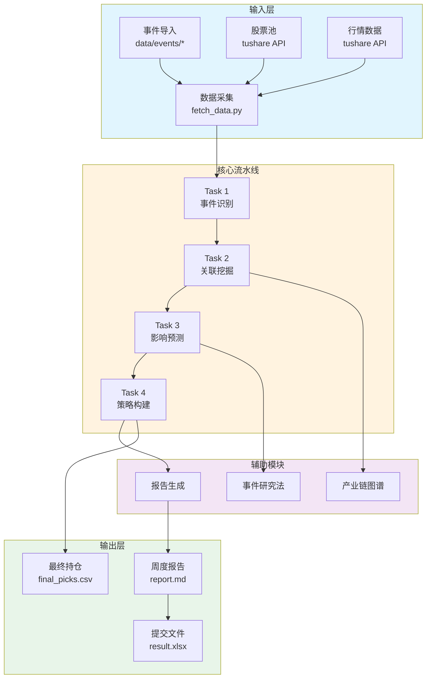

**TeddyCup-C-EventDriven** 是一套面向**泰迪杯 C 题"事件驱动型股市投资策略构建"**的完整量化投资解决方案。该项目实现了从**事件感知**到**策略落地**的全链路分析，覆盖数据采集、事件识别、关联挖掘、影响预测与仓位分配等核心环节。

---

## 项目背景与目标

本项目源自泰迪杯数据分析竞赛 C 题，聚焦 A 股市场的事件驱动型投资策略。赛题要求参赛者完成四个递进任务：

| 任务 | 内容说明 |
|------|----------|
| **Task 1** | 从海量数据中识别事件，完成四维分类与五大量化特征提取 |
| **Task 2** | 挖掘事件关联公司，构建"事件-上市公司"关联图谱 |
| **Task 3** | 用事件研究法量化事件影响，给出传导逻辑链条 |
| **Task 4** | 构建投资策略，以 10 万元初始资金在指定窗口期实测 |

竞赛分为两周提交：
- **第一周**：2026-04-20 15:00 ~ 2026-04-21 09:00
- **第二周**：2026-04-27 15:00 ~ 2026-04-28 09:00

Sources: [README.md](README.md#L1-L45)

---

## 技术架构总览

项目采用**模块化流水线设计**，各环节职责单一、可独立测试，通过 `workflow.py` 统一编排。以下是整体架构的 Mermaid 流程图：



**流水线核心顺序**：`fetch_data` → `task1_event_identify` → `task2_relation_mining` → `task3_impact_estimate` → `task4_strategy` → `report_builder`

Sources: [workflow.py](pipeline/workflow.py#L31-L118)

---

## 核心模块解析

### 1. 数据采集模块 (`pipeline/fetch_data.py`)

负责从多个数据源获取原始数据，包括新闻事件、股票池、行情价格、基准指数和财务指标。模块内置回退机制，当 API 调用受限时自动降级到本地样例数据。

```python
# 核心调用方式
from pipeline.fetch_data import run_fetch_pipeline
artifacts = run_fetch_pipeline(context, config)
# 返回: news_df, stock_df, price_df, benchmark_df, trading_calendar
```

Sources: [CLAUDE.md](CLAUDE.md#L25-L30), [workflow.py](pipeline/workflow.py#L61-L66)

### 2. 事件识别模块 (`pipeline/task1_event_identify.py`)

从新闻数据中聚合出候选事件，核心逻辑包括：

- **时间窗口聚类**：36小时内相关报道归并为同一事件
- **四维分类体系**：主体类型（政策/公司/行业/宏观/地缘）、持续时间、可预测性、行业主题
- **五大量化特征**：热度评分、强度评分、情绪评分、置信度、影响范围

```python
event_df = run_event_identification(
    news_df,
    event_taxonomy=config.event_taxonomy
)
```

Sources: [task1_event_identify.py](pipeline/task1_event_identify.py#L31-L123)

### 3. 关联挖掘模块 (`pipeline/task2_relation_mining.py`)

构建"事件-上市公司"关联图谱，采用四维度加权评分机制：

| 评分维度 | 默认权重 | 说明 |
|----------|----------|------|
| **直接提及** | 45% | 事件文本中明确提到公司名称 |
| **业务匹配** | 25% | 事件主题与公司主营收入匹配 |
| **行业重合** | 20% | 事件行业类型与股票所属行业重叠 |
| **历史联动** | 10% | 历史行情中该行业与股票的共涨跌规律 |

此外，不同事件类型对应不同的权重配置方案，例如政策类事件更侧重行业重合度，而公司类事件更看重直接提及。

Sources: [task2_relation_mining.py](pipeline/task2_relation_mining.py#L32-L117), [config.yaml](config/config.yaml#L42-L76)

### 4. 影响预测模块 (`pipeline/task3_impact_estimate.py`)

基于事件研究法（Event Study Methodology）量化事件影响：

- **估计窗口**：事件前第 60 天至前第 6 天
- **事件窗口**：事件前第 1 天至事件后第 4 天
- **超额收益 (AR)**：个股收益率减去基准收益率
- **累计超额收益 (CAR)**：事件窗口内 AR 的累加值

预测得分由预期 CAR、关联评分、事件评分、流动性评分等多因子加权计算，并施加风险惩罚。

Sources: [task3_impact_estimate.py](pipeline/task3_impact_estimate.py#L13-L24), [config.yaml](config/config.yaml#L77-L90)

### 5. 策略构建模块 (`pipeline/task4_strategy.py`)

生成最终投资决策，包含以下过滤与排序机制：

**基础过滤条件**：
- 上市时间 ≥ 60 天
- 日均成交额 ≥ 80 万元
- 非 ST 股票
- 非停牌状态

**评分机制**：
- 预测得分权重 85% + 动量得分权重 15%
- 主体类型偏见系数（公司类 1.12 > 政策类 1.08 > 地缘类 1.15 > 宏观类 0.92）

**仓位分配**：
- 最大持仓数：3 只
- 单只仓位上限：50%
- 单只仓位下限：20%

Sources: [task4_strategy.py](pipeline/task4_strategy.py#L33-L100), [config.yaml](config/config.yaml#L32-L40)

---

## 配置体系

所有策略参数集中管理于 `config/config.yaml`，通过 `AppConfig` 类以类型化属性的方式暴露给各模块：

```python
from pipeline.models import AppConfig
from pipeline.settings import load_config

config = load_config(project_root)
print(config.max_positions)      # 最大持仓数: 3
print(config.initial_capital)    # 初始资金: 100000
print(config.event_taxonomy)     # 事件分类体系
```

配置覆盖的维度包括：

| 配置类别 | 关键参数 |
|----------|----------|
| **项目配置** | 时区、初始资金、市场收盘时间 |
| **数据配置** | 回溯天数、基准指数、股票池路径 |
| **策略配置** | 最大持仓、仓位上下限、流动性阈值 |
| **评分配置** | 关联权重、预测因子权重、主体偏见系数 |
| **事件研究窗口** | 估计窗口、事件窗口边界 |

Sources: [models.py](pipeline/models.py#L40-L177), [config.yaml](config/config.yaml#L1-L90)

---

## 数据目录结构

```
data/
├── events/                    # 正式事件导入目录（按类型分类）
│   ├── policy/                 # 政策类事件
│   ├── announcement/          # 公司公告类事件
│   ├── industry/               # 行业/技术类事件
│   └── macro/                  # 宏观/地缘类事件
├── inbox/events_raw/          # 原始采集留痕（jsonl 格式）
├── staging/events/             # 标准化候选事件与审阅队列
├── manual/                     # 样例数据（提交仓库）
│   ├── stock_universe.csv      # 历史股票池参考
│   ├── industry_relation_map.json  # 产业链映射
│   └── *.json/.csv             # 财务、停复牌等样例
├── raw/<asof_date>/           # 原始数据缓存
└── processed/<asof_date>/     # 中间处理结果

outputs/
├── weekly/<asof_date>/         # 周度运行输出
│   ├── final_picks.csv         # 最终持仓
│   ├── company_relations.csv   # 关联关系
│   └── report.md               # 周度报告
└── backtest/                   # 回测结果
    ├── weekly_summary.csv       # 周度收益汇总
    └── historical_*.csv/png    # 历史 CAR 聚合
```

Sources: [README.md](README.md#L46-L78)

---

## 运行方式

### 周度运行（主要使用场景）

```bash
source .venv/bin/activate
export TUSHARE_TOKEN='你的_TOKEN'
python main_weekly.py --asof 2026-04-20
```

### 历史回测

```bash
python main_backtest.py --start 2025-12-08 --end 2025-12-26
```

回测采用周二买入、周五卖出规则，每周自动迭代执行完整流水线。

Sources: [CLAUDE.md](CLAUDE.md#L12-L17), [backtest.py](pipeline/backtest.py#L22-L55)

---

## 事件导入流程

正式运行时，系统从 `data/events/*/` 目录读取已导入的事件文件。推荐使用项目提供的采集脚本完成事件导入：

```bash
# 1) 抓取原始事件
.venv/bin/python scripts/event_ingest.py collect --source gov_cn --since 2026-04-01

# 2) 标准化并生成审阅队列
.venv/bin/python scripts/event_ingest.py normalize --source gov_cn --batch 2026-04-07

# 3) 人工确认 review_queue.csv 中的 review_status

# 4) 发布 accepted 事件
.venv/bin/python scripts/event_ingest.py publish --source-type policy --batch 2026-04-07
```

事件导入后，系统默认只读取 `asof_date` 往前 14 天内的事件（`lookback_days: 14`）。

Sources: [README.md](README.md#L79-L120)

---

## 适合人群与前置知识

本项目适合以下读者：

- **量化投资入门者**：理解事件驱动策略的基本框架
- **金融数据分析学习者**：实践事件研究法的量化建模
- **Python 开发者**：学习模块化流水线设计与配置管理

建议前置知识：
- Python 基础（pandas、numpy）
- 金融市场基本概念（收益率、超额收益）
- 了解 A 股交易规则（涨跌幅、T+1）

---

## 后续阅读路径

完成本页面阅读后，建议按以下顺序继续深入：

1. **[快速启动](2-kuai-su-qi-dong)** — 在本机环境运行第一个完整流水线
2. **[事件分类体系](5-shi-jian-fen-lei-ti-xi)** — 深入理解四维分类与五大量化特征
3. **[流水线设计](10-liu-shui-xian-she-ji)** — 掌握完整流水线的架构细节
4. **[周度运行](18-zhou-du-yun-xing)** — 了解比赛周的运行规范