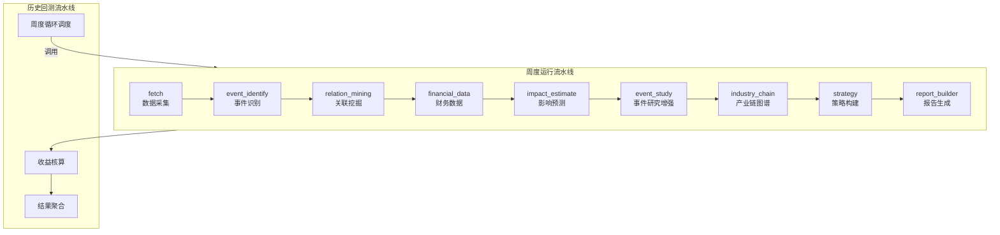

本页面系统阐述 TeddyCup-C-EventDriven 项目的核心流水线架构，包括周度运行流水线与历史回测流水线的阶段划分、数据流设计、产物规范及异常处理策略。该架构遵循**阶段化处理**与**产物传递**的设计原则，每个阶段接收上游产物并产出本阶段产物传递给下游，实现了计算资源的有效隔离与阶段可独立验证。

## 流水线架构概览

项目存在两条核心流水线：**周度运行流水线**与**历史回测流水线**。周度流水线以单个 `asof_date` 为锚点执行一轮完整的事件驱动分析；回测流水线则在该基础上增加周度循环调度与收益核算逻辑。两者的关系如以下 Mermaid 图所示：



Sources: [pipeline/workflow.py](pipeline/workflow.py#L44-L98) at section "run_weekly_pipeline"

## 周度运行流水线详解

周度运行流水线由 `run_weekly_pipeline` 函数统一编排，该函数位于 `pipeline/workflow.py` 第 44 行至 276 行。整个流水线包含 9 个阶段，每个阶段接受特定的输入产物并产生对应的输出产物。

### 阶段 1：数据采集（fetch）

数据采集阶段由 `run_fetch_pipeline` 函数执行，负责从 Tushare、Akshare 等数据源获取周度运行所需的全部基础数据。该阶段产出 `FetchArtifacts` 数据类，包含新闻数据、股票池数据、价格历史、基准指数及交易日历等五类产物。阶段执行时首先向后回溯 180 个日历日获取充足的历史数据窗口，随后依次调用 `fetch_trading_calendar`、`fetch_stock_universe`、`fetch_news`、`fetch_price_history` 和 `fetch_benchmark_history` 等子函数完成数据拉取。

该阶段设计为**强制依赖阶段**——若数据采集失败，流水线将直接抛出异常终止运行，不进入后续阶段。这反映了项目对数据质量的严格要求：缺乏完整的价格数据和交易日历，后续所有依赖市场模型的事件研究将无法正常执行。

Sources: [pipeline/fetch_data.py](pipeline/fetch_data.py#L42-L87) at section "run_fetch_pipeline"

### 阶段 2：事件识别（event_identify）

事件识别阶段将离散的新闻条目聚合为结构化的候选事件。核心逻辑由 `run_event_identification` 函数实现，采用基于相似度的滑窗聚类方法。算法在 36 小时的滑动窗口内，通过文本 Jaccard 相似度、标题相似度、关键词共现和实体共现四项指标判断两条新闻是否应归入同一事件集群。

每个事件集群被抽象为一个独立事件，提取以下量化特征：热度得分（基于来源权重、集群规模和时效性）、强度得分（基于关键词命中、官方来源加成和金额信息）、范围得分（基于行业覆盖广度）和置信度得分（综合前三项经 logistic 变换）。事件同时被映射至四维分类体系：影响持续周期、驱动主体、可预测性和行业属性。

Sources: [pipeline/task1_event_identify.py](pipeline/task1_event_identify.py#L21-L93) at section "run_event_identification"

### 阶段 3：关联挖掘（relation_mining）

关联挖掘阶段建立事件与股票池之间的关联关系，核心函数为 `run_relation_mining`。该阶段读取事件列表、股票池数据、价格历史及行业关系映射表，为每对事件-股票计算关联得分。

关联得分采用**四维加权模型**：`direct_mention`（直接提及）、`business_match`（业务匹配）、`industry_overlap`（行业重叠）和 `historical_co_move`（历史共振）。基础权重由配置文件统一控制，可按事件主体类型动态调整。关联得分低于 0.2 的关系被过滤丢弃，高于阈值的关系进入下一阶段。

该阶段同时生成关系图谱文件（PNG 和交互式 HTML），可视化展示事件-股票-行业的关联网络。

Sources: [pipeline/task2_relation_mining.py](pipeline/task2_relation_mining.py#L22-L77) at section "run_relation_mining"

### 阶段 4：财务数据采集（financial_data）

财务数据采集是流水线中的辅助阶段，负责获取关联股票的财务指标和停复牌信息。财务数据包括 PE、PB、ROE、净利润增长率、营收增长率和资产负债率等基本面指标；停复牌数据用于后续阶段的交易可行性判断。

该阶段在设计上是**可选的**——若获取失败，流水线继续以空数据帧往下执行，不影响其他阶段的正常进行。这避免了个别股票财务数据缺失导致全局流水线中断的问题。

Sources: [pipeline/workflow.py](pipeline/workflow.py#L72-L88)

### 阶段 5：影响预测（impact_estimate）

影响预测阶段采用简化的事件研究法估计事件对关联股票的超额收益，核心函数为 `run_impact_estimation`。该阶段的核心计算逻辑包含以下步骤：

首先，通过市场模型估计个股的正常收益——以 [-60,-6] 交易日为估计窗口，使用 OLS 回归拟合 α 和 β 参数。然后，计算事件窗口 [0,+4] 日的异常收益（AR）和累计异常收益（CAR）。

预测得分融合预期 4 日 CAR、关联强度、事件特征、流动性和风险惩罚五个维度，并引入**自适应缩放因子**——基于历史 CAR 波动率动态调整预测区间宽度，避免预测结果在不同市场环境下出现过激或过于保守的情况。

Sources: [pipeline/task3_impact_estimate.py](pipeline/task3_impact_estimate.py#L11-L120) at section "run_impact_estimation"

### 阶段 6：事件研究增强（event_study）

事件研究增强阶段生成标准化的事件研究明细表和统计汇总，核心函数为 `run_event_study_enhanced`。相比影响预测阶段，该阶段提供更丰富的分析维度：

事件窗口扩展至 [-1,+10] 日，输出每只股票每日的事件收益明细；按情绪方向分组（正向事件/负向事件）计算联合均值 CAR；输出统计表包含样本量、各窗口均值 AR/CAR 和胜率指标。最终产物包括明细 CSV、统计 CSV、联合均值 CAR 图表及原始数据。

Sources: [pipeline/event_study_enhanced.py](pipeline/event_study_enhanced.py#L24-L86) at section "run_event_study_enhanced"

### 阶段 7：产业链图谱增强（industry_chain）

产业链图谱增强阶段基于行业关系映射表构建链式产业关系，核心函数为 `run_industry_chain_enhanced`。该阶段将事件-股票的二元关联扩展为事件-主题-环节-股票的链式结构，输出包含主题匹配得分、环节匹配得分和链式置信度。

产物包括产业链关系表、单个事件图谱 PNG、合并图谱 PNG/HTML 及图谱说明文档。选出的特征事件（通常取 Top 3 关联数量的高热事件）会被重点渲染。

Sources: [pipeline/industry_chain_enhanced.py](pipeline/industry_chain_enhanced.py#L29-L72) at section "run_industry_chain_enhanced"

### 阶段 8：策略构建（strategy）

策略构建阶段将预测信号转化为可执行的投资决策，核心函数为 `run_strategy_construction`。该阶段遵循"筛选-评分-分配"三步流程：

**筛选层**执行基础过滤（剔除 ST 股、流动性不足、新股）和基本面过滤（PE 极值、ROE 门槛、净利润增长约束），再通过停牌约束判断本周是否可交易。

**评分层**在预测得分基础上引入 5 日动量因子（15% 权重），最终得分 = 85% 预测得分 + 15% 动量得分。

**分配层**对 Top 标的按得分排序后，通过带上下限约束的等比例分配与最大余数法舍入生成最终仓位。若所有候选标的预测得分均低于阈值（默认 -0.01），策略触发空仓保护本周不操作。

Sources: [pipeline/task4_strategy.py](pipeline/task4_strategy.py#L23-L105) at section "run_strategy_construction"

### 阶段 9：报告生成（report_builder）

报告生成阶段将所有阶段产物整合为结构化的 Markdown 周报，核心函数为 `build_weekly_report`。报告包含运行概览、研究方法论、事件识别结果、关联图谱、影响预测与逻辑链条、事件研究统计、产业链图谱、投资决策及数据来源说明等章节。

报告中的投资决策推理过程部分会回溯候选标的的完整评分链条，便于结果可解释性审计。

Sources: [pipeline/report_builder.py](pipeline/report_builder.py#L11-L80) at section "build_weekly_report"

## 历史回测流水线

历史回测流水线由 `run_backtest` 函数实现，位于 `pipeline/backtest.py` 第 16 行至 187 行。该流水线在周度运行流水线基础上增加周度循环调度与收益核算逻辑。

回测以周一为起始锚点，按赛题规则执行日频周度交易模拟。每周执行流程如下：首先调用 `run_weekly_pipeline` 获取本周事件识别与预测结果；然后基于下一交易日买入、该周最后一个交易日收盘卖出的规则核算实际收益；最后将结果追加至回测汇总表。

收益计算包含交易成本模拟：佣金率 0.1% 加滑点 0.05%，买卖各计一次。回测产物包括周度汇总表（含净值序列）、交易明细及历史联合均值 CAR 图。

Sources: [pipeline/backtest.py](pipeline/backtest.py#L16-L120) at section "run_backtest"

## 产物规范与数据类定义

项目为每个流水线阶段定义了对应的数据类，用于约束产物结构和阶段间接口。以下为核心产物数据类一览：

| 数据类名 | 所在模块 | 用途 |
|---------|---------|------|
| `RunContext` | `pipeline/models.py` | 单次运行上下文，携带日期、根目录和输出路径 |
| `FetchArtifacts` | `pipeline/fetch_data.py` | 数据采集阶段产物 |
| `WorkflowArtifacts` | `pipeline/workflow.py` | 完整周度流程产物 |
| `EventStudyArtifacts` | `pipeline/event_study_enhanced.py` | 事件研究增强产物 |
| `IndustryChainArtifacts` | `pipeline/industry_chain_enhanced.py` | 产业链图谱增强产物 |

`WorkflowArtifacts` 作为流水线最终产物，聚合了所有中间阶段的产物引用，包括事件 DataFrame、关联 DataFrame、预测 DataFrame、最终持仓 DataFrame、报告路径、图谱路径列表、事件研究产物和产业链产物。这种集中化的产物封装简化了调用方的结果消费逻辑。

Sources: [pipeline/workflow.py](pipeline/workflow.py#L16-L29) at section "WorkflowArtifacts"

## 异常处理与容错策略

流水线各阶段的异常处理采用**分级容错**策略，不同阶段的失败后果不同：

**强制失败**（流水线终止）：数据采集阶段（fetch）失败直接抛出异常，不进入后续阶段。原因在于缺乏基础数据，后续阶段无法正常执行。

**软失败继续**（以空数据帧继续）：事件识别、关联挖掘、影响预测、事件研究、产业链图谱和策略构建阶段均采用 try-except 包裹，失败时以空 DataFrame 继续执行。这一设计确保单个阶段的分析失败不影响其他阶段的正常输出，报告仍可生成（只是缺失该部分内容）。

**报告生成容错**：报告构建阶段同样采用软失败策略，失败时生成最小化的降级报告。

这种分层容错设计在保证关键数据依赖的同时最大限度地保留了部分有效的分析结果，便于问题定位和迭代修复。

Sources: [pipeline/workflow.py](pipeline/workflow.py#L52-L98) at section "exception handling patterns"

## 配置驱动的流水线参数

流水线行为通过 `config/config.yaml` 集中配置，主要配置维度包括：

**数据配置**：回溯天数（`lookback_days`）、基准指数代码（`benchmark_code`）、交易日历来源（`trading_calendar_source`）。

**策略配置**：最大持仓数（`max_positions`）、单标的仓位上限/下限（`single_position_max`/`single_position_min`）、最小上市天数（`min_listing_days`）、最小日均成交额（`min_avg_turnover_million`）、正向得分阈值（`positive_score_threshold`）。

**评分配置**：关联四维权重（`association`）、主体类型倍率（`association_profiles`）、预测得分权重（`prediction`）、事件主体偏差（`subject_bias`）。

**事件分类体系**：`event_taxonomy` 定义了事件分类的四个维度及其关键词映射，支持通过配置文件扩展或调整分类规则。

Sources: [config/config.yaml](config/config.yaml#L1-L150) at sections "project", "data", "strategy", "scoring"

## 目录结构与产物落盘

流水线执行过程中产生的所有产物按以下目录结构落盘：

```
outputs/weekly/{asof_date}/
├── event_candidates.csv          # 候选事件列表
├── company_relations.csv          # 事件-股票关联关系
├── strategy_candidates.csv         # 策略候选标的
├── final_picks.csv                # 最终持仓
├── report.md                      # 周度报告
├── result.xlsx                    # 提交文件
├── event_study/                   # 事件研究产物
│   ├── event_study_detail.csv
│   ├── event_study_stats.csv
│   ├── joint_mean_car.csv
│   └── joint_mean_car.png
├── kg_visual/                     # 产业链图谱产物
│   ├── industry_chain_relations.csv
│   ├── industry_chain_graph.png
│   └── industry_chain_graph.html
└── 图谱 PNG 文件列表
```

数据采集阶段同时在 `data/raw/{asof_date}/` 目录缓存原始数据，便于离线复现和增量分析。

Sources: [pipeline/workflow.py](pipeline/workflow.py#L48-L55) at section "directory setup"

## 下一步

建议继续阅读以下页面深入理解流水线各阶段的内部实现：

- [数据采集模块](13-shu-ju-cai-ji-mo-kuai) — 了解数据采集的完整逻辑，包括交易日历获取和行情数据拉取
- [事件识别模块](14-shi-jian-shi-bie-mo-kuai) — 深入理解新闻聚类算法和事件评分机制
- [关联挖掘模块](15-guan-lian-wa-jue-mo-kuai) — 掌握四维关联评分模型的计算细节
- [影响预测模块](16-ying-xiang-yu-ce-mo-kuai) — 理解市场模型和预期 CAR 的估计方法
- [策略构建模块](17-ce-lue-gou-jian-mo-kuai) — 学习仓位分配算法和空仓保护机制