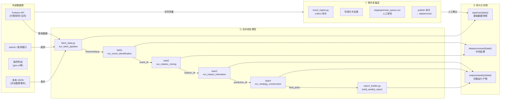

本页面系统阐述 TeddyCup-C-EventDriven 事件驱动策略系统的**数据流与目录结构**。数据流遵循"采集 → 入库 → 流水线处理 → 报告输出"的四阶段闭环设计，目录结构分为 `data/` 持久化存储、`outputs/` 流水线产物和 `staging/` 人工审阅三个层次。理解这两层架构是掌握系统全貌的前提。

Sources: [pipeline/workflow.py](pipeline/workflow.py#L48-L60), [pipeline/models.py](pipeline/models.py#L38-L50)

---

## 顶层目录架构

项目顶层存在两条平行的数据主线：**原始数据与事件** 存放在 `data/` 目录下，**流水线运行产物** 存放在 `outputs/` 目录下。此外，事件采集的中间态文件经由 `data/staging/` 进入人工审阅流程，最终合并至 `data/events/` 正式目录。

```text
项目根目录
│
├── config/
│   └── config.yaml               # 全局配置（事件路径、数据源、策略参数）
├── data/                         # 持久化数据存储（按日期分区）
│   ├── events/                   # 已发布的正式事件库
│   │   ├── announcement/         # 公告类事件
│   │   ├── industry/             # 行业类事件
│   │   ├── macro/                # 宏观/地缘类事件
│   │   └── policy/               # 政策类事件
│   ├── inbox/
│   │   └── events_raw/           # 原始采集文件（按来源+批次）
│   ├── manual/                   # 人工维护的参考数据
│   ├── processed/                # 事件识别中间结果
│   ├── raw/                      # 基础市场数据快照（按运行日期）
│   │   └── {asof_date}/
│   │       ├── benchmark_*.csv
│   │       ├── financial_*.csv
│   │       ├── news_*.csv
│   │       ├── prices_*.csv
│   │       ├── stock_universe.csv
│   │       ├── suspend_resume_*.csv
│   │       └── trading_calendar_*.csv
│   └── staging/
│       └── events/               # 待审阅的候选事件队列
│           ├── policy/
│           └── review_queue.csv
├── outputs/                      # 流水线产物（按运行日期分区）
│   ├── backtest/                 # 回测全局产物
│   └── weekly/
│       └── {asof_date}/
│           ├── company_relations.csv
│           ├── event_study/      # 事件研究法输出
│           ├── final_picks.csv  # 最终策略持仓
│           ├── kg_visual/        # 产业链知识图谱可视化
│           ├── predictions.csv   # 影响预测结果
│           ├── report.md         # 周度报告
│           ├── result.xlsx       # 竞赛提交结果
│           └── strategy_candidates.csv
├── pipeline/                     # 流水线核心代码
└── scripts/
    └── event_ingest.py           # 独立事件采集脚本
```

Sources: [get_dir_structure 输出](file:///dev/null#L1-L55)（综合 `data/` 与 `outputs/` 目录树）

---

## 数据流四阶段闭环

整个系统围绕一条**事件驱动数据流**运转，从外部数据源采集到策略持仓输出，形成完整闭环。



**数据流的核心特征**：

1. **外部数据源仅触发流水线**，不直接写入 `data/`——流水线通过 `FetchArtifacts` 将采集结果缓存到 `data/raw/{date}/`
2. **事件有独立采集通道**，`event_ingest.py` 负责抓取外部事件，经 staging 审阅后写入 `data/events/`
3. **所有运行产物以日期为分区键**，`asof_date` 贯穿 `raw_dir`、`processed_dir` 和 `output_dir` 三个上下文路径
4. **异常隔离设计**，每个阶段独立 try-except，失败时回退到空 DataFrame 保证流水线不中断

Sources: [pipeline/workflow.py](pipeline/workflow.py#L43-L245), [pipeline/fetch_data.py](pipeline/fetch_data.py#L50-L100)

---

## 目录结构详解

### data/events/ — 正式事件库

按事件类型（`source_type`）划分的 JSON 文件集。事件发布遵循**月度合并**策略：同一月份内来自多个批次的事件统一写入 `{type}_{YYYYMM}.json`，便于流水线按月加载。

| 目录 | 类型 | 来源 | 采集模式 |
|------|------|------|----------|
| `policy/` | 政策类 | gov.cn / ndtc.gov.cn 等 | 自动抓取 + 手动导入 |
| `announcement/` | 公告类 | 巨潮资讯网 cninfo | 手动导入 |
| `industry/` | 行业类 | 东方财富 / 36氪等 | 手动导入 |
| `macro/` | 宏观地缘类 | 第一财经 / 人工整理 | 手动导入 |

Sources: [pipeline/models.py#L90-L104](pipeline/models.py#L90-L104), [pipeline/fetch_data.py#L340-L400](pipeline/fetch_data.py#L340-L400)

### data/raw/{asof_date}/ — 基础数据快照

每次周度运行采集的市场基础数据，以运行日期（`asof_date`）为子目录名。文件名以 `_{asof_date}.csv` 后缀区分不同运行批次，便于事后回溯。

| 文件 | 内容 | 用途 |
|------|------|------|
| `benchmark_*.csv` | 沪深300基准行情 | CAR 计算的基准收益率 |
| `financial_*.csv` | 相关股票财务数据 | 影响预测辅助因子 |
| `news_*.csv` | 新闻事件文本 | 事件识别的输入 |
| `prices_*.csv` | 股票历史价格 | 收益率计算与流动性评分 |
| `stock_universe.csv` | 当日股票池 | 标的范围过滤 |
| `suspend_resume_*.csv` | 停复牌信息 | 交易可行性判断 |
| `trading_calendar_*.csv` | 交易日历 | 锚点日期与窗口计算 |

Sources: [pipeline/fetch_data.py#L95-L106](pipeline/fetch_data.py#L95-L106)

### data/processed/{asof_date}/ — 中间处理结果

流水线中游阶段的输出。`workflow.py` 在事件识别完成后写入 `event_candidates.csv`；财务数据与停复牌数据因依赖关联挖掘结果，也以 `raw_dir` 路径存储而非 `processed_dir`。

Sources: [pipeline/workflow.py](pipeline/workflow.py#L78-L127)

### data/staging/events/ — 人工审阅队列

事件采集的**中间态目录**，是自动采集与正式发布的缓冲区。`review_queue.csv` 是全局审阅清单，各 `source_type` 子目录下存放当批次候选事件。审阅通过后由 `publish` 命令合并至 `data/events/`。

Sources: [pipeline/event_ingest.py](pipeline/event_ingest.py#L15-L25)

### outputs/weekly/{asof_date}/ — 完整运行产物

流水线末端输出的完整产物集，涵盖策略决策所需全部中间文件与最终报告。

| 文件/目录 | 内容 | 下游消费者 |
|-----------|------|-----------|
| `event_candidates.csv` | 识别出的候选事件 | 关联挖掘、报告 |
| `company_relations.csv` | 事件-股票关联关系 | 影响预测、产业链图 |
| `predictions.csv` | 预期 CAR 与综合评分 | 策略构建 |
| `final_picks.csv` | 最终持仓股票 | 回测、结果导出 |
| `report.md` | 周度分析报告 | 人工阅读 |
| `result.xlsx` | 竞赛提交格式 | 提交系统 |
| `event_study/` | 事件研究法明细 | 回测统计、报告 |
| `kg_visual/` | 产业链图谱可视化 | 报告嵌入 |

Sources: [pipeline/workflow.py](pipeline/workflow.py#L43-L60), [pipeline/task2_relation_mining.py](pipeline/task2_relation_mining.py#L114-L116), [pipeline/task3_impact_estimate.py](pipeline/task3_impact_estimate.py#L207)

---

## RunContext 与路径上下文

`RunContext` 是贯穿流水线各阶段的核心数据结构，通过 `asof_date` 统一各阶段的路径计算逻辑。所有产物目录在同一 `asof_date` 下互为兄弟目录，保证数据完整性。

```python
@dataclass(slots=True)
class RunContext:
    asof_date: date
    project_root: Path
    output_dir: Path      # outputs/weekly/{asof_date}/
    raw_dir: Path         # data/raw/{asof_date}/
    processed_dir: Path   # data/processed/{asof_date}/
```

在 `run_weekly_pipeline` 入口处，三个目录路径以 `asof_date` 为基础路径一次性确定，后续各模块通过 `context.output_dir` 或 `context.raw_dir` 追加子路径名获取目标路径，无需重复计算日期分区键。

Sources: [pipeline/models.py](pipeline/models.py#L38-L50), [pipeline/workflow.py](pipeline/workflow.py#L43-L59)

---

## 关键设计模式

**日期分区命名约定**：所有以日期为维度的存储位置均采用 ISO 格式（`YYYY-MM-DD`）作为子目录名，`save_dataframe` 等工具函数自动将 DataFrame 写入 `{base_path}.csv`，无需手动指定后缀。

**四层数据隔离**：原始采集（`inbox/`）→ 待审阅（`staging/`）→ 正式存储（`events/`）→ 流水线消费（`fetch_data` 加载），形成完整的 ETL 管道，防止脏数据进入分析流程。

**灵活的回退机制**：事件识别失败返回空 DataFrame、关联挖掘失败返回空 DataFrame，各阶段互不阻塞。这种**宽容性设计**确保任何单一阶段的失败不会导致整轮流水线中断，同时通过日志记录便于事后定位问题。

Sources: [pipeline/utils.py](pipeline/utils.py#L200-L210), [pipeline/workflow.py](pipeline/workflow.py#L60-L78)

---

## 后续阅读

掌握数据流与目录结构后，建议按以下路径深入核心模块：

- 若需了解完整流水线如何编排各阶段，参见 [流水线设计](10-liu-shui-xian-she-ji)
- 若需了解配置文件中事件路径与数据源的映射关系，参见 [配置体系](12-pei-zhi-ti-xi)
- 若需了解 `data/events/` 的内容结构与分类规则，参见 [事件分类体系](5-shi-jian-fen-lei-ti-xi)