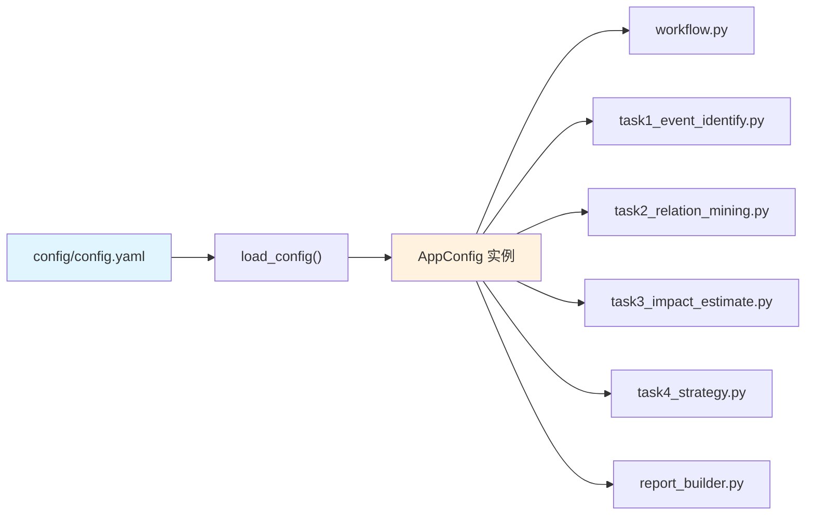
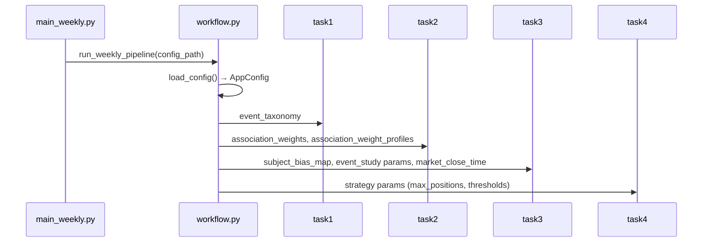

本页面详细说明事件驱动量化策略系统的配置管理体系，涵盖配置文件的组织结构、加载机制、各配置项的语义及业务含义，以及如何通过配置实现策略参数的灵活调整。

## 配置架构概述

系统的配置管理采用 **YAML 声明式配置 + Python 数据类绑定** 的双层架构。`config/config.yaml` 作为唯一配置源，通过 `pipeline/settings.py` 中的 `load_config()` 函数加载，最终由 `pipeline/models.py` 中的 `AppConfig` 数据类以类型化属性的形式暴露给各业务模块。



这种设计的核心优势在于**单一真相源**（Single Source of Truth）：修改 `config.yaml` 即可调整全系统的行为，无需在各模块中硬编码参数。同时，`AppConfig` 的属性化访问提供了 IDE 类型提示和编译期检查能力。

Sources: [config/config.yaml](config/config.yaml#L1-L50), [pipeline/settings.py](pipeline/settings.py#L1-L33), [pipeline/models.py](pipeline/models.py#L70-L120)

## 配置文件结构

`config.yaml` 采用分层结构设计，包含以下顶层配置块：

| 配置块 | 用途 | 关键参数 |
|--------|------|----------|
| `project` | 项目基础信息与全局参数 | timezone, initial_capital, market_close_time |
| `data` | 数据获取相关配置 | lookback_days, benchmark_code, trading_calendar_source |
| `tushare` | Tushare API 凭证管理 | token_env, token |
| `events` | 事件数据导入配置 | qstock_enabled, import_paths |
| `strategy` | 策略构建参数 | max_positions, position_cap/floor, min_listing_days |
| `scoring` | 评分权重体系 | association, prediction, subject_bias |
| `event_study` | 事件研究法参数 | estimation_window, event_window |
| `event_taxonomy` | 事件分类词表 | duration_type, subject_type, predictability, industry_type |
| `report` | 报告生成配置 | top_event_count, top_relation_count |

Sources: [config/config.yaml](config/config.yaml#L1-L319)

## 项目基础配置

`project` 配置块定义系统运行的基础环境参数：

```yaml
project:
  name: TeddyCup-C-EventDriven
  timezone: Asia/Shanghai
  initial_capital: 100000
  market_close_time: "15:00:00"
```

`timezone` 指定系统使用的时区，所有时间运算均基于此时区进行。`initial_capital` 定义回测初始资金规模。`market_close_time` 设置 A 股收盘时间，用于事件锚定交易日的判断逻辑——若事件发布时间晚于收盘时间，则事件实际生效日期顺延至下一交易日。

Sources: [config/config.yaml](config/config.yaml#L1-L6), [pipeline/models.py](pipeline/models.py#L75-L82)

## 数据获取配置

`data` 配置块控制数据回溯范围和基准标的：

```yaml
data:
  lookback_days: 14
  benchmark_code: 000300.SH
  trading_calendar_source: tushare
  stock_whitelist_path: ""
  stock_blacklist_path: ""
```

`lookback_days` 指定每次运行时向前回溯获取新闻数据的天数。`benchmark_code` 定义基准指数代码（如沪深 300），用于计算超额收益和市场状态判断。`stock_whitelist_path` 和 `stock_blacklist_path` 支持白名单/黑名单机制，允许在特定回测场景下限定股票池范围。

Sources: [config/config.yaml](config/config.yaml#L8-L15), [pipeline/models.py](pipeline/models.py#L84-L96)

## API 凭证管理

`tushare` 配置块实现敏感信息的双重来源机制：

```yaml
tushare:
  token_env: TUSHARE_TOKEN
  token: "dfe0d353d766151c848b0bbd2f84fc22db5fba75815d49158a405dae"
```

系统优先使用配置文件中的 token，若配置文件 token 为空，则回退至环境变量 `TUSHARE_TOKEN`。这种设计兼顾了本地开发环境（直接写在配置文件中）和生产环境（通过环境变量注入）的不同需求。若两者均缺失，系统启动时抛出 `RuntimeError` 异常。

Sources: [config/config.yaml](config/config.yaml#L16-L20), [pipeline/settings.py](pipeline/settings.py#L20-L29), [tests/test_settings.py](tests/test_settings.py#L1-L81)

## 策略构建参数

`strategy` 配置块定义选股和风控的核心阈值：

```yaml
strategy:
  max_positions: 3
  single_position_max: 0.5
  single_position_min: 0.2
  min_listing_days: 60
  min_avg_turnover_million: 80
  positive_score_threshold: 0.02
  min_prediction_score_threshold: -0.01
```

| 参数 | 含义 | 作用阶段 |
|------|------|----------|
| `max_positions` | 最大持仓数量 | 策略输出 |
| `single_position_max` | 单只股票最大仓位比例 | 仓位分配 |
| `single_position_min` | 单只股票最小仓位比例 | 仓位分配 |
| `min_listing_days` | 股票最小上市天数 | 流动性过滤 |
| `min_avg_turnover_million` | 日均成交额下限（万元） | 流动性过滤 |
| `positive_score_threshold` | 正向预测得分阈值 | 候选筛选 |
| `min_prediction_score_threshold` | 最小预测得分阈值 | 兜底筛选 |

Sources: [config/config.yaml](config/config.yaml#L32-L42), [pipeline/models.py](pipeline/models.py#L100-L120), [pipeline/task4_strategy.py](pipeline/task4_strategy.py#L1-L50)

## 评分权重体系

`scoring` 配置块是系统的核心参数区域，包含关联评分、预测评分和主体偏置三套权重机制。

### 基础关联权重

```yaml
scoring:
  association:
    direct_mention: 0.45      # 直接提及
    business_match: 0.25      # 业务匹配
    industry_overlap: 0.20    # 行业重叠
    historical_co_move: 0.10  # 历史联动
```

`association_weights` 定义了事件-股票关联度的四大评分因子权重。`direct_mention` 权重最高，表示新闻文本中直接提及股票名称；其余因子通过文本语义和历史数据辅助判断关联强度。

### 事件类型配置

```yaml
scoring:
  association_profiles:
    default:
      direct_mention: 1.0
      business_match: 1.0
      industry_overlap: 1.0
      historical_co_move: 1.0
    政策类事件:
      direct_mention: 0.75
      business_match: 1.0
      industry_overlap: 1.4
      historical_co_move: 1.0
    公司类事件:
      direct_mention: 1.35
      business_match: 0.8
      industry_overlap: 0.75
      historical_co_move: 1.0
    行业类事件:
      direct_mention: 0.9
      business_match: 1.15
      industry_overlap: 1.0
      historical_co_move: 1.0
    宏观类事件:
      direct_mention: 0.7
      business_match: 0.8
      industry_overlap: 1.35
      historical_co_move: 1.3
    地缘类事件:
      direct_mention: 0.8
      business_match: 0.8
      industry_overlap: 1.4
      historical_co_move: 1.15
```

`association_weight_profiles` 为不同事件主体类型（`subject_type`）提供差异化的权重配置。例如政策类事件中 `industry_overlap` 因子权重提升 40%，因为政策往往先影响行业层面再传导至具体公司；而公司类事件中 `direct_mention` 因子权重提升 35%，因为公司公告中的信息更直接指向该公司本身。

系统通过 `_resolve_association_weights()` 函数将基础权重与类型倍率相乘后归一化，生成最终的关联评分计算权重。

Sources: [config/config.yaml](config/config.yaml#L44-L100), [pipeline/models.py](pipeline/models.py#L122-L150), [pipeline/task2_relation_mining.py](pipeline/task2_relation_mining.py#L117-L133)

### 主体偏置系数

```yaml
scoring:
  subject_bias:
    政策类事件: 1.08
    公司类事件: 1.12
    行业类事件: 1.0
    宏观类事件: 0.92
    地缘类事件: 1.15
```

`subject_bias_map` 为不同事件类型设置预测得分调整系数。地缘类事件偏置最高（1.15），因为其冲击性往往超出市场预期；宏观类事件偏置最低（0.92），因为宏观因素传导路径较长且受多重因素扰动。

Sources: [config/config.yaml](config/config.yaml#L94-L100), [pipeline/models.py](pipeline/models.py#L152-L165), [pipeline/task3_impact_estimate.py](pipeline/task3_impact_estimate.py#L100-L150)

## 事件研究法参数

`event_study` 配置块定义事件研究法的时间窗口：

```yaml
event_study:
  estimation_window_start: -60
  estimation_window_end: -6
  event_window_start: -1
  event_window_end: 4
```

| 参数 | 值 | 含义 |
|------|-----|------|
| `estimation_window_start` | -60 | 估计窗口起点（事件日前第60天） |
| `estimation_window_end` | -6 | 估计窗口终点（事件日前第6天） |
| `event_window_start` | -1 | 事件窗口起点（事件日前1天） |
| `event_window_end` | 4 | 事件窗口终点（事件日后第4天） |

这组参数定义了标准事件研究法的时间结构：使用事件前60至6个交易日估计正常收益模型，再用事件窗口内的异常收益（CAR）评估事件影响。

Sources: [config/config.yaml](config/config.yaml#L102-L109)

## 事件分类词表

`event_taxonomy` 配置块定义事件分类的多维度词表体系：

### 持续时间类型

```yaml
event_taxonomy:
  duration_type:
    脉冲型事件: [突发, 爆炸, 冲突, 坠毁, 事故, 紧急, 速报, 快讯, 突然, 骤然, 猝然]
    长尾型事件: [规划, 战略, 改革, 转型, 长期, 五年, 十四五, 十五五, 远景, 纲要, 路线图]
    中期型事件: [季度, 半年, 年度, 阶段, 周期, 中期, 短期目标]
```

### 主体类型

```yaml
event_taxonomy:
  subject_type:
    政策类事件: [政策, 方案, 规划, 意见, 通知, 办法, 条例, 法规, ...]
    公司类事件: [公告, 业绩, 重组, 并购, 增持, 减持, 回购, ...]
    行业类事件: [行业, 产业, 技术突破, 新产品, 创新, ...]
    宏观类事件: [GDP, CPI, PMI, 利率, 降息, 加息, 降准, ...]
    地缘类事件: [战争, 冲突, 制裁, 封锁, 军演, ...]
```

### 可预测性

```yaml
event_taxonomy:
  predictability:
    突发型事件: [突发, 意外, 紧急, 黑天鹅, 不可预测, ...]
    预披露型事件: [预告, 预计, 预期, 计划, 拟, 将, ...]
```

### 行业类型

```yaml
event_taxonomy:
  industry_type:
    军工类事件: [军工, 国防, 武器, 导弹, 战斗机, ...]
    科技类事件: [AI, 人工智能, 芯片, 半导体, 算力, ...]
    新能源类事件: [新能源, 光伏, 风电, 储能, 氢能, ...]
    低空类事件: [低空, eVTOL, 飞行汽车, 通航, ...]
    消费类事件: [消费, 零售, 电商, 品牌, 白酒, ...]
    医药类事件: [医药, 创新药, 生物医药, 疫苗, ...]
    金融类事件: [银行, 保险, 券商, 基金, ...]
    地产类事件: [房地产, 楼市, 限购, 限贷, ...]
    农业类事件: [农业, 种业, 粮食安全, 转基因, ...]
    业绩类事件: [业绩预告, 业绩快报, 年报, 季报, ...]
```

这些词表用于[事件识别模块](14-shi-jian-shi-bie-mo-kuai)对新闻文本进行多维度分类，识别出事件的主体类型、行业归属、持续时间和可预测性特征，进而驱动后续的关联评分和影响预测。

Sources: [config/config.yaml](config/config.yaml#L111-L319), [pipeline/models.py](pipeline/models.py#L167-L177)

## 配置加载机制

`load_config()` 函数实现配置的双重加载逻辑：

```python
def load_config(project_root: Path, config_path: str | None = None) -> AppConfig:
    """读取 YAML 配置，并注入环境变量中的动态参数。"""

    target = project_root / (config_path or DEFAULT_CONFIG_PATH)
    with target.open("r", encoding="utf-8") as file:
        raw: dict[str, Any] = yaml.safe_load(file)

    token_env = raw.get("tushare", {}).get("token_env", "TUSHARE_TOKEN")
    raw.setdefault("tushare", {})
    config_token = str(raw["tushare"].get("token", "") or "").strip()
    env_token = os.getenv(token_env, "").strip() if token_env else ""
    raw["tushare"]["token"] = config_token or env_token
    # ...
    return AppConfig(raw=raw)
```

关键设计点：
1. 默认配置文件路径为 `config/config.yaml`，可通过 `--config` 参数覆盖
2. Tushare token 支持配置文件优先、环境变量兜底的加载顺序
3. 返回的 `AppConfig` 实例是不可变的 `dataclass(slots=True)`，确保配置在流水线执行过程中不会被意外修改

Sources: [pipeline/settings.py](pipeline/settings.py#L1-L33), [pipeline/models.py](pipeline/models.py#L55-L60)

## 配置在流水线中的传递

配置对象沿流水线各阶段向下传递，每个阶段按需读取相关配置：



配置传递遵循**最小知情原则**：每个模块仅读取其所需的配置项，而非获取整个配置对象。这种设计降低了模块间的耦合度，也便于后续的功能拆分。

Sources: [pipeline/workflow.py](pipeline/workflow.py#L1-L100), [pipeline/task2_relation_mining.py](pipeline/task2_relation_mining.py#L40-L80), [pipeline/task3_impact_estimate.py](pipeline/task3_impact_estimate.py#L1-L50)

## 配置使用示例

### 修改关联评分权重

若需调整公司类事件的关联评分计算方式，可修改 `association_profiles.公司类事件` 配置：

```yaml
scoring:
  association_profiles:
    公司类事件:
      direct_mention: 1.5      # 提高直接提及权重
      business_match: 0.6      # 降低业务匹配权重
      industry_overlap: 0.5    # 降低行业重叠权重
      historical_co_move: 1.0
```

### 调整策略风控参数

若需提高持仓集中度，可调整仓位限制：

```yaml
strategy:
  max_positions: 2            # 减少持仓数量
  single_position_max: 0.6    # 提高单只最大仓位
  single_position_min: 0.3    # 提高单只最小仓位
```

### 扩展事件分类词表

若需支持新行业的事件分类，可在 `event_taxonomy.industry_type` 下新增词表：

```yaml
event_taxonomy:
  industry_type:
    机器人事件: [机器人, 人形机器人, 工业机器人, 协作机器人, 伺服电机, 减速器]
```

Sources: [config/config.yaml](config/config.yaml#L44-L100), [config/config.yaml](config/config.yaml#L200-L250)

## 后续步骤

配置体系理解后，建议继续阅读：
- [流水线设计](10-liu-shui-xian-she-ji) — 了解配置在各流水线阶段的实际使用方式
- [关联挖掘模块](15-guan-lian-wa-jue-mo-kuai) — 深入理解关联评分配置的具体应用
- [影响预测模块](16-ying-xiang-yu-ce-mo-kuai) — 深入理解事件研究和预测评分的配置驱动逻辑