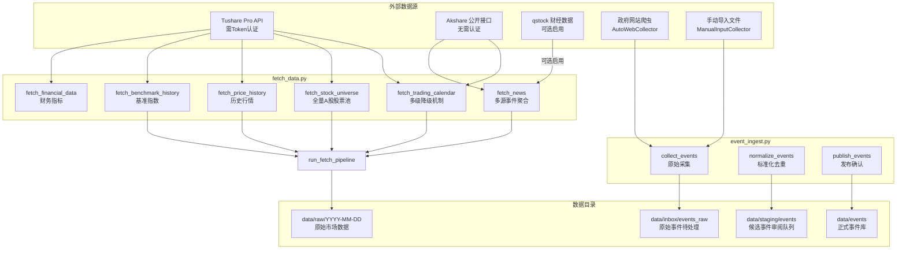

数据采集模块是事件驱动量化策略系统的数据入口层，负责从多个外部数据源汇聚市场基础数据和事件信息。该模块采用分层设计理念，将市场数据获取（`pipeline/fetch_data.py`）与事件采集引入（`pipeline/event_ingest.py`）分离为两条独立流水线，通过统一的数据模型输出标准化的中间产物。

## 模块定位

在系统整体架构中，数据采集模块处于流水线的最上游环节。其输入层对接外部数据提供方（Tushare、Akshare、qstock 及网页爬虫），输出层为下游的事件识别、关联挖掘、影响预测等模块提供结构化的数据基底。这种设计确保了上游数据源变更不会向下游业务逻辑扩散，形成良好的关注点分离。

数据采集模块的核心职责涵盖三个维度：第一，获取股票市场的交易日历、股票池、历史行情等基础数据；第二，从多种渠道采集事件文本并完成去重、标准化处理；第三，构建可追溯的数据缓存机制以支持后续回测与周度运行。

## 架构总览

数据采集模块由两个核心文件构成，分别承担市场数据获取与事件采集引入的职责。两者的数据流向在 `data/raw` 目录汇合，共同为后续流水线阶段提供输入。



## 市场数据采集流水线

市场数据采集功能集中在 `pipeline/fetch_data.py` 中，通过 `run_fetch_pipeline()` 函数作为单一入口点协调执行。该函数接收 `RunContext` 上下文对象与 `AppConfig` 配置对象，按依赖顺序依次调用各专项采集函数，最终打包为 `FetchArtifacts` 数据类返回。

### 交易日历获取

交易日历的获取实现了四级降级机制（fetch_data.py#L215-L304），确保在数据源不可用时能够逐层回退：

| 优先级 | 数据源 | 依赖条件 | 状态说明 |
|--------|--------|----------|----------|
| 第1级 | Tushare Pro | 有效的 `tushare_token` 配置 | 积分需满足 trade_cal 接口权限 |
| 第2级 | Akshare Sina | `akshare` 模块可用 | 依赖 py_mini_racer 进行 JS 解码 |
| 第3级 | Akshare 兼容模式 | 网络连通性 | 直接请求新浪 txt 接口绕过 JS 依赖 |
| 第4级 | 本地缓存 CSV | `data/raw/*/trading_calendar_*.csv` | 合并历史运行缓存 |
| 第5级 | Pandas 工作日 | 无外部依赖 | 仅含工作日，不含中国节假日修正 |

```python
# 多级降级示例（fetch_data.py#L215-L268）
def fetch_trading_calendar(start_date, end_date, config):
    # 第1级：尝试 Tushare
    try:
        pro = require_tushare_client(config)
        calendar_df = pro.trade_cal(...)
        if calendar_df is not None and not calendar_df.empty:
            return TradingCalendarArtifacts(calendar=..., source_name="tushare", ...)
    except Exception as e1:
        logger.warning(describe_tushare_trade_calendar_error(e1))

    # 第2级：尝试 Akshare
    if ak is not None:
        try:
            calendar_df = ak.tool_trade_date_hist_sina()
            ...
        except Exception as e2:
            logger.warning(describe_akshare_trade_calendar_error(e2))
            # 第3级：兼容模式
            calendar_df = fetch_trading_calendar_from_akshare_compat(...)

    # 第4级：本地缓存
    # 第5级：Pandas bdate_range 兜底
```

当所有外部数据源均不可用时，系统会输出警告日志并使用 Pandas 的 `bdate_range` 生成不含中国节假日修正的工作日列表作为最终兜底。这种设计保证了流水线在任何环境下都能继续执行，尽管精度可能有所下降。

### 股票池获取与收缩

`fetch_stock_universe()` 函数（fetch_data.py#L699-L758）负责获取全量在市 A 股股票基础信息。在成功获取时，该函数会调用 Tushare 的 `stock_basic` 接口获取股票列表，并通过 `stock_company` 接口补充主要业务描述。当 Tushare 调用失败时，函数会自动回退到本地手动股票池文件 `data/manual/stock_universe.csv`。

```python
# 股票池获取逻辑（fetch_data.py#L699-L758）
def fetch_stock_universe(project_root, asof_date, config):
    try:
        pro = require_tushare_client(config)
        basic_df = pro.stock_basic(exchange="", list_status="L", ...)
        # 补充公司主营业务信息
        company_df = pro.stock_company(exchange=exchange, ...)
        stock_df = basic_df.merge(company_df, on="ts_code", how="left")
        ...
    except Exception:
        stock_df = pd.DataFrame()

    # Tushare 失败时使用本地缓存
    if stock_df.empty:
        manual_path = project_root / "data/manual/stock_universe.csv"
        stock_df = pd.read_csv(manual_path)
```

获取完整股票池后，`narrow_stock_universe()` 函数（fetch_data.py#L807-L851）根据事件文本内容与产业关系映射表将候选股票池收缩至与当前事件相关的范围。具体逻辑包括：匹配事件文本中的股票名称、扫描产业关系映射表的关键词命中情况。若两种方式均未命中，则默认取股票池前 50 只作为保守兜底。

### 历史行情与流动性指标

`fetch_price_history()` 函数（fetch_data.py#L763-L798）通过 Tushare `daily` 接口批量获取个股日线行情。函数对股票代码进行去重后逐只请求，合并所有结果并按股票代码和交易日期排序。

```python
# 历史行情采集（fetch_data.py#L763-L798）
def fetch_price_history(stock_codes, start_date, end_date, config, ...):
    code_set = {str(code).zfill(6) for code in stock_codes}
    for stock_code in sorted(code_set):
        ts_code = to_tushare_code(stock_code)  # 转换为 Tushare 代码格式
        daily_df = pro.daily(ts_code=ts_code, start_date=..., end_date=...)
        ...
```

`attach_liquidity_metrics()` 函数（fetch_data.py#L853-L870）在获取的行情数据基础上计算最近 20 个交易日的平均成交额，并换算为百万元单位，作为流动性筛选指标。该指标在后续策略构建模块中用于过滤低流动性股票。

### 财务数据与停复牌信息

`fetch_financial_data()` 函数（fetch_data.py#L927-L1020）从 Tushare 获取财务快照数据，包括市盈率（PE）、市净率（PB）、换手率、净资产收益率（ROE）、净利润增长率等核心指标。当 Tushare 调用失败时，函数会降级调用 Akshare 的同花顺财务摘要接口作为备选。

`fetch_suspend_resume_data()` 函数（fetch_data.py#L1222-L1274）获取指定时间窗口内的停复牌信息，用于在回测阶段正确处理停牌股票的交易日对齐问题。

### 基准指数处理

`fetch_benchmark_history()` 函数（fetch_data.py#L872-L925）首先尝试获取指定的基准指数（如沪深 300）历史行情。当 Tushare 接口失败时，函数会调用 `build_proxy_benchmark_from_prices()` 使用候选股票池横截面收益的中位数构建市场代理序列，保证流水线能够继续执行。

## 事件采集引入流水线

事件采集引入功能位于 `pipeline/event_ingest.py`，采用 collect → normalize → publish 三阶段设计。命令行入口脚本 `scripts/event_ingest.py` 封装了对该流水线的调用。

### 来源配置体系

模块定义了 `SOURCE_PROFILES` 字典（event_ingest.py#L35-L75）来管理各事件来源的配置：

| 来源标识 | 类型 | 名称 | 采集模式 | 默认 URL |
|----------|------|------|----------|----------|
| gov_cn | policy | 中国政府网 | auto_web | 政府网 JSON Feed |
| ndrc | policy | 国家发展改革委 | auto_web | 发改委通知页 |
| csrc | policy | 中国证监会 | auto_web | 证监会公告页 |
| cninfo | announcement | 巨潮资讯网 | manual_input | — |
| eastmoney_industry | industry | 东方财富行业频道 | manual_input | — |
| 36kr_manual | industry | 36氪产业板块 | manual_input | — |
| yicai_manual | macro | 第一财经 | manual_input | — |
| macro_manual | macro | 宏观/地缘人工整理 | manual_input | — |

每种来源配置包含采集模式选择：对于支持自动采集的来源（policy 类），系统会优先尝试 JSON Feed 接口，在 Feed 不可用时降级为网页爬虫抓取详情页；对于 manual_input 来源，则强制要求通过 `--input` 参数提供导入文件。

### 三阶段流水线

**第一阶段：原始采集（collect_events）**

`collect_events()` 函数（event_ingest.py#L119-L143）根据来源配置创建对应的采集器实例。对于 `auto_web` 模式的来源，系统首先尝试 JSON Feed 接口获取快速摘要，在 Feed 不可用时通过 `AutoWebCollector` 类爬取列表页并解析详情页链接。

```python
# 采集器选择逻辑（event_ingest.py#L119-L143）
def collect_events(project_root, source, since_value, until_value, ...):
    profile = _get_source_profile(source)
    collector = _build_collector(profile)  # 根据 profile.mode 选择采集器类型
    records = collector.collect(since=since, until=until, ...)
    
    output_path = _raw_batch_dir(project_root, source, batch) / RAW_FILENAME
    _write_jsonl(output_path, [asdict(record) for record in records])
```

采集结果以 JSONL 格式写入 `data/inbox/events_raw/{source}/{batch}/records.jsonl`，每条记录包含原始 ID、来源信息、标题、正文、发布时间等字段。

**第二阶段：标准化与审阅（normalize_events）**

`normalize_events()` 函数（event_ingest.py#L145-L190）将原始采集记录转换为候选事件记录，完成以下处理：

1. **去重键生成**：基于来源类型、标准化标题、发布时间和来源 URL 生成 MD5 哈希作为去重键
2. **实体抽取**：扫描事件文本中的股票名称，与当前股票池进行匹配
3. **重复检测**：与已有正式事件库中的事件进行去重比对
4. **建议状态**：根据标题长度（≥8）、正文长度（≥40）和重复嫌疑给出初步建议（accepted/pending/rejected）

```python
# 标准化处理（event_ingest.py#L145-L190）
def normalize_events(project_root, source, batch):
    raw_records = _read_jsonl(raw_path)
    stock_names = _load_stock_names(project_root)
    existing_keys = _load_existing_event_keys(project_root)
    
    for item in raw_records:
        candidate = _normalize_raw_record(item, stock_names, existing_keys, batch)
        candidates.append(candidate)
        existing_keys.add(candidate.dedupe_key)
```

标准化结果写入暂存目录 `data/staging/events/{source_type}/{batch}_{source}.jsonl`，并追加到全局审阅队列 `data/staging/events/review_queue.csv`。

**第三阶段：发布（publish_events）**

`publish_events()` 函数（event_ingest.py#L192-L237）从审阅队列中筛选状态为 `accepted` 的候选事件，按月份合并写入正式事件库目录 `data/events/{source_type}/{source_type}_{month}.json`。合并过程中会与已有事件记录进行去重，确保同一事件不会被重复写入。

```python
# 发布逻辑（event_ingest.py#L192-L237）
def publish_events(project_root, source_type, batch):
    review_df = pd.read_csv(review_queue_path)
    source_type_df = review_df[
        (review_df["source_type"] == source_type)
        & (review_df["batch"] == batch)
        & (review_df["review_status"] == "accepted")
    ]
    
    # 按月份分组写入正式事件库
    for month_key, records in by_month.items():
        target_path = project_root / f"data/events/{source_type}/{source_type}_{month_key}.json"
        merged = _merge_event_records(existing, records)
        target_path.write_text(json.dumps(merged, ensure_ascii=False, indent=2))
```

### 网页解析器

`AutoWebCollector` 类使用正则表达式实现轻量级网页解析（event_ingest.py#L799-L896），包括：

- `_extract_candidate_links()`：从列表页提取候选文章链接，过滤长度过短和域外链接
- `_extract_article_title()`：依次尝试 Open Graph 标题、Meta Title、HTML Title、H1 标签
- `_extract_article_content()`：提取段落文本，优先使用前 12 个有效段落
- `_extract_article_datetime()`：支持多种日期格式的正则匹配

## 数据输出规范

数据采集模块的输出遵循统一的目录结构和文件命名约定，确保下游流水线能够稳定解析。

### 原始市场数据目录

`data/raw/{date}/` 目录下按运行日期存储采集的市场数据：

| 文件名 | 内容说明 |
|--------|----------|
| `news_{date}.csv` | 事件文本与实体候选信息 |
| `stock_universe.csv` | 当前股票池快照 |
| `prices_{date}.csv` | 历史行情数据 |
| `benchmark_{date}.csv` | 基准指数行情 |
| `trading_calendar_{date}.csv` | 交易日历 |
| `financial_{date}.csv` | 财务指标快照 |
| `suspend_resume_{date}.csv` | 停复牌信息 |

### 事件数据流转目录

事件数据在各处理阶段之间通过专用目录流转：

```
data/
├── inbox/events_raw/           # 原始采集输出
│   └── {source}/
│       └── {batch}/
│           └── records.jsonl
├── staging/events/            # 标准化与审阅
│   └── {source_type}/
│       └── {batch}_{source}.jsonl
│   └── review_queue.csv        # 全局审阅队列
└── events/                     # 正式发布事件库
    └── {source_type}/
        └── {source_type}_{YYYYMM}.json
```

## 配置参数

数据采集模块的行为通过 `config/config.yaml` 中的配置项控制，关键参数包括：

| 配置路径 | 默认值 | 说明 |
|----------|--------|------|
| `data.lookback_days` | 14 | 事件回溯天数 |
| `data.benchmark_code` | 000300.SH | 基准指数代码 |
| `data.trading_calendar_source` | tushare | 交易日历数据源 |
| `events.qstock_enabled` | false | 是否启用 qstock |
| `events.import_paths` | — | 手动导入事件路径 |