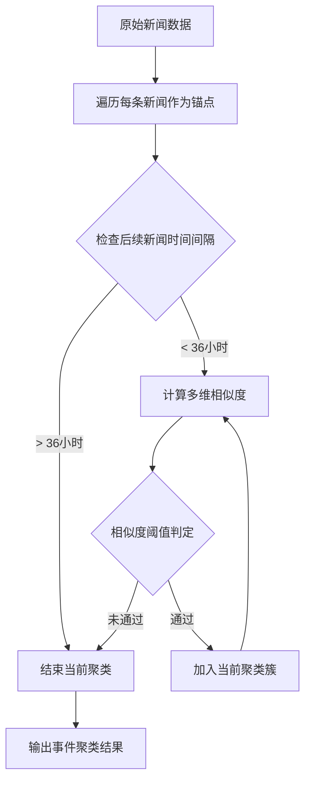
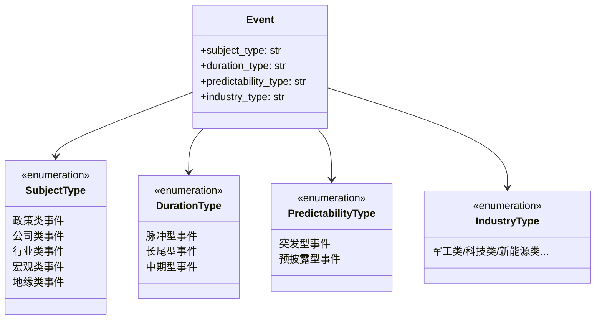
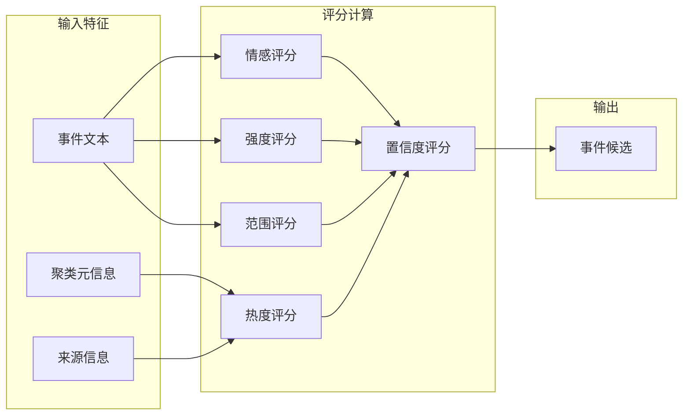

事件识别模块是量化事件驱动策略流水线中的**第一阶段核心组件**，负责将原始新闻数据转化为结构化事件候选集合。该模块在 [数据采集模块](13-shu-ju-cai-ji-mo-kuai) 之后执行，通过时间窗口聚类、多维度评分与分类体系标注，实现从噪音新闻到高质量事件候选的转化，为后续 [关联挖掘模块](15-guan-lian-wa-jue-mo-kuai) 提供输入。

## 核心函数接口

主入口函数 `run_event_identification()` 位于 `pipeline/task1_event_identify.py`，接受新闻数据框和可选的分类体系配置，返回标注了四维分类标签和综合评分的事件候选 DataFrame。

```python
def run_event_identification(
    news_df: pd.DataFrame, 
    event_taxonomy: dict[str, dict[str, list[str]]] | None = None
) -> pd.DataFrame
```

输入字段要求：`news_df` 必须包含 `title`、`content`、`published_at`、`source`、`source_name`、`entity_candidates`、`raw_id` 列。输出字段包括事件标识、四维分类标签、五项评分指标及聚类元信息。

Sources: [pipeline/task1_event_identify.py#L39-L56](pipeline/task1_event_identify.py#L39-L56)

## 新闻聚类算法

事件识别采用**时间窗口 + 多维相似度**的层次聚类策略，将语义相近且时间接近的新闻归并为同一事件。这一设计解决了信息源碎片化问题——同一事件可能在政策网站、行业媒体、社交平台产生多篇报道，单篇新闻无法完整表达事件全貌。



### 相似度判定机制

模块采用四重相似度判定，任一条件满足即归入同一事件聚类：

| 判定维度 | 阈值 | 设计意图 |
|---------|------|---------|
| 正文语义相似度 | ≥ 0.18 | 基于 token 重叠的 Jaccard 相似度 |
| 标题相似度 | ≥ 0.35 | 捕捉标题高度相似但正文差异较大的重复报道 |
| 共享关键词数 | ≥ 2 | 基于分类体系关键词的交集计数 |
| 共享实体数 | ≥ 1 | 基于预抽取股票实体的匹配 |

这种设计体现了**冗余容忍**原则——单一维度的高置信匹配或多个维度的弱匹配均能触发聚类，确保不遗漏跨来源的事件聚合。

Sources: [pipeline/task1_event_identify.py#L48-L65](pipeline/task1_event_identify.py#L48-L65)

### 时间窗口约束

聚类窗口设定为 36 小时（约 1.5 个交易日），这一边界设计基于以下考量：政策类事件通常在发布后 24 小时内集中报道，行业事件可能在 48 小时内持续发酵，而 36 小时作为折中值既能捕获事件爆发期的连续报道，又避免将无关事件错误归并。

```python
if abs((other_time - anchor_time).total_seconds()) > 36 * 3600:
    continue  # 超过窗口则不再检查后续新闻
```

Sources: [pipeline/task1_event_identify.py#L52-L53](pipeline/task1_event_identify.py#L52-L53)

## 四维分类体系

事件分类采用多标签标注策略，每个事件同时获得四个维度的类型标签。这些分类标签直接影响后续关联挖掘的权重配置和影响预测的基准参数。



分类采用**关键词命中计数法**——对每个分类维度，统计各类别关键词在事件文本中的命中总数，选择计数最高者作为该维度的分类标签。配置体系支持从 `config/config.yaml` 注入自定义关键词列表，实现分类能力的扩展。

Sources: [pipeline/task1_event_identify.py#L126-L145](pipeline/task1_event_identify.py#L126-L145)
Sources: [pipeline/models.py#L9-L48](pipeline/models.py#L9-L48)

### 分类维度详解

| 维度 | 类别数 | 典型关键词示例 | 业务意义 |
|------|--------|--------------|---------|
| subject_type | 5 | 政策/公司/行业/宏观/地缘 | 决定市场影响范围与传导路径 |
| duration_type | 3 | 脉冲/长尾/中期 | 影响事件研究窗口设计 |
| predictability_type | 2 | 突发/预披露 | 影响预测方法选择 |
| industry_type | 10 | 军工/科技/新能源/医药... | 决定关联股票池筛选范围 |

Sources: [config/config.yaml#L78-L150](config/config.yaml#L78-L150)

## 多维度评分机制

事件综合质量由五项独立评分指标加权构成，每项指标捕捉事件的不同侧面特征。



### 情感评分 (sentiment_score)

情感评分反映事件对市场的整体影响方向，采用正负面关键词命中差值法计算。

```python
POSITIVE_WORDS = ["加快", "超预期", "提升", "增长", "预增", "催化", "景气", "受益"]
NEGATIVE_WORDS = ["下滑", "亏损", "风险", "终止", "减值", "下跌", "承压"]

def compute_sentiment_score(text: str) -> float:
    positive_hits = sum(1 for word in POSITIVE_WORDS if normalize_text(word) in normalized)
    negative_hits = sum(1 for word in NEGATIVE_WORDS if normalize_text(word) in normalized)
    total = positive_hits + negative_hits
    if total == 0:
        return 0.1  # 中性偏正作为默认值
    return (positive_hits - negative_hits) / total  # 范围约 [-1, 1]
```

Sources: [pipeline/task1_event_identify.py#L10-L12](pipeline/task1_event_identify.py#L10-L12)
Sources: [pipeline/task1_event_identify.py#L147-L155](pipeline/task1_event_identify.py#L147-L155)

### 热度评分 (heat_score)

热度评分衡量事件的传播强度和时效性，由聚类规模、来源权重和新鲜度三项因子构成。

```python
def compute_heat_score(cluster_df: pd.DataFrame) -> float:
    source_score = cluster_df["source"].map(source_weight).mean()
    cluster_size = len(cluster_df)
    freshness_days = max(0.0, (cluster_df["published_at"].max() - cluster_df["published_at"].min()).total_seconds() / 86400)
    value = min(1.0, 0.18 * cluster_size + 0.55 * source_score + max(0.0, 0.2 - 0.03 * freshness_days))
```

来源权重体系预设值：政策类 1.0 > 公告类 0.95 > 行业类 0.85 > 宏观类 0.8 > qstock 0.75 > import 0.7。新鲜度因子随报道时间跨度递减，每增加一天热度衰减约 0.03。

Sources: [pipeline/task1_event_identify.py#L157-L165](pipeline/task1_event_identify.py#L157-L165)
Sources: [pipeline/utils.py#L11-L18](pipeline/utils.py#L11-L18)

### 强度评分 (intensity_score)

强度评分捕捉事件的冲击力度和官方属性。

```python
INTENSITY_WORDS = ["重大", "核心", "超预期", "显著", "快速", "重点", "加快", "强烈", "高景气"]

def compute_intensity_score(text: str, cluster_df: pd.DataFrame) -> float:
    keyword_hits = sum(1 for word in INTENSITY_WORDS if normalize_text(word) in normalized)
    official_bonus = 0.15 if any(source in {"policy", "announcement"} for source in cluster_df["source"]) else 0.0
    amount_bonus = 0.1 if any(token in text for token in ["订单", "利润", "净利润", "预增"]) else 0.0
    value = min(1.0, 0.25 + keyword_hits * 0.12 + official_bonus + amount_bonus)
```

强度评分基础值 0.25，官方来源额外 +0.15，金额关键词额外 +0.1，关键词命中按每次 +0.12 累计。

Sources: [pipeline/task1_event_identify.py#L14](pipeline/task1_event_identify.py#L14)
Sources: [pipeline/task1_event_identify.py#L167-L175](pipeline/task1_event_identify.py#L167-L175)

### 范围评分 (scope_score)

范围评分衡量事件的影响广度，包含股票提及数、分类体系和关键词覆盖度三个因子。

```python
def compute_scope_score(text: str, category_map: dict[str, str]) -> float:
    stock_mentions = len({token for token in STOCK_LIST if token in text})
    category_bonus = 0.18 if category_map["subject_type"] in {"政策类事件", "地缘类事件"} else 0.06
    breadth = len(set(extract_all_keywords(normalized)))
    value = min(1.0, 0.18 + stock_mentions * 0.08 + breadth * 0.05 + category_bonus)
```

政策类和地缘类事件因传导链条长，天然具备更广的影响范围，因此获得更高的分类加成。

Sources: [pipeline/task1_event_identify.py#L177-L185](pipeline/task1_event_identify.py#L177-L185)

### 置信度评分 (confidence_score)

置信度是最终输出的综合质量指标，通过 Logistic 变换将四维评分的加权组合映射至 (0, 1) 区间。

```python
raw = 0.3 * heat_score + 0.35 * intensity_score + 0.2 * scope_score + 0.15 * sentiment_abs
confidence_score = logistic(6 * (raw - 0.5))
```

权重分配体现了设计理念：**强度和热度是事件质量的决定性因子**（合计占 65%），范围和情感作为辅助校验。Logistic 变换的陡峭系数 6 确保评分的非线性区分度——中等质量事件（约 0.4-0.6 raw 值）会被显著压缩，高质量事件（约 0.7+ raw 值）获得接近 1 的置信度。

Sources: [pipeline/task1_event_identify.py#L78-L79](pipeline/task1_event_identify.py#L78-L79)
Sources: [pipeline/utils.py#L88-L91](pipeline/utils.py#L88-L91)

## 输出字段规范

| 字段名 | 类型 | 说明 |
|--------|------|------|
| event_id | string | 事件唯一标识，基于标题和时间戳生成 |
| event_name | string | 从聚类中选择的最具代表性标题（8-60字符，来源权重最高） |
| subject_type | string | 主体类型：政策/公司/行业/宏观/地缘 |
| duration_type | string | 持续类型：脉冲/长尾/中期 |
| predictability_type | string | 可预测类型：突发/预披露 |
| industry_type | string | 行业类型：军工/科技/新能源等 |
| sentiment_score | float | 情感方向，约 [-1, 1] |
| heat_score | float | 热度评分，[0, 1] |
| intensity_score | float | 强度评分，[0, 1] |
| scope_score | float | 范围评分，[0, 1] |
| confidence_score | float | 综合置信度，[0, 1] |
| cluster_size | int | 聚类内新闻条数 |
| cluster_member_ids | string | 逗号分隔的原始新闻ID列表 |
| raw_evidence | string | 前三条新闻标题的拼接，作为事件证据摘要 |

Sources: [pipeline/task1_event_identify.py#L80-L97](pipeline/task1_event_identify.py#L80-L97)

## 流水线集成

在完整流水线中，事件识别模块作为 `workflow.py` 的第二个阶段执行（紧接数据获取阶段），其输出直接影响后续三个模块：

```mermaid
flowchart LR
    subgraph fetch["数据获取阶段"]
        fetch_news[新闻数据]
    end
    
    subgraph identify["事件识别阶段"]
        run_identify[run_event_identification]
        event_df[event_df]
    end
    
    subgraph mining["关联挖掘阶段"]
        run_mining[run_relation_mining]
        relation_df[relation_df]
    end
    
    subgraph estimate["影响预测阶段"]
        run_estimate[run_impact_estimation]
        prediction_df[prediction_df]
    end
    
    subgraph strategy["策略构建阶段"]
        run_strategy[run_strategy_construction]
        final_picks[final_picks]
    end
    
    fetch --> run_identify
    run_identify --> event_df
    event_df --> run_mining
    run_mining --> relation_df
    relation_df --> run_estimate
    run_estimate --> prediction_df
    prediction_df --> run_strategy
    run_strategy --> final_picks
```



异常处理采用**降级策略**——若事件识别阶段失败，仍允许流水线继续执行，但后续阶段将基于空事件集运行，确保系统鲁棒性。

```python
try:
    event_df = run_event_identification(
        fetch_artifacts.news_df,
        event_taxonomy=config.event_taxonomy,
    )
except Exception as e:
    logger.exception("event_identify 阶段失败。")
    event_df = pd.DataFrame()  # 降级为空 DataFrame
```

Sources: [pipeline/workflow.py#L63-L71](pipeline/workflow.py#L63-L71)

## 配置注入机制

事件分类体系支持从 `config/config.yaml` 动态注入，提供了分类能力的可扩展性。

```python
def set_event_taxonomy(taxonomy: dict[str, dict[str, list[str]]] | None) -> None:
    global EVENT_TAXONOMY
    if taxonomy:
        EVENT_TAXONOMY = taxonomy
    else:
        EVENT_TAXONOMY = DEFAULT_EVENT_TAXONOMY
```

配置路径为 `event_taxonomy` 节点，包含四个分类维度及其对应的关键词列表。自定义配置将覆盖代码中定义的默认分类体系。

Sources: [pipeline/task1_event_identify.py#L17-L24](pipeline/task1_event_identify.py#L17-L24)
Sources: [config/config.yaml#L78-L280](config/config.yaml#L78-L280)

## 事件名称选择策略

事件名称选择直接影响下游分析的可读性和关联挖掘的准确性。模块采用优先级过滤策略：

1. **长度过滤**：排除 <8 或 >60 字符的标题（过短信息不足，过长可能截断）
2. **来源加权**：在候选标题中按来源权重累加得分
3. **回退机制**：若过滤后无有效候选，退回原始最高得分标题

```python
def choose_event_name(cluster_df: pd.DataFrame) -> str:
    title_scores: Counter[str] = Counter()
    for _, row in cluster_df.iterrows():
        score = 1.0 + source_weight(row["source"])
        title_scores[row["title"]] += score
    
    filtered_titles = [(title, score) for title, score in title_scores.items() 
                       if 8 <= len(title) <= 60]
    
    if filtered_titles:
        return max(filtered_titles, key=lambda x: x[1])[0]
    else:
        return title_scores.most_common(1)[0][0]
```

Sources: [pipeline/task1_event_identify.py#L187-L210](pipeline/task1_event_identify.py#L187-L210)

## 后续学习路径

完成本模块阅读后，建议按以下顺序深入：

- [关联挖掘模块](15-guan-lian-wa-jue-mo-kuai) — 了解如何基于识别出的事件匹配相关股票
- [影响预测模块](16-ying-xiang-yu-ce-mo-kuai) — 理解事件影响的量化预测方法
- [事件研究法原理](7-shi-jian-yan-jiu-fa-yuan-li) — 掌握 CAR 计算的理论基础
- [事件分类体系](5-shi-jian-fen-lei-ti-xi) — 深入分类体系的设计细节与扩展方法