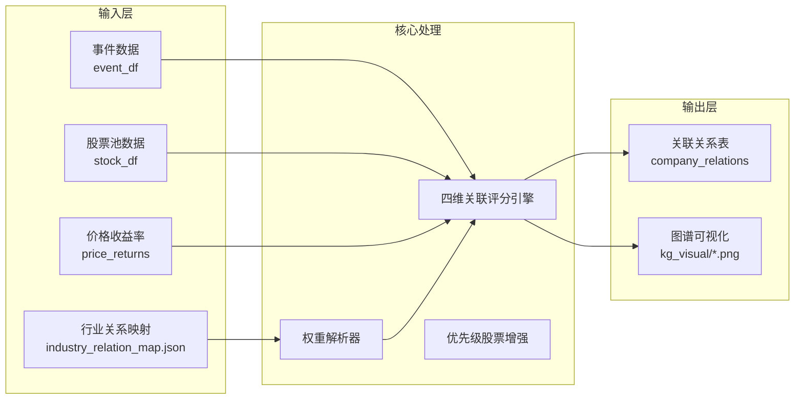
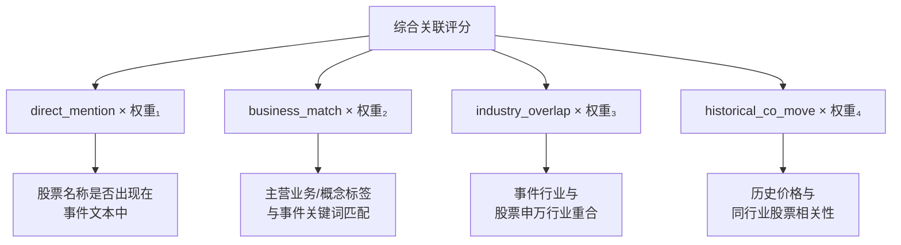
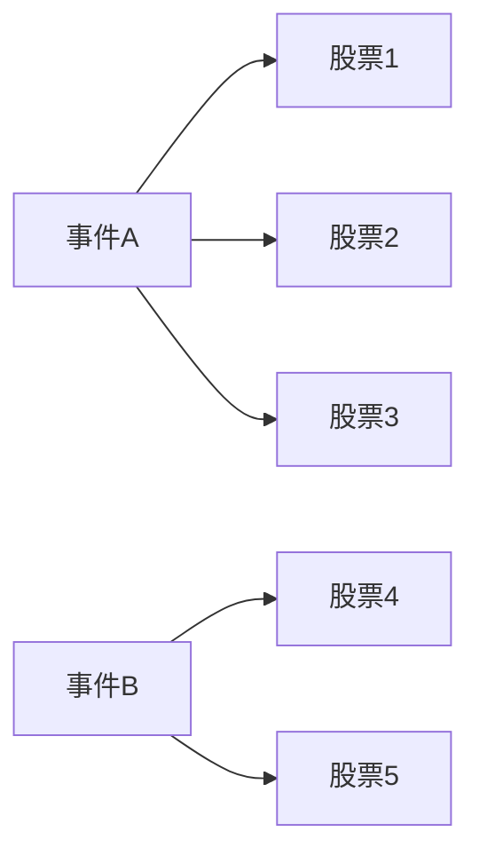

关联挖掘模块（`pipeline/task2_relation_mining.py`）是事件驱动量化策略流水线的第二阶段，负责将已识别的事件与股票池中的上市公司建立关联关系，计算关联强度评分，并生成可视化的产业链图谱。该模块实现了四维度的关联评分机制，结合配置驱动的权重体系和行业知识图谱，实现事件与股票之间的高质量关联映射。

## 架构设计

### 模块定位与数据流

关联挖掘模块在流水线中的位置至关重要——它接收来自[事件识别模块](14-shi-jian-shi-bie-mo-kuai)的事件数据，结合股票池信息和历史价格数据，输出结构化的关联关系表，供后续的[影响预测模块](16-ying-xiang-yu-ce-mo-kuai)和[策略构建模块](17-ce-lue-gou-jian-mo-kuai)使用。



模块的核心入口函数 `run_relation_mining` 定义了完整的数据处理流程。首先加载行业关系映射文件并计算价格收益率，然后遍历每个事件与股票池中的每只股票，计算四维度关联评分，最后筛选高置信度关联并生成可视化图谱。

Sources: [task2_relation_mining.py#L32-L117](pipeline/task2_relation_mining.py#L32-L117)

### 核心数据结构

关联关系表包含以下关键字段，用于记录事件与股票之间的关联细节：

| 字段名 | 类型 | 说明 |
|--------|------|------|
| `event_id` | string | 事件唯一标识符 |
| `event_name` | string | 事件名称 |
| `stock_code` | string | 股票代码（6位数字格式） |
| `stock_name` | string | 股票名称 |
| `relation_type` | string | 关系类型（如"产业链核心整机"） |
| `evidence_text` | string | 关系证据摘要 |
| `association_score` | float | 综合关联评分（0-1） |
| `relation_path` | string | 产业链传导路径描述 |
| `direct_mention` | float | 直接提及评分 |
| `business_match` | float | 业务匹配评分 |
| `industry_overlap` | float | 行业重合度评分 |
| `historical_co_move` | float | 历史同向波动评分 |

Sources: [task2_relation_mining.py#L94-L109](pipeline/task2_relation_mining.py#L94-L109)

## 四维关联评分机制

### 评分维度详解

关联评分采用加权求和的方式，综合考量四个独立维度的信号强度：



**直接提及评分（direct_mention）** 是最直接的信号，当事件文本中明确提及股票名称时得满分 1.0，否则为 0。系统首先对事件文本和股票名称进行文本规范化（去除空格、转为小写），然后进行匹配检测。

Sources: [task2_relation_mining.py#L60-L62](pipeline/task2_relation_mining.py#L60-L62)

**业务匹配评分（business_match）** 采用渐进式匹配策略，综合考虑股票的 `concept_tags`（概念标签）、`main_business`（主营业务）和 `industry`（行业）字段与事件文本的匹配程度。完全匹配（关键词完整出现在文本中）每个命中得 0.30 分，部分匹配（标签长度≥3时，其前2/3子串出现在文本中）每个命中得 0.15 分，总分上限为 1.0。

Sources: [task2_relation_mining.py#L150-L182](pipeline/task2_relation_mining.py#L150-L182)

**行业重合度评分（industry_overlap）** 采用双层匹配策略。基础层使用硬编码匹配规则，例如"科技"类事件匹配到"AI算力"、"半导体"、"芯片"等关键词时得 0.85 分，"军工"类事件匹配到"军工"、"导弹"、"航空"等关键词时得 0.90 分。增强层通过 `INDUSTRY_GROUP_MAP` 行业大类映射表，检查事件行业类型是否包含大类关键词（如"科技"、"军工"），同时股票的申万行业是否属于该大类下的细分行业列表。

Sources: [task2_relation_mining.py#L185-L230](pipeline/task2_relation_mining.py#L185-L230)

**历史同向波动评分（historical_co_move）** 衡量股票与同行业股票的历史价格相关性。系统提取目标股票的日收益率序列，计算其与同行业股票平均收益率的皮尔逊相关系数。如果共同交易日少于 20 天（数据不足）或相关系数计算失败，则返回默认值 0.5。最终将相关系数映射到 [0.3, 1.0] 区间。

Sources: [task2_relation_mining.py#L233-L293](pipeline/task2_relation_mining.py#L233-L293)

### 配置驱动的权重体系

权重解析器 `_resolve_association_weights` 实现了基于配置文件的动态权重调整机制。该函数接收基础权重配置和事件主体类型，返回经过类型倍率调整后的最终权重向量。

Sources: [task2_relation_mining.py#L120-L138](pipeline/task2_relation_mining.py#L120-L138)

默认权重配置如配置文件中所示，`direct_mention` 占 45%、`business_match` 占 25%、`industry_overlap` 占 20%、`historical_co_move` 占 10%。不同事件类型适用不同的权重配置，通过 `association_profiles` 字典定义倍率因子：

Sources: [config/config.yaml#L35-L71](config/config.yaml#L35-L71)

| 事件类型 | direct_mention倍率 | business_match倍率 | industry_overlap倍率 | historical_co_move倍率 |
|----------|-------------------|---------------------|---------------------|----------------------|
| 政策类事件 | 0.75 | 1.0 | **1.40** | 1.0 |
| 公司类事件 | **1.35** | 0.8 | 0.75 | 1.0 |
| 行业类事件 | 0.90 | **1.15** | 1.0 | 1.0 |
| 宏观类事件 | 0.70 | 0.80 | **1.35** | **1.30** |
| 地缘类事件 | 0.80 | 0.80 | **1.40** | 1.15 |

政策类事件和地缘类事件更强调行业属性，因为政策通常针对整个行业，而公司类事件则更看重直接提及。

## 行业关系映射体系

### 行业标签映射

`INDUSTRY_LABEL_MAP` 建立了事件识别阶段产生的 `industry_type` 字段与 `industry_relation_map.json` 中主题键的映射关系：

Sources: [task2_relation_mining.py#L17-L29](pipeline/task2_relation_mining.py#L17-L29)

```python
INDUSTRY_LABEL_MAP = {
    "军工类事件": "军工",
    "科技类事件": "科技",
    "新能源类事件": "新能源",
    "低空类事件": "低空经济",
    "消费类事件": "消费",
    "医药类事件": "医药",
    "金融类事件": "金融",
    "农业类事件": "农业",
    "地产类事件": "地产",
    "业绩类事件": "业绩",
}
```

### 行业关系映射文件结构

`industry_relation_map.json` 是模块的核心知识库，采用分层结构组织行业主题、产业链环节与上市公司的映射关系：

```json
{
  "军工": {
    "theme_name": "军工",
    "summary": "围绕军机整机、机载配套、导弹弹药和军工材料构建产业链传导路径。",
    "keywords": ["军工", "导弹", "战机", ...],
    "links": [
      {
        "link_name": "整机制造",
        "keywords": ["战机", "整机", ...],
        "template": "事件 -> 军工主题 -> 整机制造 -> 上市公司",
        "stocks": [
          {"stock_code": "600760", "stock_name": "中航沈飞", ...}
        ]
      }
    ],
    "stocks": [
      {"stock_code": "600760", "stock_name": "中航沈飞", ...}
    ]
  }
}
```

目前映射文件覆盖了军工、科技/算力、新能源、低空经济、消费、医药、金融、农业等多个行业主题，每个主题包含核心关键词、产业环节链接（`links`）和直连股票列表（`stocks`）。

Sources: [data/manual/industry_relation_map.json](data/manual/industry_relation_map.json#L1-L694)

### 优先级股票增强机制

当股票代码出现在行业关系映射的 `stocks` 列表中时，系统会对其关联评分进行增强。对于映射中的优先级股票，直接提及评分最低为 0.85，业务匹配评分最低为 0.75，行业重合度评分最低为 0.8，确保这些核心关联不会因评分阈值过滤而被遗漏。

Sources: [task2_relation_mining.py#L69-L72](pipeline/task2_relation_mining.py#L69-L72)

## 图谱可视化

### 单事件图谱生成

`render_relation_graphs` 函数为得分最高的两个典型事件生成事件-股票关联网络图。系统使用 NetworkX 构建无向图，以事件名称为根节点，关联股票为叶子节点，边权重对应关联评分。

Sources: [task2_relation_mining.py#L317-L363](pipeline/task2_relation_mining.py#L317-L363)

图谱渲染采用 Spring Layout 布局算法，事件节点使用红色（`#d1495b`），股票节点使用绿色（`#2d6a4f`），边的粗细与关联评分成正比。每个事件最多展示 8 只关联股票，确保图谱清晰可读。



图谱文件保存为高分辨率 PNG（180 DPI），存储在输出目录的 `kg_visual` 子文件夹中，文件名格式为 `{event_id}.png`。

### 证据文本构建

`build_evidence_text` 函数根据各维度评分生成可读的关系证据摘要。当直接提及评分≥0.8 时输出"新闻或证据文本直接提及该公司"；业务匹配评分≥0.35 时输出"主营业务与事件关键词存在明显匹配"；行业重合度评分≥0.8 时输出"行业属性与事件主线高度重合"。如果所有评分都较低，则输出"通过行业与概念映射获得弱关联"。

Sources: [task2_relation_mining.py#L296-L314](pipeline/task2_relation_mining.py#L296-L314)

## 流水线集成

### 在周度流水线中的调用

在[流水线设计](10-liu-shui-xian-she-ji)中，关联挖掘模块位于事件识别阶段之后，影响预测阶段之前。流水线以异常安全的容错方式调用该模块，即使发生异常也会生成空的关联表并记录日志，确保后续阶段能够继续执行。

Sources: [workflow.py#L81-L95](pipeline/workflow.py#L81-L95)

```python
relation_df, graph_paths = run_relation_mining(
    event_df=event_df,
    stock_df=fetch_artifacts.stock_df,
    price_df=fetch_artifacts.price_df,
    project_root=project_root,
    output_dir=output_dir,
    config=config,
)
```

### 数据依赖与输出

| 依赖项 | 来源 | 用途 |
|--------|------|------|
| `event_df` | [事件识别模块](14-shi-jian-shi-bie-mo-kuai) | 事件名称、行业类型、证据文本 |
| `stock_df` | 数据采集模块 | 股票代码、名称、行业、业务信息 |
| `price_df` | 数据采集模块 | 历史价格用于计算收益率 |
| `industry_relation_map.json` | 手动配置 | 产业链映射和优先级股票 |

关联关系表输出到 `outputs/{日期}/company_relations`，图谱文件输出到 `outputs/{日期}/kg_visual`。这些产物直接被[产业链增强模块](industry_chain_enhanced)消费，用于生成更复杂的产业传导路径图谱。

## 配置参考

### 关联评分配置示例

```yaml
scoring:
  association:
    direct_mention: 0.45      # 直接提及权重
    business_match: 0.25      # 业务匹配权重
    industry_overlap: 0.20   # 行业重合度权重
    historical_co_move: 0.10 # 历史同向波动权重
  association_profiles:
    default:
      direct_mention: 1.0
      business_match: 1.0
      industry_overlap: 1.0
      historical_co_move: 1.0
    政策类事件:
      direct_mention: 0.75
      business_match: 1.0
      industry_overlap: 1.40  # 行业关联更重要
      historical_co_move: 1.0
```

Sources: [config/config.yaml#L35-L71](config/config.yaml#L35-L71)

### 评分阈值配置

默认情况下，关联评分低于 0.2 的关联会被过滤，不纳入最终输出。这一阈值定义在 `run_relation_mining` 函数中，如果需要调整，可以修改源码中的阈值常量或将其提取为配置项。

Sources: [task2_relation_mining.py#L84-L85](pipeline/task2_relation_mining.py#L84-L85)

## 扩展指南

### 添加新的行业主题

在 `industry_relation_map.json` 中添加新的主题键，定义 `theme_name`、`summary`、`keywords`、`links` 和 `stocks` 字段。同时在 `INDUSTRY_LABEL_MAP` 中添加对应的映射关系。

### 扩展评分维度

如果需要引入新的评分维度（如舆情情绪、机构持仓变化等），可以参考现有维度的实现模式，在 `run_relation_mining` 函数中添加新的计算函数，并在权重解析器中注册新的权重键。

### 自定义关联类型

关联类型（如"产业链核心整机"、"无人机与机载配套"等）定义在 `industry_relation_map.json` 的股票条目中。如需新增关联类型，直接在 JSON 文件中添加新类型字符串即可，系统会自动将其传递到输出表中。

---

**相关模块**：[事件识别模块](14-shi-jian-shi-bie-mo-kuai) | [产业链增强模块](industry_chain_enhanced) | [影响预测模块](16-ying-xiang-yu-ce-mo-kuai)

**上游数据**：[事件分类体系](5-shi-jian-fen-lei-ti-xi) | [数据流与目录结构](11-shu-ju-liu-yu-mu-lu-jie-gou)