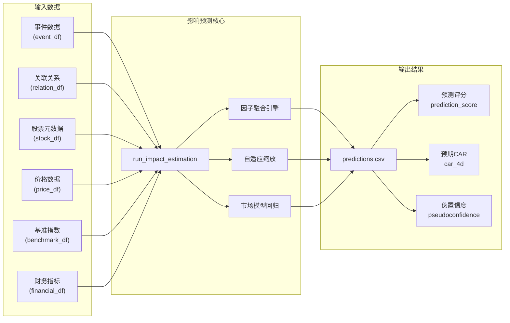

影响预测模块（Impact Estimation Module）是事件驱动量化策略流水线的第三阶段，核心职责是将已识别的事件-股票关联关系转化为可量化的价格影响预测。该模块基于简化的事件研究法框架，通过市场模型回归、因子融合和自适应缩放机制，输出每个事件-股票组合的预期累计异常收益率（Expected CAR）及相关评分指标。

## 核心架构

影响预测模块在流水线中的定位如下：从 [关联挖掘模块](15-guan-lian-wa-jue-mo-kuai) 获取事件-股票关联关系，结合价格数据、市场基准和财务指标，输出预测结果供下游 [策略构建模块](17-ce-lue-gou-jian-mo-kuai) 使用。



## 主要函数接口

### `run_impact_estimation()`

主入口函数，负责协调整个预测流程。该函数接收六类输入数据，执行数据合并、市场模型估计、因子融合计算，最终输出预测结果 DataFrame。

```python
def run_impact_estimation(
    event_df: pd.DataFrame,
    relation_df: pd.DataFrame,
    stock_df: pd.DataFrame,
    price_df: pd.DataFrame,
    benchmark_df: pd.DataFrame,
    trading_calendar: list[date],
    financial_df: pd.DataFrame,
    output_dir,
    config: AppConfig,
) -> pd.DataFrame:
```

**参数说明**：

| 参数 | 类型 | 说明 |
|------|------|------|
| `event_df` | DataFrame | 事件数据，需包含 event_id、sentiment_score、heat_score、intensity_score 等评分字段 |
| `relation_df` | DataFrame | 事件-股票关联关系，需包含 event_id、stock_code、association_score |
| `stock_df` | DataFrame | 股票元数据，需包含 stock_code、stock_name、industry、avg_turnover_million |
| `price_df` | DataFrame | 股票日线价格数据，需包含 stock_code、trade_date、close |
| `benchmark_df` | DataFrame | 基准指数日线数据，需包含 stock_code、trade_date、close |
| `trading_calendar` | list[date] | 交易日历 |
| `financial_df` | DataFrame | 财务指标数据，可选，包含 pe、pb、roe、net_profit_growth 等 |
| `output_dir` | Path | 预测结果输出目录 |
| `config` | AppConfig | 应用配置对象 |

**返回值**：包含预测结果的 DataFrame，按 prediction_score 降序排列。

Sources: [task3_impact_estimate.py](pipeline/task3_impact_estimate.py#L13-L208)

## 预测结果数据结构

预测结果 DataFrame 包含以下核心字段：

| 字段名 | 类型 | 说明 |
|--------|------|------|
| `event_id` | str | 事件唯一标识 |
| `event_name` | str | 事件名称 |
| `stock_code` | str | 股票代码（6位数字） |
| `stock_name` | str | 股票名称 |
| `subject_type` | str | 事件主体类型 |
| `relation_type` | str | 关联类型 |
| `association_score` | float | 关联度评分（0-1） |
| `anchor_trade_date` | str | 锚点交易日（ISO格式） |
| `ar_1d` | float | 1日预期异常收益率 |
| `car_2d` | float | 2日预期累计异常收益率 |
| `car_4d` | float | 4日预期累计异常收益率（核心指标） |
| `direction` | str | 影响方向（正向/负向） |
| `prediction_score` | float | 综合预测评分 |
| `event_score` | float | 事件综合评分 |
| `fundamental_score` | float | 基本面评分（0-1） |
| `liquidity_score` | float | 流动性评分（0-1） |
| `risk_penalty` | float | 风险惩罚因子 |
| `pseudoconfidence` | float | 伪置信度（0-1） |
| `logic_chain` | str | 可解释逻辑链文本 |
| `beta` | float | 市场模型 Beta 系数 |
| `residual_volatility` | float | 残差波动率 |

Sources: [task3_impact_estimate.py](pipeline/task3_impact_estimate.py#L174-L198)

## Expected CAR 计算模型

预期 4 日累计异常收益率（Expected CAR）是模块的核心输出，其计算采用多因子融合模型。

### 计算公式

```python
expected_car_4d = (
    sentiment_direction          # 情绪方向：+1 或 -1
    × event_score                # 事件综合评分（加权融合）
    × association_score          # 关联度评分
    × subject_multiplier          # 主体偏置因子
    × (0.55 + market_state)       # 市场状态调节
    × max(0.15, 1 - residual_risk)  # 残差风险调节
    × (1 + fundamental_score × 0.15)  # 基本面增强
    × adaptive_scale              # 自适应缩放因子
)
```

### 各因子详解

**情绪方向（sentiment_direction）**：根据事件情感评分确定，负值事件乘以 -1，反转预期方向。

**事件综合评分（event_score）**：由四个事件特征加权融合：

```python
event_score = 0.30 × heat_score    # 热度评分
             + 0.35 × intensity_score  # 强度评分
             + 0.20 × scope_score      # 范围评分
             + 0.15 × confidence_score # 置信度评分
```

**主体偏置因子（subject_multiplier）**：不同事件主体类型对市场的影响力度不同，配置于 `config.yaml` 的 `scoring.subject_bias` 节点：

| 事件主体类型 | 偏置因子 | 说明 |
|-------------|---------|------|
| 地缘类事件 | 1.15 | 影响广泛且不确定性高 |
| 公司类事件 | 1.12 | 直接影响公司基本面 |
| 政策类事件 | 1.08 | 传导路径明确 |
| 行业类事件 | 1.00 | 基准水平 |
| 宏观类事件 | 0.92 | 已被市场部分预期 |

**市场状态（market_state）**：基于基准指数近10日收益率均值计算，范围 [0.1, 0.9]，反映当前市场整体趋势。

**自适应缩放因子（adaptive_scale）**：根据历史 CAR 波动率动态调整，公式为：

```python
adaptive_scale = min(0.25, max(0.10, historical_car_std × 2.5))
```

该机制确保预测结果与市场实际波动水平相匹配，避免在低波动环境下过度预测，或在高波动环境下预测不足。

Sources: [task3_impact_estimate.py](pipeline/task3_impact_estimate.py#L94-L137), [config/config.yaml](config/config.yaml#L78-L83)

## 市场模型回归

模块使用单因子市场模型估计个股与基准指数的关系，为后续计算异常收益率提供基准。

### 估计窗口

- **估计起点**：事件日前第 60 个交易日
- **估计终点**：事件日前第 6 个交易日
- **最少数据点**：15 个交易日（否则返回默认参数）

```python
estimation_end = event_date + timedelta(days=-6)
estimation_start = event_date + timedelta(days=-60)
```

### 回归实现

使用 NumPy 的 `polyfit()` 进行简单线性回归：

```python
R_stock = α + β × R_benchmark + ε
Expected_Return = α + β × R_benchmark
```

残差波动率（Annualized）计算：

```python
residual_volatility = np.clip(np.std(residual) × √252, 0.02, 0.80)
```

Sources: [task3_impact_estimate.py](pipeline/task3_impact_estimate.py#L251-L279)

## 基本面评分体系

基本面评分基于财务指标标准化计算，用于调节基本面优质公司的预测幅度。

### 评分因子权重

```python
fundamental_score = 0.30 × pe_score     # 市盈率评分
                  + 0.25 × pb_score     # 市净率评分
                  + 0.25 × roe_score    # 净资产收益率评分
                  + 0.20 × growth_score # 净利润增长率评分
```

### 指标归一化逻辑

| 指标 | 优质区间 | 劣质阈值 | 归一化方法 |
|------|---------|---------|-----------|
| PE | 10-30 | >150 或亏损 | 分段线性映射 |
| PB | 2-4 | >8 | 分段线性映射 |
| ROE | ≥15% | ≤5% | 线性插值 |
| 净利润增长率 | ≥30% | ≤-30% | 线性插值 |

Sources: [task3_impact_estimate.py](pipeline/task3_impact_estimate.py#L301-L434)

## 锚点交易日确定

事件发布时间决定其价格影响的起始点，模块采用以下规则：

- **收盘前发布**：锚定当日交易日
- **收盘后发布或非交易日发布**：顺延至下一交易日

```python
def resolve_event_anchor_trade_date(
    calendar: list[date],
    published_at: datetime,
    market_close_time: time,  # 默认 15:00:00
) -> date | None:
```

Sources: [pipeline/utils.py](pipeline/utils.py#L97-L110), [tests/test_impact_estimate.py](tests/test_impact_estimate.py#L16-L123)

## 综合评分公式

除 Expected CAR 外，模块还输出综合预测评分（prediction_score），用于排序和筛选：

```python
prediction_score = (
    0.40 × expected_car_4d       # 预期CAR权重
  + 0.25 × association_score     # 关联度权重
  + 0.20 × event_score           # 事件评分权重
  + 0.10 × liquidity_score       # 流动性权重
  - 0.05 × risk_penalty          # 风险惩罚（负权重）
)
```

**流动性评分（liquidity_score）**：基于日均成交额计算：

```python
liquidity_score = min(1.0, avg_turnover_million / 600)
```

**风险惩罚（risk_penalty）**：

```python
risk_penalty = residual_risk × 0.6 + max(0.0, 0.2 - market_state)
```

Sources: [task3_impact_estimate.py](pipeline/task3_impact_estimate.py#L138-L165), [config/config.yaml](config/config.yaml#L72-L77)

## 伪置信度机制

伪置信度（pseudoconfidence）是一个综合可信度指标，融合多维度信息：

```python
pseudoconfidence = min(0.99, 
    0.20                                        # 基准置信度
  + 0.25 × confidence_score                     # 事件置信度
  + 0.20 × association_score                    # 关联置信度
  + 0.20 × liquidity_score                      # 流动性置信度
  + 0.15 × data_sufficiency                     # 数据充分性
  + 0.10 × max(0.0, 1 - residual_risk)           # 风险调整
)
```

Sources: [task3_impact_estimate.py](pipeline/task3_impact_estimate.py#L140-L151)

## 可解释逻辑链

每个预测结果附带结构化逻辑链文本，便于理解预测依据：

```python
logic_chain = (
    f"事件「{event_name}」(热度{heat_score:.2f}, 强度{intensity_score:.2f}) → "
    f"关联「{stock_name}」(关联度{association_score:.2f}) → "
    f"预期CAR {expected_car_4d:+.2%} → "
    f"综合评分 {prediction_score:.3f}"
)
```

Sources: [task3_impact_estimate.py](pipeline/task3_impact_estimate.py#L167-L172)

## 配置体系

影响预测模块的权重和偏置参数集中管理于 `config/config.yaml`：

```yaml
scoring:
  prediction:
    expected_car_4d: 0.40     # 预期CAR权重
    association_score: 0.25   # 关联度权重
    event_score: 0.20         # 事件评分权重
    liquidity_score: 0.10     # 流动性权重
    risk_penalty: 0.05         # 风险惩罚系数
  subject_bias:               # 主体偏置因子
    政策类事件: 1.08
    公司类事件: 1.12
    行业类事件: 1.0
    宏观类事件: 0.92
    地缘类事件: 1.15
```

Sources: [config/config.yaml](config/config.yaml#L35-L83)

## 单元测试覆盖

模块包含锚点交易日确定的测试用例，验证收盘后发布事件的处理逻辑：

```python
def test_after_close_prediction_uses_next_trade_date_anchor(self):
    # 15:01 发布的事件应锚定下一交易日
    event_df = pd.DataFrame([{
        "published_at": "2026-04-20 15:01:00",
        ...
    }])
    prediction_df = run_impact_estimation(...)
    self.assertEqual(prediction_df.iloc[0]["anchor_trade_date"], "2026-04-21")
```

Sources: [tests/test_impact_estimate.py](tests/test_impact_estimate.py#L16-L123)

## 与下游模块的衔接

预测结果输出至 `output_dir/predictions/` 目录，供策略构建模块使用：

```python
# pipeline/workflow.py
prediction_df = run_impact_estimation(...)
# prediction_df 传递给 task4_strategy.py 构建仓位
```

策略模块基于 `prediction_score` 排序筛选，并结合 `direction`、`pseudoconfidence` 等字段进行风控过滤。

Sources: [pipeline/workflow.py](pipeline/workflow.py#L131-L145)

## 扩展阅读

- [事件研究法原理](7-shi-jian-yan-jiu-fa-yuan-li)：深入理解 AR/CAR 计算的理论基础
- [预期CAR计算](9-yu-qi-carji-suan)：CAR 在策略中的具体应用方式
- [策略构建模块](17-ce-lue-gou-jian-mo-kuai)：预测结果如何转化为实际交易信号