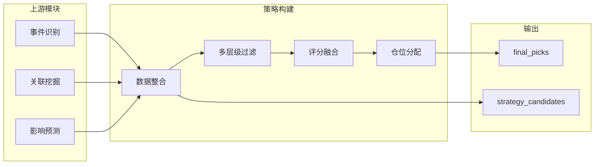

策略构建模块是事件驱动量化交易系统的核心决策引擎，位于 [pipeline/task4_strategy.py](pipeline/task4_strategy.py#L33-L146) 中的 `run_strategy_construction()` 函数。该模块接收上游模块（事件识别、关联挖掘、影响预测）的输出，通过多层级过滤、评分融合与仓位分配算法，生成最终投资决策。

## 模块定位与数据流

策略构建模块在周度流水线中处于最后一环，其上游输入来自三个关键模块的产物：

| 上游模块 | 输出数据 | 用途 |
|---------|---------|------|
| [事件识别模块](14-shi-jian-shi-bie-mo-kuai) | event_df（事件列表） | 构建选股理由文本 |
| [关联挖掘模块](15-guan-lian-wa-jue-mo-kuai) | relation_df（关联关系） | 关联度与置信度信息 |
| [影响预测模块](16-ying-xiang-yu-ce-mo-kuai) | prediction_df（预测结果） | 核心评分与预期CAR |



## 核心数据结构

### 预测数据框（prediction_df）

影响预测模块输出的 prediction_df 包含策略构建所需的核心字段，定义于 [pipeline/task3_impact_estimate.py](pipeline/task3_impact_estimate.py#L174-L198)：

```python
{
    "event_id": str,           # 事件唯一标识
    "event_name": str,         # 事件名称
    "stock_code": str,         # 股票代码（6位）
    "stock_name": str,         # 股票名称
    "subject_type": str,       # 事件主体类型
    "association_score": float, # 关联度评分
    "prediction_score": float,  # 综合预测评分
    "pseudoconfidence": float, # 伪置信度
    "risk_penalty": float,      # 风险惩罚项
    "liquidity_score": float,   # 流动性评分
}
```

### 配置参数体系

策略相关配置集中于 [config/config.yaml](config/config.yaml#L26-L33) 的 `strategy` 段落，通过 [AppConfig](pipeline/models.py#L52-L131) 类以属性方式暴露：

| 配置项 | 类型 | 默认值 | 说明 |
|-------|------|-------|------|
| `max_positions` | int | 3 | 最大持仓数量 |
| `single_position_max` | float | 0.5 | 单只股票最大仓位比例 |
| `single_position_min` | float | 0.2 | 单只股票最小仓位比例 |
| `min_listing_days` | int | 60 | 最小上市天数 |
| `min_avg_turnover_million` | float | 80 | 最小日均成交额（万元） |
| `positive_score_threshold` | float | 0.02 | 正向筛选阈值 |
| `min_prediction_score_threshold` | float | -0.01 | 空仓保护阈值 |

## 执行流程解析

### 1. 数据整合阶段

`run_strategy_construction()` 函数首先执行多源数据合并，将预测结果与股票基础信息、财务数据整合：

```python
merged = prediction_meta.merge(
    stock_meta[["stock_code", "stock_name", "listed_date", "is_st", "avg_turnover_million"]],
    on=["stock_code", "stock_name"],
    how="left",
)
```

来源：[pipeline/task4_strategy.py](pipeline/task4_strategy.py#L51-L56)

### 2. 多层级过滤机制

策略采用三级过滤体系，依次排除不符合条件的标的：

#### 第一层：基础过滤

`pass_basic_filter()` 函数实施基础条件筛选，定义于 [pipeline/task4_strategy.py#L149-L158](pipeline/task4_strategy.py#L149-L158)：

| 过滤条件 | 配置项 | 逻辑 |
|---------|-------|------|
| ST标识 | — | 排除所有ST/*ST股票 |
| 流动性 | `min_avg_turnover_million` | 日均成交额需高于阈值 |
| 上市时长 | `min_listing_days` | 上市天数需达到阈值 |

```python
def pass_basic_filter(row: pd.Series, config: AppConfig) -> bool:
    if bool(row["is_st"]):
        return False
    if float(row["avg_turnover_million"]) < config.min_avg_turnover_million:
        return False
    if int(row["listing_days"]) < config.min_listing_days:
        return False
    return True
```

#### 第二层：基本面过滤

`pass_fundamental_filter()` 函数应用基本面约束，定义于 [pipeline/task4_strategy.py#L161-L191](pipeline/task4_strategy.py#L161-L191)：

| 指标 | 约束条件 | 说明 |
|-----|---------|------|
| PE | 0 ≤ PE ≤ 100 | 市盈率需在合理区间 |
| ROE | ROE ≥ 5% | 净资产收益率需为正 |
| 净利润增长 | ≥ -20% | 允许短期下滑但有限度 |

#### 第三层：交易可行性过滤

`is_tradeable()` 函数检查股票是否满足交易时间窗口约束，定义于 [pipeline/task4_strategy.py#L194-L223](pipeline/task4_strategy.py#L194-L223)：

```python
def is_tradeable(stock_code: str, asof_date: date, trading_calendar: list[date], 
                 suspend_resume_df: pd.DataFrame) -> bool:
    normalized_code = normalize_stock_code(stock_code)
    buy_date = next_trading_date(trading_calendar, asof_date, target_weekday=1)  # 周二
    sell_date = week_last_trading_date(trading_calendar, asof_date)  # 周五
    # 检查停牌状态...
```

核心交易日确定逻辑：
- **买入日**：`next_trading_date()` 返回目标周第一个交易日（周二）
- **卖出日**：`week_last_trading_date()` 返回本周最后一个交易日（周五）

### 3. 评分融合机制

通过动量因子与预测评分的加权融合生成最终得分，定义于 [pipeline/task4_strategy.py#L87-L98](pipeline/task4_strategy.py#L87-L98)：

```python
# 计算5日动量因子
tradable["momentum_5d"] = tradable.apply(
    lambda row: _compute_momentum(row["stock_code"], price_df, asof_date, n_days=5),
    axis=1,
)

# 动量得分使用logistic归一化映射
tradable["momentum_score"] = tradable["momentum_5d"].apply(
    lambda x: logistic(x * 10) if x != 0 else 0.5)

# 最终得分：85% 预测评分 + 15% 动量评分
tradable["final_score"] = 0.85 * tradable["prediction_score"] + \
    0.15 * tradable["momentum_score"]
```

动量因子计算逻辑（[pipeline/task4_strategy.py#L17-L30](pipeline/task4_strategy.py#L17-L30)）：

```python
def _compute_momentum(stock_code: str, price_df: pd.DataFrame, asof_date, n_days: int = 5) -> float:
    stock_prices = price_meta[price_meta["stock_code"] == normalized_code].sort_values('trade_date')
    stock_prices = stock_prices[stock_prices['trade_date'] <= str(asof_date)]
    if len(stock_prices) < n_days + 1:
        return 0.0
    recent = stock_prices.tail(n_days + 1)
    return (recent['close'].iloc[-1] / recent['close'].iloc[0]) - 1
```

### 4. 仓位分配算法

`allocate_positions()` 函数实现带约束的最优仓位分配，定义于 [pipeline/task4_strategy.py#L278-L324](pipeline/task4_strategy.py#L278-L324)：

#### 4.1 初始权重计算

```python
# 基于最终得分的比例分配
scores = picks["final_score"].clip(lower=0.0001)
picks["capital_ratio"] = scores / scores.sum()
```

#### 4.2 领先优势加成

当最高分标的与第二名差距显著时（超过1.5倍），给予额外5%权重加成：

```python
if sorted_scores.iloc[0] > sorted_scores.iloc[1] * 1.5:
    # 从其他标的扣除 5%，加到最高分
    picks.loc[top_idx, "capital_ratio"] += 0.05
```

#### 4.3 约束边界处理

`_allocate_constrained_weights()` 函数实现带上下限的权重约束分配，定义于 [pipeline/task4_strategy.py#L327-L381](pipeline/task4_strategy.py#L327-L381)：

```python
def _allocate_constrained_weights(raw_weights: list[float], 
                                  floor: float, cap: float) -> list[float]:
    # 1. 初始化：将低于下限的设为下限，高于上限的设为上限
    # 2. 迭代重分配：循环处理仍需调整的权重
    # 3. 残差分配：将剩余权重按比例分配给未解决项
```

#### 4.4 最大余数法舍入

`_round_weights_largest_remainder()` 函数确保权重和精确等于1.0，定义于 [pipeline/task4_strategy.py#L384-L429](pipeline/task4_strategy.py#L384-L429)：

```python
def _round_weights_largest_remainder(weights: list[float], digits: int,
                                     floor: float, cap: float) -> list[float]:
    scale = 10 ** digits
    exact_units = [weight * scale for weight in weights]
    rounded_units = [int(math.floor(unit + 1e-12)) for unit in exact_units]
    # 按余数大小优先分配剩余单位
```

### 5. 兜底与空仓保护机制

#### 5.1 兜底池构建

当没有标的达到正分阈值时，触发 `build_fallback_pool()` 函数，定义于 [pipeline/task4_strategy.py#L256-L275](pipeline/task4_strategy.py#L256-L275)：

```python
def build_fallback_pool(tradable: pd.DataFrame, config: AppConfig) -> pd.DataFrame:
    fallback["stability_score"] = (
        0.40 * fallback["liquidity_norm"]      # 流动性权重
        + 0.35 * fallback["pseudoconfidence"]   # 置信度权重
        + 0.25 * (1 - fallback["risk_penalty"]) # 风险惩罚权重
    )
```

#### 5.2 空仓保护

当所有候选标的预期收益均为负时，触发空仓保护，定义于 [pipeline/task4_strategy.py#L114-L122](pipeline/task4_strategy.py#L114-L122)：

```python
if final_picks["prediction_score"].max() < config.min_prediction_score_threshold:
    logger.info("所有候选标的预期收益均低于阈值 %.4f，触发本周空仓。", 
                 min_score_threshold)
    final_picks = final_picks.iloc[0:0]  # 清空但保留列结构
```

## 输出产物

### 候选股票列表

`strategy_candidates.csv`：通过所有过滤条件的完整候选股票池，包含字段：

| 字段名 | 说明 |
|-------|------|
| stock_code | 股票代码 |
| stock_name | 股票名称 |
| event_name | 关联事件 |
| prediction_score | 预测评分 |
| momentum_5d | 5日动量 |
| final_score | 最终得分 |
| passes_filter | 是否通过过滤 |

### 最终持仓

`final_picks.csv`：最终执行决策，包含字段：

| 字段名 | 说明 |
|-------|------|
| rank | 排名 |
| event_name | 关联事件 |
| stock_code | 股票代码 |
| stock_name | 股票名称 |
| capital_ratio | 仓位比例 |
| prediction_score | 预测评分 |
| reason | 选股理由 |

## 与回测模块的集成

[回测模块](19-li-shi-hui-ce) `pipeline/backtest.py` 读取策略输出的 `final_picks`，按周度周期模拟交易：

```python
for _, pick in artifacts.final_picks.iterrows():
    buy_price = float(buy_row.iloc[0]["open"])   # 周二开盘买入
    sell_price = float(sell_row.iloc[0]["close"]) # 周五收盘卖出
    # 佣金0.1% + 滑点0.05%
    total_cost = 0.001 * 2 + 0.0005 * 2
    trade_return = (sell_price / buy_price) - 1 - total_cost
```

来源：[pipeline/backtest.py](pipeline/backtest.py#L71-L91)

## 测试覆盖

[测试模块](tests/test_strategy.py) 覆盖策略核心规则：

| 测试用例 | 验证内容 |
|---------|---------|
| `test_next_trading_date_can_fall_on_friday` | 交易日跨越周末的正确处理 |
| `test_open_interval_suspend_is_not_tradeable` | 停牌状态判断 |
| `test_week_last_trading_date_uses_last_open_day` | 周内最后交易日确定 |
| `test_allocate_positions_respects_bounds_and_sum` | 仓位分配的上下限约束与求和验证 |

## 配置示例

```yaml
strategy:
  max_positions: 3                    # 最多持仓3只
  single_position_max: 0.5              # 单只最大50%
  single_position_min: 0.2              # 单只最小20%
  min_listing_days: 60                 # 上市至少60天
  min_avg_turnover_million: 80         # 日均成交额≥80万
  positive_score_threshold: 0.02       # 正向筛选阈值
  min_prediction_score_threshold: -0.01 # 空仓保护阈值
```

---

**延伸阅读**：
- 预测评分计算逻辑：[影响预测模块](16-ying-xiang-yu-ce-mo-kuai)
- 关联度评分机制：[关联评分机制](6-guan-lian-ping-fen-ji-zhi)
- 回测执行规则：[历史回测](19-li-shi-hui-ce)