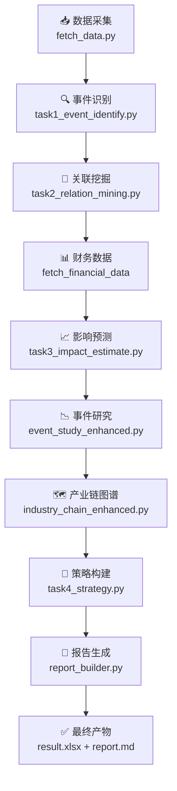
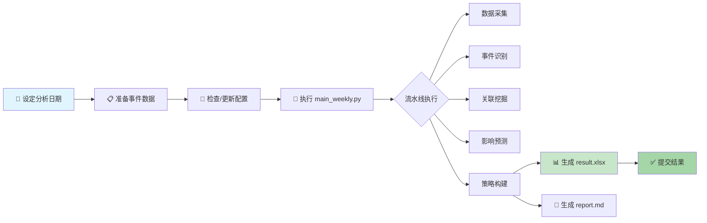

本页面介绍如何使用本项目执行**周度实测运行**，完成从事件识别到投资决策的全流程分析，并生成符合竞赛要求的提交文件 `result.xlsx`。

---

## 快速开始

执行周度运行仅需一个命令，核心参数为分析基准日 `--asof`：

```bash
# 激活虚拟环境并设置数据令牌
source .venv/bin/activate
export TUSHARE_TOKEN=你的_TOKEN

# 执行周度运行（例如分析 2026-04-20 的事件并给出决策）
python main_weekly.py --asof 2026-04-20
```

运行完成后，系统会在 `outputs/weekly/2026-04-20/` 目录下生成完整的分析产物，包括策略报告和提交文件。

Sources: [main_weekly.py](main_weekly.py#L1-L54)

---

## 命令行参数说明

| 参数 | 必需 | 说明 | 示例 |
|------|------|------|------|
| `--asof` | 是 | 分析基准日，格式为 `YYYY-MM-DD` | `--asof 2026-04-20` |
| `--config` | 否 | 自定义配置文件路径，默认为 `config/config.yaml` | `--config my_config.yaml` |

```bash
# 使用自定义配置运行
python main_weekly.py --asof 2026-04-20 --config config/custom.yaml
```

Sources: [main_weekly.py](main_weekly.py#L39-L45)

---

## 流水线架构总览

周度运行通过 `run_weekly_pipeline()` 函数编排一个**八阶段顺序流水线**，每个阶段产出特定数据并传递给下一阶段：



### 流水线阶段详解

| 阶段 | 模块 | 核心输入 | 核心输出 |
|------|------|----------|----------|
| 1. 数据采集 | `fetch_data.py` | Tushare API | 新闻、价格、基准、交易日历 |
| 2. 事件识别 | `task1_event_identify.py` | 新闻数据 | 事件候选列表（含分类） |
| 3. 关联挖掘 | `task2_relation_mining.py` | 事件、股票、价格 | 事件-股票关联关系 |
| 4. 财务数据 | `fetch_financial_data` | 关联股票代码 | 财务数据、停复牌信息 |
| 5. 影响预测 | `task3_impact_estimate.py` | 关联关系、价格 | 预测评分与 CAR |
| 6. 事件研究 | `event_study_enhanced.py` | 事件、价格、基准 | CAR 统计与可视化 |
| 7. 产业链图谱 | `industry_chain_enhanced.py` | 事件、关联、股票 | 产业链增强图谱 |
| 8. 策略构建 | `task4_strategy.py` | 预测结果、财务 | 最终持仓与资金比例 |
| 9. 报告生成 | `report_builder.py` | 所有中间产物 | 周报 Markdown |

Sources: [pipeline/workflow.py](pipeline/workflow.py#L42-L195)

---

## 目录结构与产物

运行完成后，系统在 `outputs/weekly/{日期}/` 目录下组织所有产物：

```
outputs/weekly/2026-04-20/
├── final_picks.csv          # 最终选股结果
├── result.xlsx              # ⭐ 竞赛提交文件
├── report.md                # 周度策略报告
├── event_candidates.csv     # 识别的事件候选
├── event_study/             # 事件研究结果
│   ├── event_study_detail.csv
│   ├── event_study_stats.csv
│   ├── joint_mean_car.csv
│   └── joint_mean_car.png
├── kg_visual/               # 产业链图谱
│   ├── industry_chain_graph.png
│   ├── industry_chain_graph.html
│   └── summary.md
└── relation_graphs/         # 关联关系图谱文件
    └── *.png / *.html
```

Sources: [pipeline/workflow.py](pipeline/workflow.py#L42-L62)

---

## 配置体系

### 环境变量配置

Tushare 令牌可通过环境变量注入：

```bash
export TUSHARE_TOKEN=你的_TOKEN
```

系统在 `config/config.yaml` 中定义了 `token_env: TUSHARE_TOKEN`，运行时自动读取环境变量。

Sources: [pipeline/settings.py](pipeline/settings.py#L1-L33)

### 核心配置项

| 配置分类 | 键名 | 默认值 | 说明 |
|----------|------|--------|------|
| **项目** | `initial_capital` | 100000 | 初始资金 |
| **数据** | `lookback_days` | 14 | 回溯天数 |
| **数据** | `benchmark_code` | 000300.SH | 基准指数 |
| **数据** | `trading_calendar_source` | tushare | 交易日历来源 |
| **策略** | `max_positions` | 3 | 最大持仓数 |
| **策略** | `single_position_max` | 0.5 | 单只最大仓位比例 |
| **策略** | `single_position_min` | 0.2 | 单只最小仓位比例 |
| **策略** | `min_listing_days` | 60 | 最短上市天数 |
| **策略** | `min_avg_turnover_million` | 80 | 最小日均成交额（万元） |

Sources: [pipeline/models.py](pipeline/models.py#L70-L130), [config/config.yaml](config/config.yaml#L1-L50)

### 关联权重配置

关联评分通过四维指标加权计算，支持按事件主体类型动态调整：

```yaml
scoring:
  association:
    direct_mention: 0.45      # 直接提及
    business_match: 0.25       # 业务匹配
    industry_overlap: 0.20    # 行业重叠
    historical_co_move: 0.10   # 历史共振
  association_profiles:
    政策类事件:
      direct_mention: 0.75
      industry_overlap: 1.4
    地缘类事件:
      industry_overlap: 1.4
```

Sources: [config/config.yaml](config/config.yaml#L51-L70)

---

## 异常容错机制

流水线各阶段具备**优雅降级**能力——单个阶段失败不会导致整个流程中断：

| 阶段 | 失败处理 | 后续影响 |
|------|----------|----------|
| fetch | 抛出异常，终止流程 | fetch 是基础步骤，必须成功 |
| event_identify | 返回空 DataFrame | 后续阶段以空数据继续 |
| relation_mining | 返回空 DataFrame + 空图谱列表 | 预测基于已有数据 |
| financial_data | 返回空 DataFrame | 跳过财务筛选 |
| impact_estimate | 返回空 DataFrame | 策略使用备选逻辑 |
| event_study | 返回空 artifacts | 报告显示"未生成" |
| industry_chain | 返回空 artifacts | 报告显示"未生成" |
| strategy | 返回空 DataFrame + fallback summary | 可能影响最终决策 |
| report_builder | 生成空报告文件 | 日志记录错误 |

Sources: [pipeline/workflow.py](pipeline/workflow.py#L64-L155)

---

## 周度运行流程图

以下流程图展示了完整的手动周度运行步骤：



---

## 输出文件详解

### 提交文件格式

`result.xlsx` 包含三列，符合竞赛提交规范：

| 列名 | 数据类型 | 说明 |
|------|----------|------|
| 事件名称 | string | 触发本次持仓的事件 |
| 标的（股票）代码 | string | 6位股票代码，带后缀 |
| 资金比例 | float | 0-1 之间小数，求和为1 |

Sources: [generate_result_xlsx.py](generate_result_xlsx.py#L1-L35)

### 周报结构

生成的 `report.md` 包含 12 个章节：

1. **运行概览** — 基本统计信息
2. **研究方法论** — 系统方法说明
3. **事件识别结果** — TOP 5 事件
4. **典型事件完整展示** — 详细案例分析
5. **关联图谱与关联公司** — TOP 12 关系
6. **影响预测与逻辑链条** — 预测结果
7. **事件研究增强结果** — CAR 统计分析
8. **模型性能实验** — 预测效果评估
9. **产业链图谱增强结果** — 产业关联图谱
10. **本周投资决策** — 最终持仓
11. **数据来源与限制** — 数据说明
12. **历史回测摘要** — 回测数据（如有）

Sources: [pipeline/report_builder.py](pipeline/report_builder.py#L55-L130)

---

## 前提条件检查

运行前请确保以下条件满足：

### 1. Tushare 令牌

```bash
# 检查令牌是否设置
echo $TUSHARE_TOKEN

# 如未设置，设置后再运行
export TUSHARE_TOKEN=你的令牌
```

### 2. 事件数据

确保 `data/events/` 目录下存在导入的事件文件：

```
data/events/
├── policy/          # 政策类事件
├── announcement/    # 公告类事件
├── industry/        # 行业类事件
└── macro/           # 宏观类事件
```

Sources: [wiki/Home.md](wiki/Home.md#L35-L50)

### 3. Python 环境

```bash
# 激活虚拟环境
source .venv/bin/activate

# 验证依赖
python -c "import pandas; import yaml; print('依赖正常')"
```

---

## 常见问题排查

| 问题 | 可能原因 | 解决方案 |
|------|----------|----------|
| `RuntimeError: 未检测到 Tushare 凭证` | 环境变量未设置 | 执行 `export TUSHARE_TOKEN=xxx` |
| `ModuleNotFoundError` | 虚拟环境未激活 | 执行 `source .venv/bin/activate` |
| 事件数为 0 | 事件导入路径为空 | 检查 `data/events/*/` 目录 |
| 关联数为 0 | 事件识别失败或无新闻数据 | 检查数据采集阶段日志 |
| 选股为空 | 预测评分低于阈值 | 检查 `positive_score_threshold` 配置 |

---

## 下一步

完成周度运行后，建议进一步阅读：

- [历史回测](19-li-shi-hui-ce) — 验证策略历史表现
- [结果报告解读](20-jie-guo-bao-gao-jie-du) — 理解报告各项指标
- [流水线设计](10-liu-shui-xian-she-ji) — 深入理解各模块原理