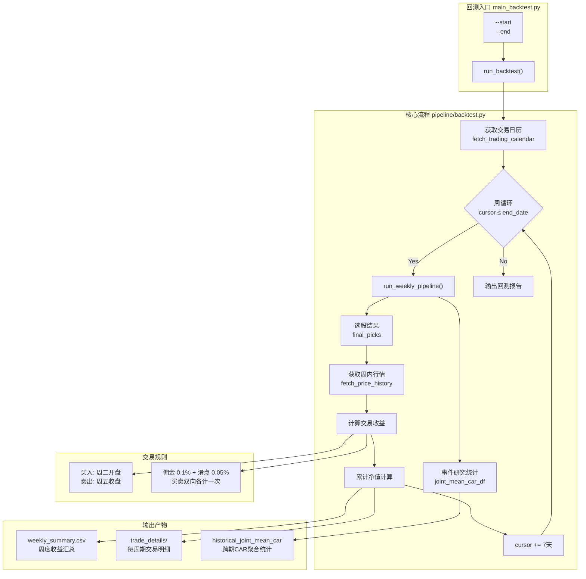

本文档介绍泰迪杯 C 题事件驱动策略的历史回测模块，用于在指定时间范围内验证策略的有效性。回测系统基于真实交易日历和历史事件数据，按周度频次复现完整的策略流水线，并记录每笔交易的收益情况。

## 系统架构

历史回测模块位于流水线架构的终端，整合了数据采集、事件识别、关联挖掘、影响预测和策略构建五大核心环节。



Sources: [main_backtest.py](main_backtest.py#L1-L48)
Sources: [pipeline/backtest.py](pipeline/backtest.py#L1-L187)

## 执行方式

### 命令行参数

```bash
python main_backtest.py --start <开始日期> --end <结束日期>
```

| 参数 | 格式要求 | 说明 |
|------|----------|------|
| `--start` | `YYYY-MM-DD` | 回测区间起始日期，通常为周一 |
| `--end` | `YYYY-MM-DD` | 回测区间结束日期 |

### 典型用法

```bash
# 完整激活虚拟环境后执行
source .venv/bin/activate
python main_backtest.py --start 2025-12-08 --end 2025-12-26

# 或直接调用
.venv/bin/python main_backtest.py --start 2025-12-08 --end 2025-12-26
```

回测以周一为基准周期，每周执行一次完整流水线（`run_weekly_pipeline`），覆盖从事件识别到策略构建的全流程。最终在 `outputs/backtest/` 目录下生成回测结果。

Sources: [main_backtest.py](main_backtest.py#L25-L47)

## 交易规则

### 周度交易时点

系统按照赛题规则定义周度交易周期：

- **买入时点**：周一的下一个交易日（周二）的开盘价买入
- **卖出时点**：当前周的最后一个交易日（周五）的收盘价卖出

当周二超出回测结束日期时，该周不参与回测。

```python
# 买入日期：周一后第一个交易日
buy_date = next_trading_date(trading_calendar, monday, target_weekday=1)

# 卖出日期：本周最后一个交易日
sell_date = week_last_trading_date(trading_calendar, monday)
```

Sources: [pipeline/backtest.py](pipeline/backtest.py#L45-L75)

### 交易成本

每笔交易的双向成本由佣金和滑点组成：

| 成本项 | 费率 | 计费方式 |
|--------|------|----------|
| 佣金 | 0.1%（0.001） | 买卖双向各计一次 |
| 滑点 | 0.05%（0.0005） | 买卖双向各计一次 |
| **总成本** | **0.3%** | 买入 + 卖出 |

实际收益率计算公式：

```python
total_cost = commission_rate * 2 + slippage * 2  # 0.003
trade_return = (sell_price / buy_price) - 1 - total_cost
weighted_return = trade_return * float(pick["capital_ratio"])
```

Sources: [pipeline/backtest.py](pipeline/backtest.py#L79-L83)

## 仓位分配机制

### 综合得分计算

最终得分由两部分加权组成：

| 因子 | 权重 | 说明 |
|------|------|------|
| 预测得分（prediction_score） | 85% | 基于事件影响强度的预期收益 |
| 动量得分（momentum_score） | 15% | 近5日股票涨幅的logistic归一化 |

```python
tradable["momentum_5d"] = tradable.apply(
    lambda row: _compute_momentum(row["stock_code"], price_df, asof_date, n_days=5)
)
tradable["momentum_score"] = tradable["momentum_5d"].apply(
    lambda x: logistic(x * 10) if x != 0 else 0.5
)
tradable["final_score"] = 0.85 * tradable["prediction_score"] + 0.15 * tradable["momentum_score"]
```

Sources: [pipeline/task4_strategy.py](pipeline/task4_strategy.py#L59-L67)

### 仓位上下限约束

| 参数 | 默认值 | 说明 |
|------|--------|------|
| `single_position_max` | 0.5 | 单股最大仓位比例 |
| `single_position_min` | 0.2 | 单股最小仓位比例 |
| `max_positions` | 3 | 最大持仓股票数 |

仓位分配使用最大余数法（largest remainder method）进行约束舍入，确保所有仓位之和精确等于 1.0。

Sources: [pipeline/task4_strategy.py](pipeline/task4_strategy.py#L278-L340)
Sources: [config/config.yaml](config/config.yaml#L9-L15)

## 股票过滤规则

回测涉及的股票需要通过以下三层过滤：

### 基础过滤（pass_basic_filter）

- **ST状态**：剔除 `is_st = True` 的股票
- **流动性**：日均成交额 ≥ `min_avg_turnover_million`（默认 80 万元）
- **上市时间**：距上市天数 ≥ `min_listing_days`（默认 60 天）

### 基本面过滤（pass_fundamental_filter）

- **PE估值**：0 ≤ PE ≤ 100
- **ROE水平**：ROE ≥ 5%
- **盈利增长**：净利润增长率 ≥ -20%（容忍短期下滑）

### 交易可行性（is_tradeable）

- 检查周内是否存在有效买卖日
- 剔除在买入日仍处于停牌状态且未公告复牌日期的股票

Sources: [pipeline/task4_strategy.py](pipeline/task4_strategy.py#L130-L170)

## 输出产物

### 目录结构

```
outputs/backtest/
├── weekly_summary.csv          # 周度收益汇总（净值序列）
├── historical_joint_mean_car   # 跨期CAR聚合统计（CSV + PNG）
├── historical_event_study_stats # 历史事件研究统计明细
└── <week_monday>/
    └── trade_details.csv       # 本周每笔交易明细
```

### 周度汇总表（weekly_summary）

| 字段 | 类型 | 说明 |
|------|------|------|
| `week_monday` | string | 本周基准周一日期 |
| `buy_date` | string | 实际买入日期（周二） |
| `sell_date` | string | 实际卖出日期（周五） |
| `weekly_return` | float | 本周组合收益率（含交易成本） |
| `pick_count` | int | 本周选股数量 |
| `net_value` | float | 累计净值（从1.0开始复利） |

### 交易明细表（trade_details）

| 字段 | 类型 | 说明 |
|------|------|------|
| `week_monday` | string | 所属周基准日期 |
| `event_name` | string | 触发交易的事件名称 |
| `stock_code` | string | 股票代码（6位补零） |
| `buy_date` | string | 买入日期 |
| `buy_price` | float | 买入价格（开盘价） |
| `sell_date` | string | 卖出日期 |
| `sell_price` | float | 卖出价格（收盘价） |
| `capital_ratio` | float | 分配资金比例 |
| `weighted_return` | float | 加权收益贡献 |

Sources: [pipeline/backtest.py](pipeline/backtest.py#L85-L130)

## 关键配置参数

| 参数路径 | 默认值 | 回测相关说明 |
|----------|--------|--------------|
| `strategy.max_positions` | 3 | 最大持仓股票数 |
| `strategy.single_position_max` | 0.5 | 单股最大仓位 |
| `strategy.single_position_min` | 0.2 | 单股最小仓位 |
| `strategy.positive_score_threshold` | 0.02 | 预测得分入选门槛 |
| `strategy.min_prediction_score_threshold` | -0.01 | 空仓保护阈值 |
| `strategy.min_listing_days` | 60 | 最短上市天数 |
| `strategy.min_avg_turnover_million` | 80 | 最低日均成交额（万） |
| `data.lookback_days` | 14 | 读取历史事件的天数窗口 |

Sources: [config/config.yaml](config/config.yaml#L1-L20)
Sources: [pipeline/models.py](pipeline/models.py#L90-L110)

## 历史窗口CAR聚合

回测结束后，系统会聚合所有回测周的联合均值CAR数据，生成跨期统计：

```python
historical_joint_summary = (
    historical_joint_df.groupby(["group_label", "day_offset"])
    .agg(
        mean_car=("mean_car", "mean"),
        sample_size=("sample_size", "sum"),
    )
    .reset_index()
)
```

聚合结果按事件方向分组（正向事件/负向事件），展示各事件窗口的累计异常收益均值，可用于评估策略在不同市场环境下的稳定性。

Sources: [pipeline/backtest.py](pipeline/backtest.py#L140-L155)

## 结果解读

### 收益分析维度

1. **周度胜率**：统计 `weekly_return > 0` 的周数占比
2. **累计净值曲线**：观察策略在回测期间的整体趋势
3. **最大回撤**：从净值高点到低点的最大跌幅
4. **CAR稳定性**：historical_joint_mean_car 的置信度

### 空仓情况识别

当某周所有候选标的的 `prediction_score` 均低于 `min_prediction_score_threshold`（默认 -0.01）时，系统触发空仓保护，该周不进行任何交易。日志中会输出提示信息：

```
所有候选标的预期收益均低于阈值 -0.0100，触发本周空仓。
```

Sources: [pipeline/task4_strategy.py](pipeline/task4_strategy.py#L98-L105)

## 后续步骤

完成历史回测后，建议进行以下分析：

- 查看 [结果报告解读](20-jie-guo-bao-gao-jie-du) 了解如何解读完整的策略表现报告
- 对比 [周度运行](18-zhou-du-yun-xing) 的单周输出与回测结果的一致性
- 调整 `config/config.yaml` 中的策略参数后重新回测验证