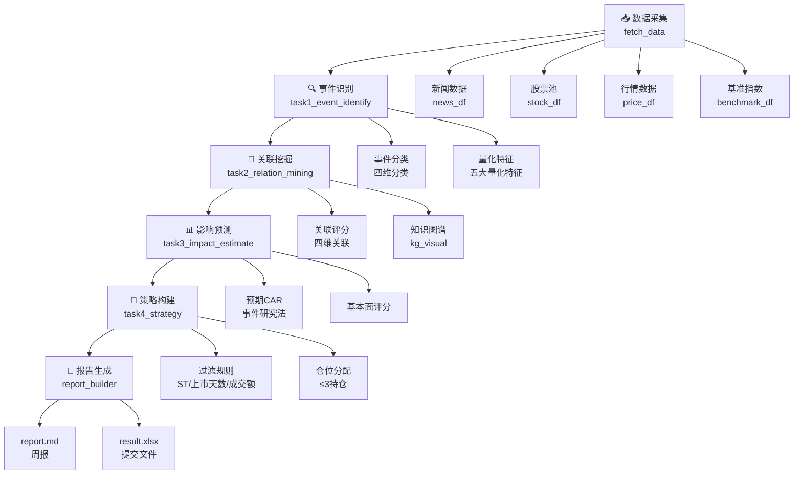

本页面为初次接触本项目的开发者提供完整的环境配置与首次运行指南。通过本文档，你将了解项目的基本架构、配置方法，以及如何执行周度运行和历史回测两种核心任务。

## 环境准备

### 系统要求

| 要求项 | 规格 |
|--------|------|
| Python 版本 | 3.12.13 |
| 操作系统 | macOS (darwin) / Linux |
| 依赖管理 | Poetry / .venv |

项目根目录位于 `/Users/xingranya/Downloads/TeddyCup-C-EventDriven`。首次使用前，请确保已完成以下步骤。

Sources: [CLAUDE.md](CLAUDE.md#L1-L10)

### 虚拟环境激活

项目使用 `.venv` 隔离 Python 依赖。在项目根目录下执行以下命令激活虚拟环境：

```bash
cd /Users/xingranya/Downloads/TeddyCup-C-EventDriven
source .venv/bin/activate
```

激活后，当前终端会话中的 `python` 命令将指向虚拟环境中的 Python 解释器。如果本地没有 `python` 别名，也可以直接使用 `.venv/bin/python` 执行脚本。

Sources: [CLAUDE.md](CLAUDE.md#L5-L8)

### Tushare 令牌配置

系统依赖 Tushare 获取股票数据。你需要准备一个有效的 Tushare 令牌，有两种配置方式：

**方式一：环境变量（推荐）**

```bash
export TUSHARE_TOKEN='你的_TOKEN'
```

**方式二：配置文件直接写入**

编辑 `config/config.yaml`，在 `tushare` 节点下填入 token：

```yaml
tushare:
  token_env: TUSHARE_TOKEN
  token: "你的_TOKEN"
```

系统加载配置时会优先读取 `config.yaml` 中的显式 token，若为空则回退读取环境变量 `TUSHARE_TOKEN`。请确保至少有一种方式配置成功，否则程序启动时将抛出异常。

Sources: [README.md](README.md#L10-L28)
Sources: [pipeline/settings.py](pipeline/settings.py#L20-L32)

## 项目结构概览

```
TeddyCup-C-EventDriven/
├── config/
│   └── config.yaml              # 全部策略参数（评分权重、持仓限制等）
├── data/
│   ├── events/                  # 正式事件导入目录
│   │   ├── policy/               # 政策类事件
│   │   ├── announcement/         # 公司公告类事件
│   │   ├── industry/             # 行业/技术类事件
│   │   └── macro/                # 宏观/地缘类事件
│   ├── manual/                  # 样例数据（提交仓库）
│   ├── raw/                      # 原始数据缓存
│   └── processed/                # 中间处理结果
├── pipeline/                     # 核心模块
│   ├── workflow.py               # 完整流水线编排
│   ├── backtest.py               # 回测引擎
│   ├── fetch_data.py             # 数据采集
│   ├── task1_event_identify.py   # 事件识别与分类
│   ├── task2_relation_mining.py   # 事件-公司关联关系
│   ├── task3_impact_estimate.py   # CAR 影响预测
│   ├── task4_strategy.py         # 策略构建与仓位分配
│   └── report_builder.py         # 周报生成
├── scripts/
│   └── event_ingest.py           # 事件采集脚本
├── main_weekly.py                # 周度运行入口
├── main_backtest.py              # 历史回测入口
└── outputs/
    ├── weekly/                   # 周度运行输出
    └── backtest/                 # 回测结果
```

Sources: [README.md](README.md#L30-L70)

## 流水线架构

系统运行遵循**五阶段串行流水线**设计。每个阶段接收上一阶段的输出，完成计算后将结果传递给下一阶段。以下是完整的流程图：



### 各阶段说明

| 阶段 | 模块 | 输入 | 输出 |
|------|------|------|------|
| 数据采集 | `fetch_data.py` | Tushare API | 新闻、股票池、行情、基准指数 |
| 事件识别 | `task1_event_identify.py` | 新闻数据 | 事件 DataFrame（含四维分类） |
| 关联挖掘 | `task2_relation_mining.py` | 事件、股票池 | 关联关系表、知识图谱 |
| 影响预测 | `task3_impact_estimate.py` | 关联、行情 | CAR 预测结果 |
| 策略构建 | `task4_strategy.py` | 预测结果、股票池 | 最终选股与仓位分配 |
| 报告生成 | `report_builder.py` | 所有中间结果 | 周报 Markdown + 提交 Excel |

Sources: [wiki/Architecture.md](wiki/Architecture.md#L1-L30)
Sources: [pipeline/workflow.py](pipeline/workflow.py#L25-L40)

## 周度运行

周度运行是竞赛提交的核心流程，在每个比赛周的基准日执行一次。

### 执行命令

```bash
cd /Users/xingranya/Downloads/TeddyCup-C-EventDriven
source .venv/bin/activate
export TUSHARE_TOKEN='你的_TOKEN'
python main_weekly.py --asof 2026-04-20
```

参数 `--asof` 指定分析基准日，格式为 `YYYY-MM-DD`。系统会基于该日期往前回溯 14 天（由 `config.yaml` 中的 `lookback_days: 14` 控制）读取事件数据。

Sources: [README.md](README.md#L187-L200)
Sources: [main_weekly.py](main_weekly.py#L20-L30)

### 输出产物

运行完成后，结果保存在 `outputs/weekly/<asof_date>/` 目录下：

| 文件 | 说明 |
|------|------|
| `final_picks.csv` | 最终选股结果（含事件名称、股票代码、资金比例） |
| `result.xlsx` | 竞赛提交用 Excel 文件 |
| `report.md` | 周度分析报告 |
| `kg_visual/` | 产业链知识图谱可视化 |
| `event_study/` | 事件研究详细数据 |

Sources: [main_weekly.py](main_weekly.py#L32-L36)

### 关键配置参数

`config/config.yaml` 中影响周度运行的核心参数如下：

| 参数 | 默认值 | 说明 |
|------|--------|------|
| `max_positions` | 3 | 最大持仓股票数 |
| `single_position_max` | 0.5 | 单股最大仓位比例 |
| `single_position_min` | 0.2 | 单股最小仓位比例 |
| `min_listing_days` | 60 | 最短上市天数 |
| `min_avg_turnover_million` | 80 | 最低日均成交额（万元） |
| `positive_score_threshold` | 0.02 | 预测得分入选门槛 |
| `lookback_days` | 14 | 事件回溯天数 |

Sources: [config/config.yaml](config/config.yaml#L1-L35)
Sources: [wiki/Architecture.md](wiki/Architecture.md#L50-L65)

## 历史回测

历史回测用于验证策略在过去一段时间的表现，帮助你评估策略有效性。

### 执行命令

```bash
python main_backtest.py --start 2025-12-08 --end 2025-12-26
```

参数 `--start` 和 `--end` 分别指定回测区间的起始和结束日期。回测引擎会按周迭代调用 `run_weekly_pipeline`，并在每周周二以开盘价买入、周五以收盘价卖出。

Sources: [CLAUDE.md](CLAUDE.md#L12-L14)
Sources: [main_backtest.py](main_backtest.py#L18-L35)

### 输出产物

回测结果保存在 `outputs/backtest/` 目录下，包含每周的选股结果、收益统计和累计收益曲线。

Sources: [main_backtest.py](main_backtest.py#L38-L40)

## 事件导入流程

事件是策略的输入核心。在周度运行前，你需要将事件数据放入指定的目录。

### 事件目录结构

| 目录 | 事件类型 |
|------|----------|
| `data/events/policy/` | 政策类事件 |
| `data/events/announcement/` | 公司公告类事件 |
| `data/events/industry/` | 行业/技术类事件 |
| `data/events/macro/` | 宏观/地缘类事件 |

Sources: [README.md](README.md#L80-L95)

### 事件文件格式

每条事件至少包含以下字段：

```json
{
  "title": "事件标题",
  "content": "事件正文，尽量写清楚影响链条、行业和公司。",
  "published_at": "2026-04-18 20:30:00",
  "source_name": "来源名称",
  "source_url": "https://example.com/news"
}
```

推荐使用项目的**事件采集脚本**生成规范的事件文件，而非手工编辑。

Sources: [README.md](README.md#L140-L160)

### 使用采集脚本

```bash
# 1) 抓取原始事件
.venv/bin/python scripts/event_ingest.py collect --source gov_cn --since 2026-04-01 --until 2026-04-07

# 2) 标准化并生成审阅队列
.venv/bin/python scripts/event_ingest.py normalize --source gov_cn --batch 2026-04-07

# 3) 人工审阅 data/staging/events/review_queue.csv

# 4) 发布 accepted 事件到 data/events/
.venv/bin/python scripts/event_ingest.py publish --source-type policy --batch 2026-04-07
```

支持的事件来源包括：`gov_cn`（中国政府网）、`ndrc`（发改委）、`csrc`（证监会）、`cninfo`（巨潮资讯）、`eastmoney_industry`、`36kr_manual`、`yicai_manual`、`macro_manual`。

Sources: [README.md](README.md#L100-L130)
Sources: [pipeline/event_ingest.py](pipeline/event_ingest.py#L40-L95)

### 审阅状态说明

| 状态 | 含义 |
|------|------|
| `accepted` | 标题明确、来源可信、时间在目标窗口内 |
| `rejected` | 重复转载、标题过短、无明确事件主体 |
| `pending` | 正文过短、来源可信度一般、需要补详情页 |

Sources: [README.md](README.md#L162-L175)

## 常见问题

### 运行时数据获取失败

系统会优先从 Tushare API 获取数据，若 API 不可用或权限受限，会自动回退使用以下缓存数据：

- `data/manual/sample_news.json` — 新闻样例
- `data/manual/stock_universe.csv` — 历史股票池参考
- `data/manual/industry_relation_map.json` — 产业链映射
- `data/manual/stock_financial_sample.json` — 财务数据样例

Sources: [README.md](README.md#L65-L80)

### 事件未被读取

默认配置 `lookback_days: 14`，系统只读取 `asof_date` 往前 14 天内的事件。如果导入的事件早于这个时间窗口，即使字段格式正确，也无法用于运行。请确保事件文件中的 `published_at` 在目标周度的回溯范围内。

Sources: [README.md](README.md#L177-L190)

### 缺少 Tushare 令牌

运行时若抛出 `RuntimeError: 未检测到 Tushare 凭证`，请先完成 Tushare 令牌的配置。配置完成后重新运行即可。

Sources: [pipeline/settings.py](pipeline/settings.py#L25-L32)

## 后续学习路径

完成快速启动后，建议按以下顺序深入学习：

1. **[项目概述](1-xiang-mu-gai-shu)** — 了解项目的整体定位与竞赛任务
2. **[流水线设计](10-liu-shui-xian-she-ji)** — 深入理解各阶段的技术细节
3. **[事件分类体系](5-shi-jian-fen-lei-ti-xi)** — 掌握事件四维分类方法
4. **[配置体系](12-pei-zhi-ti-xi)** — 了解如何调优策略参数

如需了解如何管理事件数据，请参阅 [事件导入流程](3-shi-jian-dao-ru-liu-cheng) 和 [事件采集脚本使用](4-shi-jian-cai-ji-jiao-ben-shi-yong)。