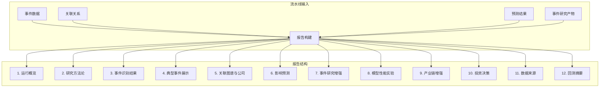

本文档详细说明事件驱动型股市投资策略周报的结构组成、各章节含义及核心指标解读方法。报告由 [pipeline/report_builder.py](pipeline/report_builder.py#L1-L172) 中的 `build_weekly_report` 函数生成，是周度运行流程的最终输出产物。

## 报告整体结构

周报采用 Markdown 格式输出，包含 12 个主要章节，按信息层次从运行概览、方法论、事件分析、关联挖掘、影响预测、模型评估到最终投资决策递进展开。



## 第一章：运行概览

运行概览章节提供本次周度运行的基础统计信息，位于报告开头 [pipeline/report_builder.py](pipeline/report_builder.py#L89-L99) 位置。

| 指标 | 含义 |
|------|------|
| 候选事件数 | 经文本聚类识别并通过分类体系的独立事件总数 |
| 关联关系数 | 事件与股票之间的关联匹配数量 |
| 预测结果数 | 经过影响预测模型评估的事件-股票组合数 |
| 最终入选股票数 | 通过策略筛选进入本周持仓的股票数量 |

此章节还记录了交易日历的来源与状态说明，用于评估回测结果的可信度。

Sources: [pipeline/workflow.py](pipeline/workflow.py#L218-L226)

## 第二章：研究方法论

方法论章节阐明系统采用的四大核心方法：事件识别、关联挖掘、影响预测和投资策略。这是理解报告后续章节的认知基础。

### 事件识别与分类体系

系统采用四维正交分类体系，对每个事件同时标注四个维度：影响持续周期（脉冲型/中期型/长尾型）、驱动主体（政策类/公司类/行业类/宏观类/地缘类）、可预测性（突发型/预披露型）、行业属性（军工/科技/新能源等十个行业类别）。

事件量化特征包含四项评分：热度评分反映媒体报道密度，强度评分反映单篇报道的影响力，范围评分反映涉及的市场广度，置信度评分反映分类结论的确定性。

Sources: [pipeline/task1_event_identify.py](pipeline/task1_event_identify.py#L1-L50)

### 事件关联挖掘

关联强度通过四维指标综合评估：直接提及（事件标题直接提及股票）、业务匹配（事件主题与公司主营存在业务关联）、行业重叠（事件行业与股票所属行业匹配）、历史共振（历史类似事件的股价联动模式）。

基础权重由 `config.yaml` 中的 `scoring.association` 配置节统一控制，各权重维度含义如下：

| 关联类型 | 默认权重 | 说明 |
|----------|----------|------|
| 直接提及 | 0.45 | 最高权重，文本直接关联 |
| 业务匹配 | 0.25 | 主营收入相关度 |
| 行业重叠 | 0.20 | 行业层面关联 |
| 历史共振 | 0.10 | 量化历史协同波动 |

Sources: [pipeline/task2_relation_mining.py](pipeline/task2_relation_mining.py#L1-L100)

### 影响预测模型

预测模型基于市场模型（Market Model）进行事件研究：以 [-60,-6] 日估计窗口通过 OLS 回归拟合 α 和 β 参数，计算事件窗口期 [0,+4] 日的异常收益（AR）和累计异常收益（CAR）。

预测得分的计算公式融合了预期 4 日 CAR、关联强度、事件特征、流动性和风险惩罚五个维度，各维度权重在 `config.yaml` 的 `scoring.prediction` 配置节定义。

Sources: [pipeline/task3_impact_estimate.py](pipeline/task3_impact_estimate.py#L127-L165)

### 投资策略构建

策略遵循"筛选-评分-分配"三步流程：首先进行 ST 状态、上市天数、成交额等基础过滤；然后基于综合预测得分排序选取不超过 3 只标的；最后通过带上下限约束的仓位分配生成最终持仓。

Sources: [pipeline/task4_strategy.py](pipeline/task4_strategy.py#L73-L112)

## 第三章：事件识别结果

此章节以 Markdown 表格形式展示本次识别出的候选事件列表，默认按配置 `report.top_event_count` 控制展示数量（通常为 5 条）。

表格包含事件名称、四个分类维度（主体类型/持续周期/可预测性/行业属性）以及四项量化特征评分。评分范围均为 0~1，数值越高表示该维度特征越显著。

解读要点：关注 `intensity_score`（强度评分）和 `confidence_score`（置信度评分）双高的前排事件，这些事件通常具有明确的因果逻辑和较高的市场影响力。

Sources: [pipeline/report_builder.py](pipeline/report_builder.py#L120-L121)

## 第四章：典型事件完整展示

典型事件章节选择本次运行中综合得分最高的事件进行深度剖析，综合得分计算方式为：

```
case_score = 0.5 × event_score + 0.3 × max_association_score + 0.2 × max_prediction_score
```

其中 event_score 由四项事件量化特征加权得出（热度 30%、强度 35%、范围 20%、置信度 15%）。

此章节包含四个子节：典型事件概览展示事件基本信息与量化特征评分；关联公司挖掘列出该事件关联的股票及其关联类型与得分；股价影响预测展示每只关联股票的预期 CAR 和综合评分；是否进入最终投资决策说明该事件相关股票是否进入本周持仓。

Sources: [pipeline/report_builder.py](pipeline/report_builder.py#L197-L278)

## 第五章：关联图谱与关联公司

关联图谱章节展示事件与股票之间的关联关系网络，包含两部分内容：关联公司表格展示前排关联关系，关联类型标签的含义如下表所示：

| 关系类型 | 英文标识 | 含义说明 |
|----------|----------|----------|
| 直接提及 | direct_mention | 事件文本直接提及该股票 |
| 业务匹配 | business_match | 公司业务与事件主题存在匹配 |
| 行业重叠 | industry_overlap | 股票所属行业与事件行业重叠 |
| 历史共振 | historical_resonance | 历史类似事件存在股价联动 |

图谱文件部分列出本次生成的图谱文件路径，包括 PNG 格式的静态图和 HTML 格式的交互式图。

Sources: [pipeline/task2_relation_mining.py](pipeline/task2_relation_mining.py#L100-L200)

## 第六章：影响预测与逻辑链条

此章节是报告的核心章节之一，展示每个事件-股票组合的影响预测结果。

### 核心预测指标解读

| 指标 | 含义 | 解读方式 |
|------|------|----------|
| `association_score` | 事件与股票的关联强度 | 0~1，越高关联越紧密 |
| `car_4d` | 预期 4 日累计异常收益 | 正值表示正向冲击，负值表示负向冲击 |
| `prediction_score` | 综合预测评分 | 融合多因素的最终排序依据 |
| `logic_chain` | 可解释逻辑链 | 文本化的因果传导路径 |

逻辑链文本格式为：`事件「{事件名}」(热度X, 强度Y) → 关联「{股票名}」(关联度Z) → 预期CAR {正向/负向}% → 综合评分 {分数}`

Sources: [pipeline/task3_impact_estimate.py](pipeline/task3_impact_estimate.py#L166-L172)

### 预测得分计算公式

综合预测得分由以下加权公式计算：

```
prediction_score = 0.40 × expected_car_4d
                 + 0.25 × association_score
                 + 0.20 × event_score
                 + 0.10 × liquidity_score
                 - 0.05 × risk_penalty
```

其中 expected_car_4d 是预期 4 日累计异常收益，liquidity_score 反映股票流动性（成交额/600 的截断值），risk_penalty 由残差波动率和市场状态共同决定。

## 第七章：事件研究增强结果

事件研究增强模块基于历史价格数据回测实际发生的异常收益，提供预测与实现的对照。

### 事件研究统计表

| 字段 | 含义 |
|------|------|
| `sample_size` | 该事件涉及的样本数 |
| `mean_ar_1d` | 事件日后第 1 天平均异常收益 |
| `mean_car_0_2` | 事件日后 0~2 日平均累计异常收益 |
| `mean_car_0_4` | 事件日后 0~4 日平均累计异常收益 |
| `positive_ratio_0_4` | 正收益样本占比 |

### 联合均值 CAR 汇总

按事件情感方向（正向事件/负向事件）分组展示均值 CAR 在不同窗口期的数值，用于观察事件驱动的整体市场反应模式。

窗口说明：事件研究采用 [-60,-6] 日估计窗口、[-1,+10] 日观察窗口，统计口径严格使用 AR(+1)、CAR(0,2)、CAR(0,4)。

Sources: [pipeline/event_study_enhanced.py](pipeline/event_study_enhanced.py#L1-L100)

## 第八章：模型性能实验

模型性能实验章节用于对齐赛题"自行设计实验分析所构建预测模型性能"的要求，提供预测准确性的量化评估。

### 核心评估指标

| 指标 | 计算方式 | 含义 |
|------|----------|------|
| 方向准确率 | 预测方向与实现方向一致的比例 | 衡量涨跌方向判断能力 |
| Top-K 命中率 | 预测得分前 K 只股票中实现正收益的比例 | 衡量选股排序能力 |
| 秩相关（Spearman） | 预测分数与实现 CAR 的秩相关系数 | 衡量相对排序准确性 |

周度实验汇总表按周分组展示各项指标，便于观察策略在不同周度的表现稳定性。

按事件主体类型分组表现表将样本按政策类/公司类/行业类等分组统计，帮助识别策略对哪类事件更有效。

数据范围说明：性能实验仅纳入 `outputs/weekly/` 中日期 ≤ 当前 asof_date 的周目录，避免前视偏差。

Sources: [pipeline/report_builder.py](pipeline/report_builder.py#L281-L384)

## 第九章：产业链图谱增强结果

产业链增强模块基于预定义的产业链关系图谱，将事件关联扩展为更长的因果传导链条。

### 产业链关系表

| 字段 | 含义 |
|------|------|
| `event_name` | 触发事件名称 |
| `theme_name` | 产业链主题（如：半导体设备） |
| `link_name` | 产业链环节（如：晶圆制造） |
| `stock_name` | 关联股票名称 |
| `association_score` | 关联强度 |
| `chain_confidence` | 产业链置信度 |
| `relation_path` | 完整传导路径 |

图谱说明部分展示产业链图谱的分析摘要，帮助理解事件如何通过产业链传导影响相关股票。

Sources: [pipeline/industry_chain_enhanced.py](pipeline/industry_chain_enhanced.py#L32-L88)

## 第十章：本周投资决策

投资决策章节是报告的行动输出部分，直接决定竞赛提交结果。

### 最终持仓表

| 字段 | 含义 |
|------|------|
| `event_name` | 关联事件名称 |
| `stock_code` | 股票代码（6 位数字） |
| `capital_ratio` | 资金分配比例（求和为 1） |
| `rank` | 综合排名 |
| `reason` | 选股理由说明 |

### 仓位分配规则

资金分配遵循以下约束（可在 `config.yaml` 的 `strategy` 配置节调整）：

- 单只股票最大仓位：`single_position_max`（默认 0.5，即 50%）
- 单只股票最小仓位：`single_position_min`（默认 0.2，即 20%）
- 最大持仓数量：`max_positions`（默认 3 只）
- 最终仓位比例舍入采用最大余数法，保证求和稳定为 1

### 投资决策推理过程

每个入选股票附带的推理过程展示完整决策链条：关联事件及其量化特征、关联强度与类型、预期 CAR(0,4)、综合评分以及最终资金分配比例。

Sources: [pipeline/report_builder.py](pipeline/report_builder.py#L432-L504)

## 第十一章：数据来源与限制

数据来源章节明确报告所依赖的数据接口及其局限性，帮助评估结果的可信度。

| 数据类型 | 主要来源 | 限制说明 |
|----------|----------|----------|
| 事件数据 | `data/events/policy|announcement|industry|macro` 目录下的标准化事件文件 | 依赖人工采集与审核流程 |
| 行情与基准 | Tushare（实盘）/ Akshare（降级备选） | 公开接口可能存在数据延迟 |
| 财务数据 | Tushare / Akshare | 受接口权限和缓存完整性影响 |
| 停复牌信息 | Tushare / Akshare | 覆盖度受接口限制 |

**重要提示**：当前策略以启发式事件评分和事件研究为主，模型性能实验依赖历史输出样本，不等同于严格的样本外机器学习回测。

Sources: [pipeline/report_builder.py](pipeline/report_builder.py#L420-L429)

## 第十二章：历史回测摘要

历史回测摘要基于 `main_backtest.py` 执行的多周回测结果，展示策略在历史区间的表现。

### 回测机制说明

回测按周迭代运行 `run_weekly_pipeline`，遵循赛题交易规则：

- **买入日**：周二开盘价买入
- **卖出日**：当周最后一个交易日收盘价卖出
- **初始资金**：100,000 元
- **交易成本**：佣金 0.1% + 滑点 0.05%，买卖各计一次

### 周度收益计算

```
单笔收益 = (卖出价 / 买入价 - 1) × 资金比例 - 交易成本
周收益 = Σ 单笔收益
净值 = (1 + 周收益1) × (1 + 周收益2) × ...
```

回测摘要表仅在执行历史回测后生成，周度运行时此章节显示提示文本"本周运行未附带历史回测摘要"。

Sources: [pipeline/backtest.py](pipeline/backtest.py#L1-L154)

## 竞赛提交文件生成

周度运行结束后，系统通过 `generate_result_xlsx.py` 将最终持仓转换为竞赛要求的 Excel 格式。

### 使用方法

```bash
python generate_result_xlsx.py --input outputs/weekly/<date>/final_picks.csv --output result.xlsx
```

### 输出格式

生成的 `result.xlsx` 包含三列：

| 列名 | 对应字段 | 格式要求 |
|------|----------|----------|
| 事件名称 | event_name | 文本 |
| 标的（股票）代码 | stock_code | 6 位数字字符串（前补零） |
| 资金比例 | capital_ratio | 数值，0~1 |

Sources: [generate_result_xlsx.py](generate_result_xlsx.py#L1-L35)

## 报告文件位置

周度运行生成的报告文件存储在 `outputs/weekly/<日期>/report.md`，完整周度运行产物目录结构如下：

```
outputs/weekly/<日期>/
├── report.md                          # 周报主文件
├── event_candidates.csv               # 候选事件
├── predictions.csv                    # 影响预测结果
├── strategy_candidates.csv            # 策略候选池
├── final_picks.csv                    # 最终持仓（提交用）
├── event_study/
│   ├── event_study_detail.csv         # 事件研究明细
│   ├── event_study_stats.csv          # 事件研究统计
│   ├── joint_mean_car.csv             # 联合均值 CAR 数据
│   └── joint_mean_car.png             # 联合均值 CAR 图
├── kg_visual/
│   ├── industry_chain_relations.csv    # 产业链关系表
│   ├── industry_chain_summary.md       # 图谱说明
│   ├── industry_chain_graph.png       # 产业链图谱 PNG
│   └── industry_chain_graph.html      # 产业链图谱 HTML
└── <图谱文件>.png/.html               # 事件关联图谱
```

## 关键指标速查表

| 指标 | 所在章节 | 理想范围 | 说明 |
|------|----------|----------|------|
| heat_score | 3/6 | 0.6+ | 热度评分越高媒体报道越密集 |
| intensity_score | 3/6 | 0.6+ | 强度评分越高单篇影响力越大 |
| association_score | 5/6 | 0.7+ | 关联评分越高事件与股票关系越紧密 |
| car_4d | 6/10 | 正值 | 预期累计异常收益，正值表示看多 |
| prediction_score | 6/10 | 0.02+ | 综合评分需高于阈值才入选 |
| direction_accuracy | 8 | 50%+ | 方向准确率越高预测可靠性越好 |
| top_k_hit_rate | 8 | 越高越好 | Top3 命中率反映选股排序能力 |

## 后续阅读

完成本章节阅读后，建议继续了解以下内容：

- [历史回测](19-li-shi-hui-ce) — 深入了解回测机制和收益计算
- [周度运行](18-zhou-du-yun-xing) — 掌握如何执行单周运行
- [影响预测模块](16-ying-xiang-yu-ce-mo-kuai) — 深入理解预测模型的数学原理