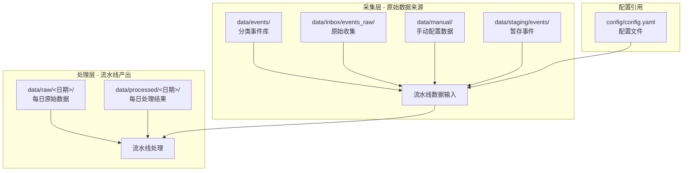

本页面详细说明项目数据目录的组织架构、各级目录的用途以及数据文件的内容格式。理解数据目录结构是掌握本项目数据流转的基础，适合作为入门开发者的第一个技术参考点。

## 目录架构总览

项目的数据目录位于 `data/` 下，采用分层设计，按数据生命周期划分为**采集层**、**处理层**和**静态配置层**三个层级。



**数据流向说明**：采集层数据经流水线处理后，产出原始数据文件（`data/raw/`）和清洗后的事件候选文件（`data/processed/`），形成完整的数据生命周期闭环。

Sources: [目录结构分析](data)

## 采集层详解

### 分类事件库 `data/events/`

分类事件库是系统最核心的**事件输入来源**，按事件类型进行目录划分，便于管理和检索。

| 子目录 | 事件类型 | 数据格式 | 典型来源 |
|--------|----------|----------|----------|
| `policy/` | 政策类事件 | JSON | 政府官网政策文件 |
| `announcement/` | 公告类事件 | JSON | 交易所公告 |
| `industry/` | 行业类事件 | JSON | 行业协会报告 |
| `macro/` | 宏观类事件 | JSON | 宏观经济指标发布 |

配置文件中通过 `events.import_paths` 字段指定这些目录路径：

```yaml
events:
  import_paths:
    policy: data/events/policy
    announcement: data/events/announcement
    industry: data/events/industry
    macro: data/events/macro
```

Sources: [config.yaml 配置部分](config/config.yaml#L15-L18)

### 原始收集箱 `data/inbox/`

原始收集箱作为数据采集脚本的**落地目录**，新采集的事件首先写入此处，再经过人工审核后转移到分类事件库。

```
data/inbox/
└── events_raw/
    └── gov_cn/
        └── 2026-04-07/      # 按采集日期组织
```

Sources: [目录结构分析](data)

### 手动配置数据 `data/manual/`

手动配置数据存放**静态配置表**和**样例数据**，是系统运行所需的基础数据源。

| 文件名 | 用途 | 关键字段 |
|--------|------|----------|
| `stock_universe.csv` | 股票池定义 | stock_code, stock_name, industry, concept_tags, main_business, listed_date, is_st, avg_turnover_million |
| `industry_relation_map.json` | 行业产业链关系图 | 主题→环节→股票映射，含 relation_path 传导路径 |
| `sample_news.json` | 新闻数据样例 | 样例数据 |
| `stock_financial_sample.json` | 财务数据样例 | 样例数据 |
| `suspend_resume_sample.json` | 停复牌数据样例 | 样例数据 |

`stock_universe.csv` 是最核心的配置文件，定义了系统关注的核心股票范围：

```csv
stock_code,stock_name,industry,concept_tags,main_business,listed_date,is_st,avg_turnover_million
600760,中航沈飞,军工,"军工,战斗机,航空装备","军机整机研发与制造",1996-10-11,false,520
688041,海光信息,半导体,"芯片,算力,服务器","高端处理器与加速器芯片",2022-08-12,false,350
```

`industry_relation_map.json` 定义了事件传导路径，例如军工主题下的产业链传导：

```json
{
  "军工": {
    "theme_name": "军工",
    "links": [
      {
        "link_name": "整机制造",
        "stocks": [
          {"stock_code": "600760", "stock_name": "中航沈飞", "relation_path": "事件 -> 军工主题 -> 整机制造 -> 中航沈飞"}
        ]
      }
    ]
  }
}
```

Sources: [stock_universe.csv 内容](data/manual/stock_universe.csv#L1-L18), [industry_relation_map.json 内容](data/manual/industry_relation_map.json#L1-L50)

### 暂存事件 `data/staging/`

暂存目录用于存放**待处理或待审核的事件数据**，是采集到正式入库之间的中间状态。

```
data/staging/
├── events/
│   └── policy/
│       └── 2026-04-07_gov_cn.jsonl    # 按采集源和日期组织的 JSONL 文件
└── review_queue.csv                    # 待审核事件队列
```

`review_queue.csv` 是审核队列文件，包含以下关键字段：

| 字段 | 含义 |
|------|------|
| `dedupe_key` | 去重标识符 |
| `source` | 数据来源标识 |
| `title` | 事件标题 |
| `content` | 事件正文 |
| `published_at` | 发布时间 |
| `review_status` | 审核状态（待审核/已通过/已拒绝） |
| `review_note` | 审核备注 |

Sources: [review_queue.csv 内容](data/staging/events/review_queue.csv#L1-L6)

## 处理层详解

### 每日原始数据 `data/raw/<日期>/`

流水线执行后，采集的原始数据存放在以日期命名的子目录中。每个日期目录包含当日所需的全部原始数据文件。

| 文件名 | 内容 | 关键字段 |
|--------|------|----------|
| `prices_<日期>.csv` | 股票价格数据 | stock_code, trade_date, open, high, low, close, volume, amount, pct_chg |
| `benchmark_<日期>.csv` | 基准指数数据 | 用于计算超额收益的沪深300数据 |
| `news_<日期>.csv` | 新闻文本数据 | 事件识别模块的输入 |
| `financial_<日期>.csv` | 财务数据 | 相关股票的财务指标 |
| `suspend_resume_<日期>.csv` | 停复牌信息 | 股票停复牌状态 |
| `trading_calendar_<日期>.csv` | 交易日历 | 确定事件日期前后的交易日 |
| `stock_universe.csv` | 股票池副本 | 当日使用的股票范围 |

价格数据的典型格式：

```csv
stock_code,trade_date,open,high,low,close,volume,amount,pct_chg
002371,2025-10-24,406.02,417.6,406.0,414.8,89560.96,3698285.803,2.7801
002371,2025-10-27,422.3,433.47,418.63,429.1,112345.09,4785159.728,3.4474
```

Sources: [prices 数据样例](data/raw/2026-04-22/prices_2026-04-22.csv#L1-L3)

### 每日处理结果 `data/processed/<日期>/`

流水线处理完成后，清洗和增强后的数据存储在 `processed` 目录下。

| 文件名 | 内容 | 用途 |
|--------|------|------|
| `event_candidates.csv` | 候选事件列表 | 事件识别和关联挖掘的输出 |

`event_candidates.csv` 包含事件的多维度评分信息：

| 字段 | 含义 |
|------|------|
| `event_id` | 事件唯一标识 |
| `event_name` | 事件名称 |
| `subject_type` | 主体类型（政策/公司/行业/宏观/地缘） |
| `duration_type` | 持续类型（脉冲/长尾/中期） |
| `predictability_type` | 可预测性（突发/预披露） |
| `industry_type` | 行业类型（军工/科技/新能源等） |
| `sentiment_score` | 情绪评分 |
| `heat_score` | 热度评分 |
| `intensity_score` | 强度评分 |
| `scope_score` | 影响范围评分 |
| `confidence_score` | 置信度评分 |
| `raw_evidence` | 原始证据文本 |
| `cluster_size` | 聚类规模 |

典型样例：

```csv
event_id,event_name,subject_type,duration_type,predictability_type,industry_type,sentiment_score,heat_score,intensity_score,scope_score,confidence_score,raw_evidence,cluster_size
20260414_国常会提出加快低空经济基础设施建设通航产业链再获,国常会提出加快低空经济基础设施建设，通航产业链再获政策关注,政策类事件,长尾型事件,突发型事件,低空经济,1.0,1.0,0.62,1.0,0.905,国常会提出加快低空经济基础设施建设...,2
```

Sources: [event_candidates.csv 内容](data/processed/2026-04-22/event_candidates.csv#L1-L3)

## 配置与目录关联

配置文件 `config/config.yaml` 中的 `data` 节定义了数据相关的全局参数：

```yaml
data:
  lookback_days: 14                  # 回溯天数
  benchmark_code: 000300.SH         # 基准指数代码
  trading_calendar_source: tushare   # 交易日历数据源
  stock_whitelist_path: ""          # 白名单路径
  stock_blacklist_path: ""          # 黑名单路径
```

`RunContext` 数据类在 `pipeline/models.py` 中定义了目录路径的运行时绑定：

```python
@dataclass(slots=True)
class RunContext:
    """一次运行所需的上下文信息。"""
    asof_date: date
    project_root: Path
    output_dir: Path
    raw_dir: Path
    processed_dir: Path
```

流水线执行时通过 `ensure_directory` 自动创建日期子目录：

```python
raw_dir = ensure_directory(project_root / "data/raw" / asof_date.isoformat())
processed_dir = ensure_directory(project_root / "data/processed" / asof_date.isoformat())
```

Sources: [settings.py 配置加载](pipeline/settings.py#L1-L33), [models.py RunContext 定义](pipeline/models.py#L54-L60), [workflow.py 目录创建](pipeline/workflow.py#L41-L44)

## 数据目录速查表

| 目录 | 层级 | 类型 | 主要用途 |
|------|------|------|----------|
| `data/events/` | 采集层 | 目录 | 分类事件库的存储位置 |
| `data/inbox/` | 采集层 | 目录 | 采集脚本原始落地目录 |
| `data/manual/` | 采集层 | 目录 | 静态配置和样例数据 |
| `data/staging/` | 采集层 | 目录 | 暂存和待审核数据 |
| `data/raw/<日期>/` | 处理层 | 目录 | 每日原始采集数据 |
| `data/processed/<日期>/` | 处理层 | 目录 | 每日处理后数据 |
| `config/config.yaml` | 配置层 | 文件 | 全局配置参数 |

## 下一步学习建议

建议按以下顺序继续阅读相关文档：

1. **[事件导入流程](3-shi-jian-dao-ru-liu-cheng)** — 了解事件数据如何从原始来源导入系统
2. **[事件分类体系](5-shi-jian-fen-lei-ti-xi)** — 深入理解 events 目录下事件的多维度分类标准
3. **[流水线设计](10-liu-shui-xian-she-ji)** — 理解数据如何在各处理阶段流转