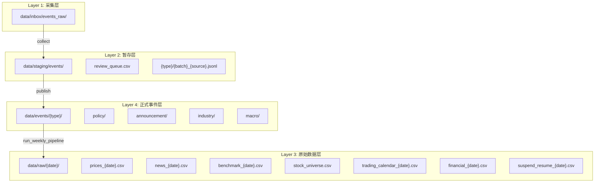
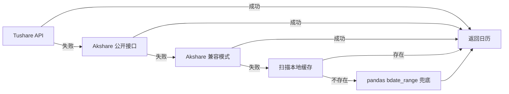
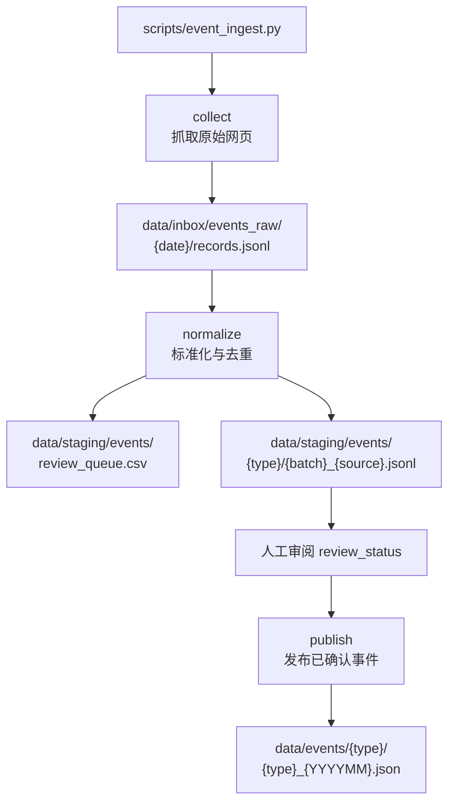
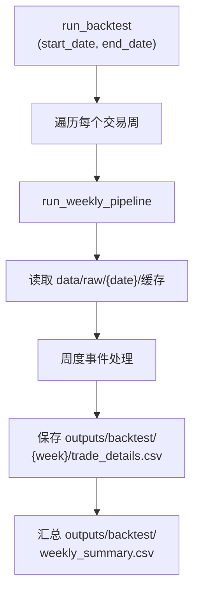

本文档详细阐述项目的事件驱动回测系统中数据缓存的整体架构、分层策略、关键实现与使用模式。

## 设计理念

本系统采用**多阶段文件缓存**架构，核心设计原则为：

1. **按时间分区存储** — 所有缓存数据以 `YYYY-MM-DD` 为粒度组织，便于历史回溯与增量更新
2. **数据源降级链** — 外部 API 不可用时自动回退到本地缓存，保证流水线稳定运行
3. **幂等写入** — 同一日期重复运行仅覆盖而非追加，避免数据膨胀
4. **去重机制** — 基于内容 MD5 哈希的事 件级去重，防止重复处理

Sources: [fetch_data.py](pipeline/fetch_data.py#L283-L331), [event_ingest.py](pipeline/event_ingest.py#L215-L271)

## 缓存分层架构

系统采用四层缓存结构，每层承担不同的数据生命周期管理职责：



### 各层职责说明

| 层级 | 目录路径 | 数据类型 | 生命周期 | 管理方式 |
|------|----------|----------|----------|----------|
| 采集层 | `data/inbox/events_raw/` | 原始网页抓取数据 | 临时 | 自动清理 |
| 暂存层 | `data/staging/events/` | 待审阅事件候选 | 中期 | 人工审阅后发布 |
| 原始数据层 | `data/raw/{date}/` | 外部 API 缓存数据 | 长期 | 按日期组织 |
| 正式事件层 | `data/events/{type}/` | 确认的事件数据 | 长期 | 月度合并存储 |

Sources: [event_ingest.py L179-L183](pipeline/event_ingest.py#L179-L183), [workflow.py L48-L53](pipeline/workflow.py#L48-L53)

## 核心缓存实现

### 交易日历缓存

交易日历采用**多源降级**策略，共四个优先级：



本地缓存搜索路径为 `data/raw/*/trading_calendar_*.csv`，系统会合并所有历史缓存文件并按日期范围裁剪：

```python
# fetch_data.py L283-L320
_search_roots = [Path.cwd(), Path(__file__).parent.parent]
_pattern = str(_root / "data" / "raw" / "*" / "trading_calendar_*.csv")
_found = sorted(_glob.glob(_pattern))
```

Sources: [fetch_data.py L224-L331](pipeline/fetch_data.py#L224-L331)

### Fetch 流水线缓存

周度运行的数据采集阶段（`run_fetch_pipeline`）将以下数据持久化到 `data/raw/{date}/` 目录：

| 文件名模式 | 内容 | 来源 |
|-----------|------|------|
| `prices_{date}.csv` | 个股日频 OHLCV 数据 | Tushare `pro.daily()` |
| `news_{date}.csv` | 财经新闻事件 | qstock/akshare/手动导入 |
| `benchmark_{date}.csv` | 基准指数行情 | Tushare `pro.index_daily()` |
| `stock_universe.csv` | 股票池基本信息 | Tushare `pro.stock_basic()` |
| `trading_calendar_{date}.csv` | 交易日历 | 多源降级获取 |
| `financial_{date}.csv` | 财务快照指标 | Tushare `pro.daily_basic()` |
| `suspend_resume_{date}.csv` | 停复牌信息 | Tushare `pro.suspend()` |

缓存保存逻辑位于 `fetch_data.py L89-L99`：

```python
save_dataframe(news_df, context.raw_dir / f"news_{context.asof_date.isoformat()}")
save_dataframe(stock_df, context.raw_dir / "stock_universe")
save_dataframe(price_df, context.raw_dir / f"prices_{context.asof_date.isoformat()}")
```

Sources: [fetch_data.py L61-L109](pipeline/fetch_data.py#L61-L109), [workflow.py L62-L127](pipeline/workflow.py#L62-L127)

### 处理结果缓存

流水线各阶段产生的中间结果保存到 `data/processed/{date}/` 目录：

```python
# workflow.py L78, L124-L127
save_dataframe(event_df, processed_dir / "event_candidates")
save_dataframe(financial_df, context.raw_dir / f"financial_{context.asof_date.isoformat()}")
save_dataframe(suspend_resume_df, context.raw_dir / f"suspend_resume_{context.asof_date.isoformat()}")
```

### 事件导入缓存

系统支持从 `config.yaml` 配置的路径导入预置事件文件：

```yaml
events:
  import_paths:
    policy: data/events/policy
    announcement: data/events/announcement
    industry: data/events/industry
    macro: data/events/macro
```

导入时会扫描指定目录下所有 `.json` 和 `.csv` 文件，按日期范围过滤后加载：

```python
# fetch_data.py L465-L477
for path in sorted(import_dir.iterdir()):
    if path.suffix.lower() == ".json":
        payload = load_json(path)
    elif path.suffix.lower() == ".csv":
        raw_records = pd.read_csv(path).to_dict(orient="records")
```

Sources: [fetch_data.py L452-L523](pipeline/fetch_data.py#L452-L523)

## 事件采集缓存工作流

事件采集通过 `scripts/event_ingest.py` 完成，采用 collect → normalize → publish 三阶段缓存：



关键缓存特性：

- **去重键生成**：使用 MD5 哈希 `hashlib.md5(f"{title}|{content}|{published_at}|{source_url}")` 生成唯一标识
- **月度合并**：发布时按发布月份合并到同一个 JSON 文件中
- **增量追加**：合并时与已存在的事件记录去重合并

Sources: [event_ingest.py L155-L272](pipeline/event_ingest.py#L155-L272)

## 去重与哈希机制

系统使用 MD5 哈希实现多层次去重：

### 事件内容去重

```python
# fetch_data.py L542-L544
content_hash = hashlib.md5(
    f"{title}|{content}|{published_at.isoformat()}|{source_url}".encode("utf-8")
).hexdigest()
```

生成的 32 位哈希用于 `news_df.drop_duplicates(subset=["content_hash"])` 去重。

### 事件导入去重

```python
# event_ingest.py L238-L248
existing_keys = _load_existing_event_keys(project_root)
for item in raw_records:
    candidate = _normalize_raw_record(item, stock_names, existing_keys, batch)
    candidates.append(candidate)
    existing_keys.add(candidate.dedupe_key)
```

Sources: [fetch_data.py L526-L557](pipeline/fetch_data.py#L526-L557)

## 回测缓存策略

历史回测（`main_backtest.py`）利用已缓存的原始数据加速执行：



回测产出同样缓存到 `outputs/backtest/{week_monday}/` 目录，包含：
- `trade_details.csv` — 单周交易明细
- `historical_joint_mean_car.csv` — 历史窗口联合均值 CAR 聚合
- `historical_event_study_stats.csv` — 事件研究统计

Sources: [backtest.py L22-L154](pipeline/backtest.py#L22-L154)

## 手动数据文件

`data/manual/` 目录存放手工维护的参考数据：

| 文件 | 用途 |
|------|------|
| `stock_universe.csv` | 备用股票池（API 失败时使用） |
| `industry_relation_map.json` | 行业关联关键词映射 |
| `sample_news.json` | 测试用示例新闻 |
| `stock_financial_sample.json` | 财务数据样本 |
| `suspend_resume_sample.json` | 停复牌数据样本 |

Sources: [fetch_data.py L750-L764](pipeline/fetch_data.py#L750-L764)

## 缓存最佳实践

### 避免重复抓取

同一日期的周度运行会重复使用已缓存的 `data/raw/{date}/` 数据，仅当目录不存在时才发起 API 请求：

```python
# workflow.py L48-L53
raw_dir = ensure_directory(project_root / "data/raw" / asof_date.isoformat())
context = RunContext(
    asof_date=asof_date,
    raw_dir=raw_dir,
    ...
)
```

### 利用本地缓存恢复

交易日历获取失败时，系统会自动扫描历史缓存文件：

```python
# fetch_data.py L283-L295
for _root in _search_roots:
    _pattern = str(_root / "data" / "raw" / "*" / "trading_calendar_*.csv")
    _found = sorted(_glob.glob(_pattern))
    if _found:
        cache_files = _found
        break
```

### 定期清理策略

- `data/inbox/events_raw/` — 采集完成后可安全删除
- `data/staging/events/` — 人工审阅完成后可清理已发布批次
- `data/raw/` 与 `data/processed/` — 建议保留 6 个月以上以支持回测

## 下一步

- 了解数据目录的完整组织方式：[数据目录结构](21-shu-ju-mu-lu-jie-gou)
- 掌握周度运行流程：[周度运行](18-zhou-du-yun-xing)
- 了解历史回测方法：[历史回测](19-li-shi-hui-ce)