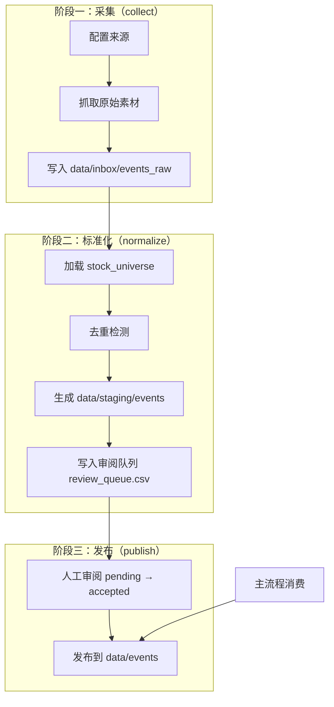
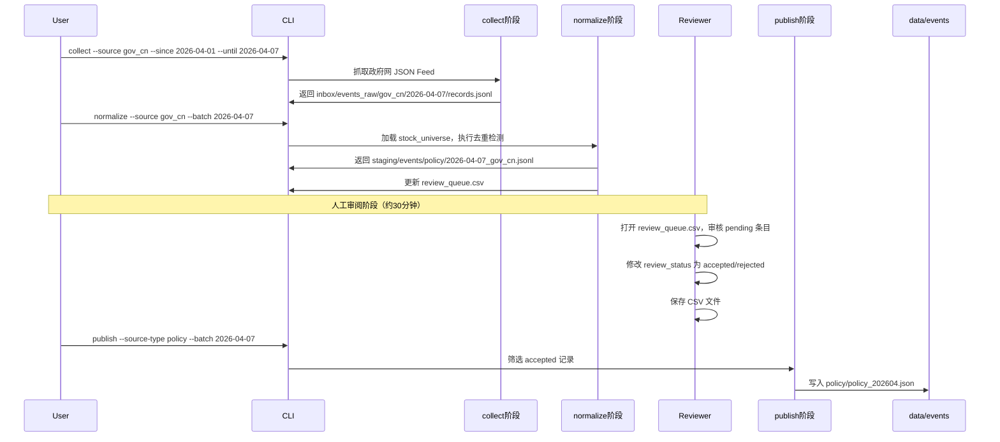

事件导入流程是整个量化事件驱动系统的数据入口，负责将散落在互联网各处的原始事件素材，经过采集、标准化、人工事后审阅，最终发布为系统可直接消费的正式事件。本页面向初学者开发者详细介绍这一流程的设计理念、具体步骤与操作方式。

## 流程总览

事件导入采用**三阶段流水线**架构：采集（collect）→ 标准化（normalize）→ 发布（publish）。这种设计将原始数据的获取、清洗与人工事后处理解耦，使得每个阶段可以独立验证与调试，也避免了自动化流程中误采噪音数据直接进入系统。



整个流水线由 `pipeline/event_ingest.py` 实现，入口脚本为 `scripts/event_ingest.py`。你可以通过命令行执行三种子命令，分别对应三个阶段。

Sources: [event_ingest.py](pipeline/event_ingest.py#L155-L185)
Sources: [event_ingest.py](pipeline/event_ingest.py#L187-L212)
Sources: [event_ingest.py](pipeline/event_ingest.py#L215-L271)

## 支持的事件来源

系统预置了八种事件来源配置，存储在 `SOURCE_PROFILES` 字典中。每种配置定义了该来源的类型、采集模式与默认 URL。

| 来源标识 | 类型 | 名称 | 采集模式 | 默认数据源 |
|---|---|---|---|---|
| `gov_cn` | policy | 中国政府网 | auto_web | JSON feed + 列表页 |
| `ndrc` | policy | 国家发展改革委 | auto_web | 列表页 |
| `csrc` | policy | 中国证监会 | auto_web | 列表页 |
| `cninfo` | announcement | 巨潮资讯网 | manual_input | 需通过 --input 指定 |
| `eastmoney_industry` | industry | 东方财富行业频道 | manual_input | 需通过 --input 指定 |
| `36kr_manual` | industry | 36氪产业板块 | manual_input | 需通过 --input 指定 |
| `yicai_manual` | macro | 第一财经 | manual_input | 需通过 --input 指定 |
| `macro_manual` | macro | 宏观/地缘人工整理 | manual_input | 需通过 --input 指定 |

其中 `gov_cn`、`ndrc`、`csrc` 标记为 FEED_SUMMARY_SOURCES，系统会优先尝试从 JSON Feed 获取摘要数据。如果 Feed 失败，再降级为列表页抓取。manual_input 类型的来源无法自动抓取，必须通过 `--input` 参数提供导入文件。

Sources: [event_ingest.py](pipeline/event_ingest.py#L45-L105)
Sources: [event_ingest.py](pipeline/event_ingest.py#L107-L108)

## 数据目录结构

事件导入流程涉及的数据目录分布在三个层级：

```
data/
├── inbox/
│   └── events_raw/
│       └── {source}/          # 按来源和批次组织的原始采集文件
│           └── {batch}/
│               └── records.jsonl
├── staging/
│   └── events/
│       ├── {source_type}/      # 按类型组织的标准化候选文件
│       │   └── {batch}_{source}.jsonl
│       └── review_queue.csv    # 全局审阅队列（所有来源共享）
└── events/
    ├── policy/                # 发布后的正式事件
    ├── announcement/
    ├── industry/
    └── macro/
        └── {source_type}_{YYYYMM}.json
```

**inbox 目录**：存放原始采集结果，包含从网页抓取的 HTML 内容或 JSON 数据。每个来源的每个批次独立存储，便于追溯与回溯。

**staging 目录**：存放标准化后的候选事件，等待人工审阅。审阅队列使用 CSV 格式，支持 Excel 直接编辑。

**events 目录**：存放正式发布的事件，被下游流程（事件识别、关联挖掘、影响预测等模块）直接消费。

Sources: [event_ingest.py](pipeline/event_ingest.py#L28)
Sources: [event_ingest.py](pipeline/event_ingest.py#L532-L535)

## 阶段一：采集（collect）

采集阶段负责从指定来源抓取原始素材，将结果写入 inbox 目录。

**命令行用法**：

```bash
# 自动抓取政府网（使用默认 feed URL）
python scripts/event_ingest.py collect --source gov_cn --since 2026-04-01 --until 2026-04-07

# 手动导入 CSV 文件
python scripts/event_ingest.py collect --source macro_manual --since 2026-04-01 --until 2026-04-07 --input data/manual/sample_news.json

# 覆盖默认列表页 URL
python scripts/event_ingest.py collect --source ndrc --since 2026-04-01 --until 2026-04-07 --seed-url https://custom.ndrc.gov.cn/xwdt/tzgg/
```

**核心参数说明**：

| 参数 | 必需 | 说明 |
|---|---|---|
| `--source` | 是 | 事件来源标识，从 SOURCE_PROFILES 中选择 |
| `--since` | 是 | 采集时间范围起点（YYYY-MM-DD） |
| `--until` | 是 | 采集时间范围终点（YYYY-MM-DD） |
| `--input` | 否 | 手动导入的文件路径（CSV/JSON/JSONL/TXT） |
| `--seed-url` | 否 | 覆盖默认列表页 URL，可多次指定 |
| `--limit` | 否 | 单次最多处理的详情条数，默认 30 |

采集器根据来源配置自动选择 `AutoWebCollector` 或 `ManualInputCollector`。自动网页采集器会依次尝试 JSON Feed、列表页抓取，最终逐条抓取详情页内容。

Sources: [event_ingest.py](pipeline/event_ingest.py#L155-L185)
Sources: [event_ingest.py](pipeline/event_ingest.py#L274-L295)
Sources: [event_ingest.py](pipeline/event_ingest.py#L342-L413)

## 阶段二：标准化（normalize）

标准化阶段将原始采集结果转换为候选事件，生成审阅队列供人工审阅。

**命令行用法**：

```bash
python scripts/event_ingest.py normalize --source gov_cn --batch 2026-04-07
```

执行后返回两个文件路径：标准化候选文件路径和审阅队列路径。

**标准化过程中的处理逻辑**：

1. **加载股票名称**：从 `data/manual/stock_universe.csv` 或 `data/raw/stock_universe.csv` 加载股票池，用于匹配事件文本中提及的公司。

2. **加载已有事件键**：扫描 `data/events/*` 下所有正式事件，构建去重键集合。

3. **生成去重键**：对每条记录使用 `source_type | normalize(title) | normalize(source_url or title+date)` 的组合计算 MD5 前 16 位哈希，确保相同事件不会被重复导入。

4. **实体命中检测**：将标题和正文与股票名称进行匹配，最多记录 12 个命中的股票名称。

5. **自动建议审阅状态**：根据以下规则给出建议状态：
   - 标题长度不足 8 字符 → `rejected`
   - 正文长度不足 40 字符 → `pending`
   - 出现重复嫌疑 → `pending`
   - 其他情况 → `accepted`

Sources: [event_ingest.py](pipeline/event_ingest.py#L187-L212)
Sources: [event_ingest.py](pipeline/event_ingest.py#L779-L819)
Sources: [event_ingest.py](pipeline/event_ingest.py#L822-L851)

## 阶段三：发布（publish）

发布阶段将审阅后确认的事件正式写入 `data/events` 目录。

**命令行用法**：

```bash
python scripts/event_ingest.py publish --source-type policy --batch 2026-04-07
```

**发布流程说明**：

1. 从审阅队列筛选 `review_status == "accepted"` 且匹配 `source_type` 和 `batch` 的记录。

2. 将通过的记录写入 staging 目录对应类型的 JSONL 文件。

3. 按发布月份合并到 `data/events/{source_type}/{source_type}_{YYYYMM}.json` 中，使用 dedupe_key 作为唯一键进行合并去重。

4. 最终文件按发布时间升序排列。

Sources: [event_ingest.py](pipeline/event_ingest.py#L215-L271)
Sources: [event_ingest.py](pipeline/event_ingest.py#L959-L978)

## 审阅队列操作

审阅队列文件 `data/staging/events/review_queue.csv` 是整个导入流程的核心枢纽，支持以下操作：

**查看当前队列**：

```bash
# 查看所有待审阅事件
cat data/staging/events/review_queue.csv

# 查看特定类型的待审阅事件
grep "policy" data/staging/events/review_queue.csv | head -20
```

**手动修改审阅状态**：直接用 Excel 或文本编辑器打开 CSV 文件，修改 `review_status` 列（pending / accepted / rejected）和 `review_note` 列。修改完成后运行 publish 命令即可将 accepted 的事件正式发布。

**审阅队列字段说明**：

| 字段 | 说明 |
|---|---|
| `dedupe_key` | 事件唯一标识符 |
| `title` | 事件标题 |
| `content` | 事件正文 |
| `source_type` | 事件类型（policy/announcement/industry/macro） |
| `entity_hits` | 匹配的股票名称（用顿号分隔） |
| `entity_hit_count` | 命中股票数量 |
| `duplicate_suspect` | 是否疑似重复（True/False） |
| `review_status` | 当前审阅状态（pending/accepted/rejected） |
| `review_note` | 审阅备注 |
| `suggested_status` | 系统自动建议的审阅状态 |

Sources: [event_ingest.py](pipeline/event_ingest.py#L110-L149)
Sources: [event_ingest.py](pipeline/event_ingest.py#L895-L927)

## 完整导入示例

以下是一个完整的周度事件导入流程演示：



**实际操作命令序列**：

```bash
# 1. 采集政府网政策事件
python scripts/event_ingest.py collect --source gov_cn --since 2026-04-01 --until 2026-04-07

# 2. 采集宏观事件（手动导入）
python scripts/event_ingest.py collect --source macro_manual --since 2026-04-01 --until 2026-04-07 --input data/manual/macro_news.jsonl

# 3. 标准化政府网数据
python scripts/event_ingest.py normalize --source gov_cn --batch 2026-04-07

# 4. 标准化宏观数据
python scripts/event_ingest.py normalize --source macro_manual --batch 2026-04-07

# 5. [人工审阅 review_queue.csv]

# 6. 发布政策事件
python scripts/event_ingest.py publish --source-type policy --batch 2026-04-07

# 7. 发布宏观事件
python scripts/event_ingest.py publish --source-type macro --batch 2026-04-07
```

Sources: [tests/test_event_ingest.py](tests/test_event_ingest.py#L18-L137)

## 故障排除

| 问题 | 原因 | 解决方案 |
|---|---|---|
| `collect` 提示 "没有默认 seed url" | manual_input 来源缺少 `--input` 或 `--seed-url` | 添加 `--input` 参数指定导入文件 |
| `normalize` 提示 "未找到原始采集文件" | 尚未运行 collect 或 batch 参数不匹配 | 检查 inbox 目录是否已生成 records.jsonl |
| `publish` 提示 "未找到可发布的 accepted 事件" | 审阅队列为空或没有 accepted 状态的记录 | 检查 review_queue.csv 中该批次的记录状态 |
| 列表页抓取超时 | 网络不稳定或目标站点响应慢 | 减少 `--limit` 值，或使用 `--input` 直接提供已有素材 |
| JSON Feed 抓取失败 | 目标站点的 Feed 接口变更或不可访问 | 降级为列表页模式，确保 default_urls 配置正确 |

Sources: [event_ingest.py](pipeline/event_ingest.py#L380-L383)
Sources: [event_ingest.py](pipeline/event_ingest.py#L488-L494)
Sources: [event_ingest.py](pipeline/event_ingest.py#L219-L229)

## 后续步骤

导入的事件最终会被主流程消费，用于事件识别、关联挖掘与影响预测。完成事件导入后，你可以：

- 运行周度流程处理新导入的事件 → [周度运行](18-zhou-du-yun-xing)
- 查看事件数据目录结构 → [数据目录结构](21-shu-ju-mu-lu-jie-gou)
- 了解事件如何被识别和分类 → [事件分类体系](5-shi-jian-fen-lei-ti-xi)