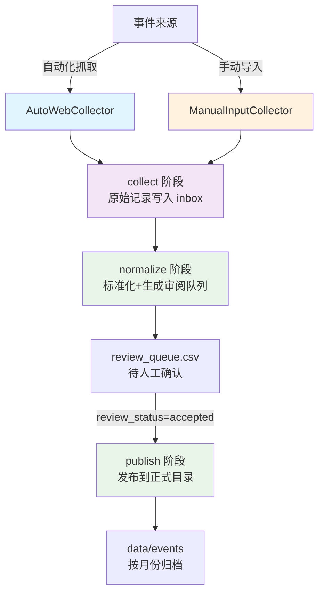
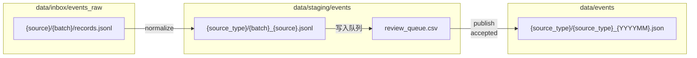

事件采集脚本是项目数据管道的入口模块，负责从各类来源抓取原始事件内容，并经过标准化处理后进入审阅队列。该脚本支持自动化网页抓取与手动导入两种模式，通过三阶段流水线（采集→标准化→发布）将分散的事件信息汇聚为结构化的事件数据集。

## 系统架构概览

事件采集系统采用采集器模式（Collector Pattern），将不同来源的事件获取逻辑封装为统一的接口。系统核心由三个子命令组成，分别对应数据处理的不同阶段。



脚本入口位于 `scripts/event_ingest.py`，实际业务逻辑封装在 `pipeline/event_ingest.py` 模块中。该模块包含两个核心数据类：`CollectedRecord` 用于存储原始采集记录，`CandidateRecord` 用于存储标准化后的候选事件。Sources: [scripts/event_ingest.py](scripts/event_ingest.py#L1-L18), [pipeline/event_ingest.py](pipeline/event_ingest.py#L110-L152)

## 事件来源配置

系统预置了七种事件来源配置，通过 `SOURCE_PROFILES` 字典管理。每种来源关联特定的事件类型（source_type）和采集模式（mode）。

| 来源标识 | 事件类型 | 来源名称 | 采集模式 | 默认 URL |
|---------|---------|---------|---------|---------|
| gov_cn | policy | 中国政府网 | auto_web | https://www.gov.cn/zhengce/zuixin/ |
| ndrc | policy | 国家发展改革委 | auto_web | https://www.ndrc.gov.cn/xwdt/tzgg/ |
| csrc | policy | 中国证监会 | auto_web | https://www.csrc.gov.cn/csrc/c100027/common_list.shtml |
| cninfo | announcement | 巨潮资讯网 | manual_input | - |
| eastmoney_industry | industry | 东方财富行业频道 | manual_input | - |
| 36kr_manual | industry | 36氪产业板块 | manual_input | - |
| yicai_manual | macro | 第一财经 | manual_input | - |
| macro_manual | macro | 宏观/地缘人工整理 | manual_input | - |

其中 `gov_cn`、`ndrc`、`csrc` 三者属于支持 JSON Feed 的来源，系统优先尝试通过 `default_feed_urls` 获取结构化数据，仅在获取失败时回退到网页抓取模式。Sources: [pipeline/event_ingest.py](pipeline/event_ingest.py#L45-L105)

## 三阶段命令详解

### 第一阶段：采集（collect）

```bash
python scripts/event_ingest.py collect \
    --source gov_cn \
    --since 2026-04-01 \
    --until 2026-04-07 \
    [--input /path/to/seed.csv] \
    [--seed-url https://example.com/list] \
    [--limit 30]
```

| 参数 | 必填 | 说明 |
|-----|------|-----|
| --source | 是 | 事件来源标识，见上表 |
| --since | 是 | 采集起始日期（YYYY-MM-DD） |
| --until | 是 | 采集结束日期（YYYY-MM-DD） |
| --input | 否 | 手动导入文件路径，支持 CSV/JSON/JSONL/TXT |
| --seed-url | 否 | 覆盖默认列表页 URL，可多次传入 |
| --limit | 否 | 单次最多处理条数，默认 30 |

采集阶段根据来源的 `mode` 属性选择不同的采集器：`auto_web` 模式由 `AutoWebCollector` 处理，优先使用 JSON Feed 拉取元数据，再按需补抓详情页；`manual_input` 模式由 `ManualInputCollector` 处理，要求通过 `--input` 或 `--seed-url` 提供导入素材。Sources: [pipeline/event_ingest.py](pipeline/event_ingest.py#L155-L184), [pipeline/event_ingest.py](pipeline/event_ingest.py#L342-L520)

**采集输出**：原始记录以 JSONL 格式写入 `data/inbox/events_raw/{source}/{batch}/records.jsonl`，其中 batch 为 `--until` 参数值。Sources: [pipeline/event_ingest.py](pipeline/event_ingest.py#L532-L535)

### 第二阶段：标准化（normalize）

```bash
python scripts/event_ingest.py normalize \
    --source gov_cn \
    --batch 2026-04-07
```

标准化阶段执行以下处理：将原始记录转换为 `CandidateRecord`；通过去重键（dedupe_key）检测重复事件；提取正文中出现的股票名称并生成 `entity_hits` 字段；根据标题长度、内容完整性等因素自动给出 `suggested_status`（accepted/pending/rejected）。Sources: [pipeline/event_ingest.py](pipeline/event_ingest.py#L187-L212), [pipeline/event_ingest.py](pipeline/event_ingest.py#L779-L851)

**去重机制**：dedupe_key 由 `source_type`、`normalize(title)`、`normalize(source_url|{title}|{date})` 三部分拼接后取 MD5 前 16 位哈希值生成。标准化时会扫描 `data/events` 目录下所有已发布的 `.json` 文件，与历史事件进行去重比对。Sources: [pipeline/event_ingest.py](pipeline/event_ingest.py#L822-L827), [pipeline/event_ingest.py](pipeline/event_ingest.py#L871-L892)

**标准化输出**：
- `data/staging/events/{source_type}/{batch}_{source}.jsonl` — 候选事件列表
- `data/staging/events/review_queue.csv` — 全局审阅队列（追加合并）

审阅队列 CSV 包含 `review_status` 和 `review_note` 两列供人工审阅修改。Sources: [pipeline/event_ingest.py](pipeline/event_ingest.py#L895-L928)

### 第三阶段：发布（publish）

```bash
python scripts/event_ingest.py publish \
    --source-type policy \
    --batch 2026-04-07
```

发布阶段仅处理 `review_status` 标记为 `accepted` 的记录，按发布月份归档到 `data/events/{source_type}/{source_type}_{YYYYMM}.json` 文件中，支持增量合并——已存在的事件（按 dedupe_key 判断）不会被重复写入。Sources: [pipeline/event_ingest.py](pipeline/event_ingest.py#L215-L271), [pipeline/event_ingest.py](pipeline/event_ingest.py#L959-L978)

## 手动导入格式

当使用 `--input` 参数时，脚本支持以下文件格式：

| 格式 | 列/字段映射 | 示例 |
|-----|------------|------|
| CSV | source_url, title, content, published_at | 详见 `data/manual/sample_news.json` |
| JSON | source_url/URL, title/标题, content/正文, published_at/发布时间 | 对象数组或 `{records: [...]}` 结构 |
| JSONL | 每行一个 JSON 对象，字段同上 | 每行独立事件 |
| TXT | 每行一个 URL | 用于快速导入链接列表 |

脚本会自动补全缺失字段：当 `title`、`content`、`published_at` 任一字段为空但存在 `source_url` 时，会尝试抓取详情页补充内容。Sources: [pipeline/event_ingest.py](pipeline/event_ingest.py#L538-L561), [pipeline/event_ingest.py](pipeline/event_ingest.py#L564-L624)

## 完整工作流示例

以下示例展示从政府网抓取政策事件并发布的完整流程：

```bash
# Step 1: 采集最近一周的政策事件
python scripts/event_ingest.py collect \
    --source gov_cn \
    --since 2026-04-01 \
    --until 2026-04-07

# Step 2: 标准化并生成审阅队列
python scripts/event_ingest.py normalize \
    --source gov_cn \
    --batch 2026-04-07

# Step 3: 人工审阅 review_queue.csv（修改 review_status）
# 使用 Excel 或文本编辑器将需要的事件标记为 accepted

# Step 4: 发布已确认的事件
python scripts/event_ingest.py publish \
    --source-type policy \
    --batch 2026-04-07
```

执行后，事件将归档至 `data/events/policy/policy_202604.json`。Sources: [pipeline/event_ingest.py](pipeline/event_ingest.py#L298-L339)

## 数据流与目录结构



关键目录说明：
- `data/inbox/events_raw/` — 原始采集数据，按来源和批次组织，作为归档存储
- `data/staging/events/` — 标准化中间结果，review_queue.csv 为全局审阅入口
- `data/events/` — 正式发布的事件，按类型和月份归档

## 配置与依赖

事件分类体系（用于后续事件识别阶段）定义在 `config/config.yaml` 的 `event_taxonomy` 区块，包含 `subject_type`（政策/公司/行业/宏观/地缘）、`duration_type`（脉冲型/中期型/长尾型）、`predictability`（突发型/预披露型）等维度。Sources: [config/config.yaml](config/config.yaml#L91-L200)

股票名称列表（用于 `entity_hits` 提取）默认从 `data/manual/stock_universe.csv` 加载，文件包含 `stock_code`、`stock_name`、`industry`、`concept_tags` 等字段。Sources: [pipeline/event_ingest.py](pipeline/event_ingest.py#L854-L868)

## 后续步骤

完成事件采集后，建议继续阅读以下页面：
- [事件导入流程](3-shi-jian-dao-ru-liu-cheng) — 了解采集脚本与后续事件识别模块的衔接
- [数据目录结构](21-shu-ju-mu-lu-jie-gou) — 深入理解各目录的用途和数据格式
- [事件分类体系](5-shi-jian-fen-lei-ti-xi) — 掌握事件类型定义在配置中的位置