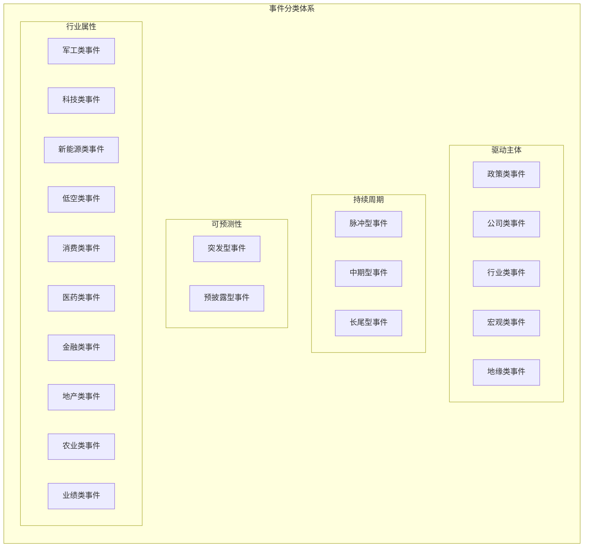
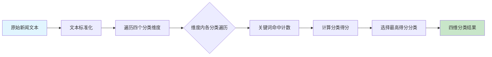

本文档介绍项目中用于对新闻事件进行多维度分类的核心框架。该分类体系贯穿事件识别、关联挖掘、影响预测和策略构建四个核心环节，是实现量化事件驱动策略的基础架构。

## 设计背景与目标

传统的金融新闻分析往往仅关注事件本身，而忽视了其多维度的属性差异。例如，政策发布可能引发行业级别的长尾效应，而公司公告可能产生脉冲式影响。本项目采用**四维分类体系**，通过 `subject_type`（驱动主体）、`duration_type`（持续周期）、`predictability_type`（可预测性）和 `industry_type`（行业属性）四个维度对事件进行刻画。

这种多维度分类的设计目标是：为后续的关联评分机制提供差异化权重依据，并为预期 CAR 计算提供事件特征输入。分类体系完全配置驱动，可通过 `config/config.yaml` 中的 `event_taxonomy` 节点灵活调整关键词和分类阈值。

Sources: [config/config.yaml](config/config.yaml#L85-L199)
Sources: [pipeline/models.py](pipeline/models.py#L10-L60)

## 四维分类架构

事件分类体系由四个独立的分类维度构成，每个维度内部定义了若干互斥类别，每个类别通过一组关键词进行匹配。以下是分类体系的完整结构：



### 维度一：驱动主体（subject_type）

驱动主体维度标识事件的发起方或责任方，对后续的关联评分权重配置有直接影响。该维度包含五个类别：

| 类别 | 关键词示例 | 典型场景 |
|------|-----------|---------|
| 政策类事件 | 政策、方案、规划、意见、通知、条例、监管 | 部委发文、地方实施细则 |
| 公司类事件 | 公告、业绩、重组、并购、增持、回购、分红 | 上市公司公告、重大事项 |
| 行业类事件 | 行业、产业、技术突破、新产品、量产、商用 | 技术进展、产能扩张 |
| 宏观类事件 | GDP、CPI、PMI、降息、降准、汇率、CPI | 央行政策、经济数据 |
| 地缘类事件 | 战争、冲突、制裁、军演、导弹、台海 | 国际政治军事事件 |

政策类事件通常具有广泛的行业辐射效应，公司类事件则对单一标的影响更为集中。在关联评分配置中，`subject_bias` 参数为不同驱动主体设置了不同的预测系数：地缘类事件（1.15）和公司类事件（1.12）享有较高系数，而宏观类事件（0.92）系数最低，反映其影响路径更为间接。

Sources: [config/config.yaml](config/config.yaml#L103-L118)
Sources: [pipeline/models.py](pipeline/models.py#L26-L39)

### 维度二：持续周期（duration_type）

持续周期维度描述事件影响的时效特征，对于预测持仓周期和 CAR 计算窗口设置至关重要：

| 类别 | 关键词 | 预期影响时长 |
|------|--------|-------------|
| 脉冲型事件 | 突发、爆炸、冲突、坠毁、事故、紧急、速报、快讯 | 1-5 个交易日 |
| 中期型事件 | 季度、半年、年度、阶段、周期 | 1-4 周 |
| 长尾型事件 | 规划、战略、改革、转型、五年、十四五、远景 | 数月乃至数年 |

脉冲型事件如突发事故或紧急政策，通常在消息公布后的短期内集中释放影响；长尾型事件如五年规划或产业转型路线图，则需要较长时间窗口来观察政策落地效果。事件研究法的 CAR 窗口配置会参考此维度进行差异化调整。

Sources: [config/config.yaml](config/config.yaml#L86-L92)

### 维度三：可预测性（predictability_type）

可预测性维度区分事件是否具有预先披露特征，这对于区分 Alpha 来源具有重要意义：

| 类别 | 关键词 | Alpha 来源 |
|------|--------|-----------|
| 突发型事件 | 突发、意外、紧急、黑天鹅、震惊 | 事件驱动（消息后抢筹） |
| 预披露型事件 | 预告、预计、计划、拟、即将、草案、征求意见 | 事件研究（预期差交易） |

预披露型事件允许投资者在正式公告前形成预期，当实际公告与预期产生偏差时存在套利空间；突发型事件则要求快速反应能力，Alpha 主要来源于对信息传播速度和价格发现效率的把握。

Sources: [config/config.yaml](config/config.yaml#L93-L97)

### 维度四：行业属性（industry_type）

行业属性维度标识事件涉及的垂直行业，用于关联评分中的行业匹配计算：

| 类别 | 关键词 |
|------|--------|
| 军工类事件 | 军工、国防、导弹、战斗机、航母、北斗、航天、军民融合 |
| 科技类事件 | AI、芯片、半导体、算力、大模型、机器人、量子、5G、6G、GPU |
| 新能源类事件 | 光伏、风电、储能、氢能、锂电、电池、碳中和、碳达峰 |
| 低空类事件 | 低空、eVTOL、飞行汽车、通航、无人机、适航、空域 |
| 消费类事件 | 消费、零售、电商、白酒、食品、餐饮、旅游、免税 |
| 医药类事件 | 医药、创新药、生物医药、疫苗、医疗器械、集采、FDA |
| 金融类事件 | 银行、保险、券商、基金、数字货币、注册制 |
| 地产类事件 | 房地产、楼市、限购、限贷、保交楼、城中村、旧改 |
| 农业类事件 | 农业、种业、粮食安全、转基因、化肥、养殖 |
| 业绩类事件 | 业绩预告、业绩快报、年报、季报、盈利、亏损、高增长 |

Sources: [config/config.yaml](config/config.yaml#L98-L169)

## 分类算法实现

事件分类的核心逻辑位于 `pipeline/task1_event_identify.py` 中的 `classify_event` 函数。该函数接收文本输入，通过关键词匹配计算各分类的命中得分，最终选择得分最高的类别作为分类结果。

### 分类流程



分类算法采用**词频加权投票**策略：对于每个维度，统计文本中命中该类别所有关键词的次数，得分最高的类别当选。当文本未命中任何预设关键词时，系统会返回该维度的默认类别作为兜底。

Sources: [pipeline/task1_event_identify.py](pipeline/task1_event_identify.py#L111-L131)

### 关键词抽取函数

`extract_all_keywords` 函数用于从文本中提取所有被分类体系命中的关键词，该结果同时用于事件热度计算中的「广度」评分：

```python
def extract_all_keywords(text: str) -> list[str]:
    """抽取所有分类维度中命中的关键词。"""
    normalized = normalize_text(text)
    keywords: list[str] = []
    for dimension in EVENT_TAXONOMY.values():
        for token_list in dimension.values():
            for token in token_list:
                if normalize_text(token) in normalized:
                    keywords.append(token)
    return keywords
```

该函数首先对输入文本进行标准化处理（转小写、去除标点），然后遍历分类体系中的所有关键词进行匹配，命中的关键词会被收集到结果列表中。

Sources: [pipeline/task1_event_identify.py](pipeline/task1_event_identify.py#L100-L109)

## 配置注入机制

分类体系的配置采用**配置优先、默认值兜底**的设计原则。在 `pipeline/models.py` 中定义了 `DEFAULT_EVENT_TAXONOMY` 作为硬编码默认值，而在 `pipeline/settings.py` 中会尝试从 `config/config.yaml` 读取 `event_taxonomy` 配置节。

主流程通过 `AppConfig.event_taxonomy` 属性向外提供配置访问：

```python
@property
def event_taxonomy(self) -> dict[str, dict[str, list[str]]]:
    """事件分类体系配置，包含 duration_type, subject_type, predictability, industry_type 等维度。"""
    return self.raw.get("event_taxonomy", DEFAULT_EVENT_TAXONOMY)
```

在周度流水线中，配置通过 `workflow.py` 传递给事件识别模块：

```python
event_df = run_event_identification(
    fetch_artifacts.news_df,
    event_taxonomy=config.event_taxonomy,  # 配置驱动注入
)
```

Sources: [pipeline/models.py](pipeline/models.py#L153-L157)
Sources: [pipeline/workflow.py](pipeline/workflow.py#L52-L57)

## 五大量化特征

分类结果会与另外四个量化特征结合，形成事件候选的完整描述：

| 特征名 | 计算方式 | 取值范围 | 用途 |
|--------|---------|---------|------|
| `sentiment_score` | 正负面词命中比值 | -1 ~ 1 | 方向判断 |
| `heat_score` | 聚类规模×0.18 + 来源权重×0.55 + 新鲜度 | 0 ~ 1 | 优先级排序 |
| `intensity_score` | 强度词×0.12 + 官方来源+0.15 + 金额词+0.1 | 0 ~ 1 | 影响力评估 |
| `scope_score` | 涉及公司数 + 行业广度 + 政策/地缘加成 | 0 ~ 1 | 辐射范围 |
| `confidence_score` | 以上四维的加权 Logistic 变换 | 0 ~ 1 | 事件可信度 |

这五个特征与四维分类共同构成事件数据结构，传递给下游的关联挖掘模块和影响预测模块。

Sources: [pipeline/task1_event_identify.py](pipeline/task1_event_identify.py#L58-L99)
Sources: [wiki/Events.md](wiki/Events.md#L19-L28)

## 事件数据结构示例

经过分类处理后的事件数据会保存为 DataFrame，包含以下关键字段：

| 字段名 | 类型 | 说明 |
|--------|------|------|
| `event_id` | string | 事件唯一标识，由事件名和发布时间生成 |
| `event_name` | string | 事件名称（聚类内最具代表性的标题） |
| `subject_type` | string | 驱动主体分类 |
| `duration_type` | string | 持续周期分类 |
| `predictability_type` | string | 可预测性分类 |
| `industry_type` | string | 行业属性分类 |
| `cluster_size` | int | 聚类内新闻条数 |
| `confidence_score` | float | 综合置信度 |

实际数据示例可参考 `data/events/policy/low_altitude_202603.json`，该文件包含低空经济相关政策事件，每条记录包含标题、内容、发布时间和来源信息。

Sources: [data/events/policy/low_altitude_202603.json](data/events/policy/low_altitude_202603.json#L1-L19)

## 下一步

完成事件分类后，系统会进入[关联评分机制](6-guan-lian-ping-fen-ji-zhi)环节，利用分类结果为不同类型的事件配置差异化的关联权重。对于希望深入了解量化特征计算的读者，可进一步阅读[热度与强度评分](8-re-du-yu-qiang-du-ping-fen)。