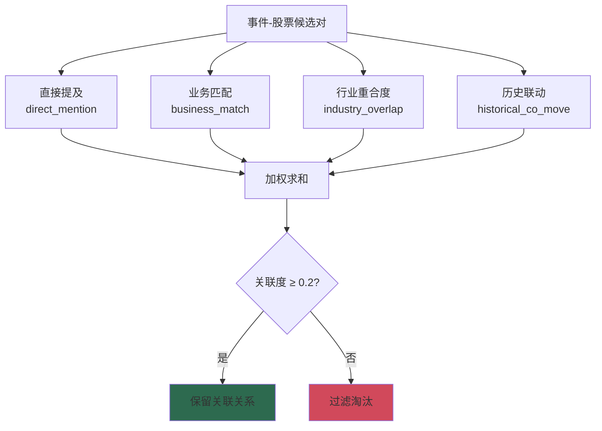
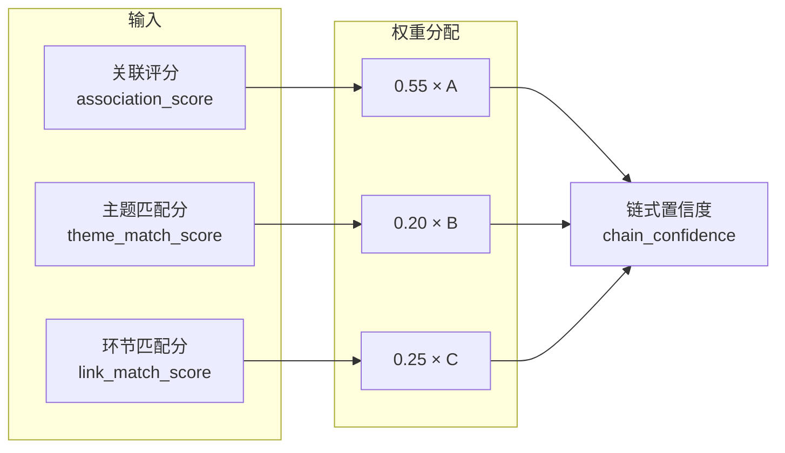

关联评分机制是事件驱动量化策略的核心组件，负责量化事件与个股之间的关联强度。该机制通过多维度特征加权计算，从海量事件-股票候选对中筛选出具有实际投资价值的关联关系，为后续[预期CAR计算](9-yu-qi-carji-suan)提供基础输入。

## 四维评分体系

关联评分的核心是一套四维加权评分框架，综合考量文本匹配、业务关联、行业重合度与历史价格联动四个维度。系统遍历所有事件-股票候选对，对每个维度独立计算得分后加权求和。



### 直接提及 (direct_mention)

该维度评估事件文本是否直接提及目标公司名称。计算逻辑为：标准化事件文本后，检查股票名称是否出现在文本中。若命中，得分为 1.0；否则为 0.0。在[优先股票映射](data/manual/industry_relation_map.json#L2-L15)中的股票会获得额外提升，其直接提及得分至少为 0.85。

```python
# Sources: pipeline/task2_relation_mining.py#L48-L52
direct_mention = 1.0 if normalize_text(
    stock["stock_name"]) in normalized_event_text else 0.0
```

### 业务匹配 (business_match)

该维度评估事件关键词与股票主营业务的相关程度，采用渐进式匹配策略。系统从股票的概念标签、主营业务和所属行业字段提取关键词，然后在事件文本中查找匹配。完全匹配（关键词完整出现）每个命中计 0.30 分；部分匹配（关键词子串出现）每个命中计 0.15 分，总分上限为 1.0。

```python
# Sources: pipeline/task2_relation_mining.py#L101-L118
for tag in tags:
    normalized_tag = normalize_text(tag)
    # 完全匹配
    if normalized_tag in normalized_event_text:
        full_match_score += 0.30
    # 部分匹配：标签长度>=3时，检查标签前2/3是否出现在文本中
    elif len(normalized_tag) >= 3:
        partial_tag = normalized_tag[:int(len(normalized_tag) * 2 / 3)]
        if partial_tag in normalized_event_text:
            partial_match_score += 0.15
```

### 行业重合度 (industry_overlap)

该维度计算事件所属行业与股票所属行业的一致性程度，采用分层匹配策略。首先检查事件行业类型字符串是否直接出现在股票行业文本中作为硬编码匹配；若命中则基础分为 1.0。系统还维护了一个行业大类到细分行业的映射表，例如"科技"类别映射到电子、计算机、通信等申万行业。当事件行业类型包含大类关键词且股票所属行业匹配到对应细分行业时，可获得额外的 0.3 分加成。

```python
# Sources: pipeline/task2_relation_mining.py#L120-L164
INDUSTRY_GROUP_MAP = {
    "科技": ["电子", "计算机", "通信", "传媒", "半导体", "软件", "信息技术"],
    "军工": ["国防军工", "航空", "航天", "兵器", "船舶"],
    "新能源": ["电力设备", "新能源", "光伏", "风电", "锂电"],
    # ... 更多映射
}

# 硬编码匹配规则作为 base_score
if industry_type in stock_text:
    base_score = 1.0
# ... 特殊行业规则

# 从事件的 industry_type 中提取行业大类关键词，匹配细分行业列表
for group_name, sub_industries in INDUSTRY_GROUP_MAP.items():
    if group_name in industry_type:
        for sub_industry in sub_industries:
            if sub_industry in stock_industry:
                additional_score = 0.3
                break
```

### 历史联动 (historical_co_move)

该维度基于历史价格数据计算股票与同行业股票的价格相关性。系统提取目标股票的日收益率序列，计算其与同行业股票平均收益率的皮尔逊相关系数。为确保统计可靠性，若共同交易日少于 20 天则返回默认值 0.5。最终结果通过线性映射将相关系数转换到 [0.3, 1.0] 区间。

```python
# Sources: pipeline/task2_relation_mining.py#L166-L220
def compute_historical_co_move(...) -> float:
    # 计算皮尔逊相关系数
    correlation = merged["return"].corr(merged["peer_avg_return"])
    # 将相关性映射到 [0.3, 1.0] 区间
    return min(1.0, 0.3 + max(0.0, correlation) * 0.7)
```

## 权重配置体系

系统支持灵活的权重配置，基础权重在 `config.yaml` 中定义，同时支持根据事件主体类型进行动态调整。

### 基础权重

默认配置下，四维评分的基础权重分配如下表所示：

| 维度 | 默认权重 | 含义 |
|------|---------|------|
| `direct_mention` | 0.45 | 文本直接提及权重最高 |
| `business_match` | 0.25 | 业务匹配次之 |
| `industry_overlap` | 0.20 | 行业重合度适中 |
| `historical_co_move` | 0.10 | 历史联动权重最低 |

```yaml
# Sources: config/config.yaml#L50-L54
scoring:
  association:
    direct_mention: 0.45
    business_match: 0.25
    industry_overlap: 0.20
    historical_co_move: 0.10
```

### 主体类型倍率调整

针对不同类型的事件，系统通过 `association_profiles` 配置差异化倍率。例如，政策类事件强调行业影响（industry_overlap 倍率 1.4），公司类事件强调直接提及（direct_mention 倍率 1.35），宏观类事件侧重行业与历史联动，地缘类事件则综合强调行业与联动特征。

```yaml
# Sources: config/config.yaml#L55-L77
scoring:
  association_profiles:
    default:
      direct_mention: 1.0
      business_match: 1.0
      industry_overlap: 1.0
      historical_co_move: 1.0
    政策类事件:
      direct_mention: 0.75
      business_match: 1.0
      industry_overlap: 1.4
      historical_co_move: 1.0
    公司类事件:
      direct_mention: 1.35
      business_match: 0.8
      industry_overlap: 0.75
      historical_co_move: 1.0
    宏观类事件:
      direct_mention: 0.7
      business_match: 0.8
      industry_overlap: 1.35
      historical_co_move: 1.3
    地缘类事件:
      direct_mention: 0.8
      business_match: 0.8
      industry_overlap: 1.4
      historical_co_move: 1.15
```

倍率调整后，系统会自动进行归一化处理，确保所有权重之和为 1.0。

```python
# Sources: pipeline/task2_relation_mining.py#L54-L71
def _resolve_association_weights(config: AppConfig, subject_type: str) -> dict[str, float]:
    """根据基础权重和主体类型倍率得到最终关联权重。"""
    base_weights = config.association_weights
    profiles = config.association_weight_profiles
    default_profile = profiles.get("default", {})
    subject_profile = profiles.get(subject_type, {})
    adjusted: dict[str, float] = {}
    for key, base_value in base_weights.items():
        multiplier = float(subject_profile.get(key, default_profile.get(key, 1.0)))
        adjusted[key] = base_value * multiplier
    # 归一化处理
    total_weight = sum(adjusted.values())
    return {key: value / total_weight for key, value in adjusted.items()}
```

## 优先股票增强机制

系统通过 `industry_relation_map.json` 维护产业链优先股票列表。当事件匹配到某个产业主题时，该主题下的优先股票会获得额外的得分加成：

- **直接提及最低保障**：提升至 max(当前值, 0.85)
- **业务匹配最低保障**：提升至 max(当前值, 0.75)
- **行业重合度最低保障**：提升至 max(当前值, 0.80)

```python
# Sources: pipeline/task2_relation_mining.py#L42-L47
if stock["stock_code"] in priority_stocks:
    direct_mention = max(direct_mention, 0.85)
    business_match = max(business_match, 0.75)
    industry_overlap = max(industry_overlap, 0.8)
```

## 关联评分阈值过滤

为控制后续计算的候选集规模，系统设置了关联评分的最低阈值 0.2。关联度低于此阈值的候选对将被直接过滤，不参与后续的产业链图谱构建和影响预测计算。

```python
# Sources: pipeline/task2_relation_mining.py#L63
if association_score < 0.2:
    continue
```

## 产业链置信度评分

在完成基础关联评分后，系统进一步通过 `industry_chain_enhanced.py` 计算产业链置信度，综合考虑事件-主题匹配、产业环节匹配与基础关联得分三个层次。



链式置信度的计算公式为：

```
chain_confidence = 0.55 × association_score + 0.20 × theme_match_score + 0.25 × link_match_score
```

### 主题匹配分 (theme_match_score)

基于事件文本对产业主题关键词的命中情况计算，基础分为 0.45，每命中一个关键词增加 0.12 分。若命中前 3 个核心关键词，还可获得额外的 0.15 分加成。

```python
# Sources: pipeline/industry_chain_enhanced.py#L166-L183
def _compute_theme_match(event_info: pd.Series, theme_payload: dict) -> float:
    """计算主题匹配分（增强版）"""
    base_score = 0.45 + hits * 0.12
    core_bonus = 0.15 if core_hits > 0 else 0.0
    return min(1.0, base_score + core_bonus)
```

### 产业环节匹配分 (link_match_score)

针对具体的产业链环节进行匹配。若目标股票在环节的优先列表中或环节关键词命中文本，则计算匹配分。直接命中优先列表股票得 0.35 分，关键词每命中一项得 0.08 分，基础分为 0.45。

## 输出数据结构

关联挖掘模块的输出包含完整的关联信息，便于后续模块使用和结果分析：

```python
# Sources: pipeline/task2_relation_mining.py#L65-L78
relation = {
    "event_id": event["event_id"],
    "event_name": event["event_name"],
    "stock_code": stock["stock_code"],
    "stock_name": stock["stock_name"],
    "relation_type": relation_type,
    "association_score": association_score,
    "relation_path": relation_path,
    "direct_mention": round(direct_mention, 4),
    "business_match": round(business_match, 4),
    "industry_overlap": round(industry_overlap, 4),
    "historical_co_move": round(historical_co_move, 4),
}
```

## 与预测评分的衔接

关联评分作为关键输入，参与后续的预测评分计算。在[影响预测模块](16-ying-xiang-yu-ce-mo-kuai)中，系统将关联评分与事件热度、强度、流动性等因素综合计算预期 CAR 和最终预测评分：

```python
# Sources: pipeline/task3_impact_estimate.py#L84-L92
expected_car_4d = round(
    sentiment_direction
    * event_score
    * row["association_score"]  # 关联评分作为核心乘数
    * subject_multiplier
    * (0.55 + market_state)
    * max(0.15, 1 - residual_risk)
    * (1 + fundamental_score * 0.15)
    * adaptive_scale,
    4,
)
```

## 下一步

完成关联评分机制的理解后，建议继续学习：

- [热度与强度评分](8-re-du-yu-qiang-du-ping-fen) — 了解事件基础评分计算
- [预期CAR计算](9-yu-qi-carji-suan) — 了解关联评分如何转化为收益预测
- [产业链图谱可视化](15-guan-lian-wa-jue-mo-kuai) — 了解关联关系的可视化呈现