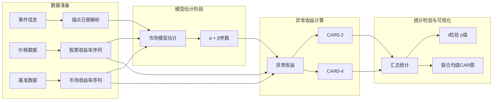

事件研究法（Event Study）是量化金融领域用于衡量特定事件对资产价格影响的核心方法论。本项目的事件研究模块实现了经典单因子市场模型，通过比较事件窗口期内资产的"实际收益"与"预期收益"来量化异常收益（Cumulative Abnormal Return, CAR），从而评估事件的市场影响力。

## 核心概念框架

事件研究法的核心假设是：在有效市场中，如果事件本身不包含新的信息，则资产收益率应仅由市场因素驱动。通过构建正常收益模型，可以将事件驱动的信息效应从市场波动中分离出来。



在技术实现层面，本项目通过 `pipeline/event_study_enhanced.py` 中的 `run_event_study_enhanced` 函数驱动完整的事件研究流程。该函数接收事件元数据、关联关系、股票价格和基准指数数据，输出包含日度异常收益明细、事件级别汇总统计以及联合均值CAR可视化图表。

Sources: [event_study_enhanced.py#L30-L179](pipeline/event_study_enhanced.py#L30-L179)

## 市场模型（Market Model）

### 单因子模型原理

本项目采用**单因子市场模型**作为正常收益的估计基准。该模型假设个股收益率由市场因素线性驱动：

$$R_{i,t} = \alpha_i + \beta_i \times R_{m,t} + \varepsilon_{i,t}$$

其中 $R_{i,t}$ 为个股日收益率，$R_{m,t}$ 为市场基准日收益率，$\alpha_i$ 为截距项（选股超额收益），$\beta_i$ 为市场敏感度（系统风险敞口），$\varepsilon_{i,t}$ 为残差项。

模型的预期收益为 $\hat{R}_{i,t} = \alpha_i + \beta_i \times R_{m,t}$，实际收益与预期收益之差即为异常收益。

### 参数估计窗口

模型的估计窗口（Estimation Window）设置为**事件锚点日期前第60个交易日至前第6个交易日**（共55个交易日）：

```python
estimation_start = pd.Timestamp(anchor_date) + pd.Timedelta(days=-60)
estimation_end = pd.Timestamp(anchor_date) + pd.Timedelta(days=-6)
```

Sources: [event_study_enhanced.py#L245-L265](pipeline/event_study_enhanced.py#L245-L265)

窗口设计遵循以下原则：选择事件前足够远的时间段以确保参数估计不受事件本身影响，同时避开距事件过近的日期以避免提前泄露效应。估计窗口长度为55个交易日（约11周），符合学术界通用标准。

### 回归估计与降级策略

当估计窗口内有效数据点少于15个时，模型自动切换为**市场调整法**（Market-Adjusted Return），此时预期收益简化为基准收益率：

```python
if len(merged) < 15:
    return {"alpha": 0.0, "beta": 1.0, "use_market_adjusted": 1.0}
```

这种降级机制确保了在数据稀疏情况下仍能提供有意义的结果，同时通过 `use_market_adjusted` 标记区分两种估计模式。

Sources: [event_study_enhanced.py#L258-L265](pipeline/event_study_enhanced.py#L258-L265)

## 事件窗口与锚点日期

### 锚点日期解析规则

锚点日期（Anchor Date）是事件研究的时间基准点。系统通过 `resolve_event_anchor_trade_date` 函数将事件的发布时间映射到最近的交易日：

```python
def resolve_event_anchor_trade_date(
    calendar: list[date],
    published_at: datetime,
    market_close_time: time,
) -> date | None:
    publish_date = published_at.date()
    if publish_date in calendar and published_at.time() < market_close_time:
        return publish_date
    for trade_date in calendar:
        if trade_date > publish_date:
            return trade_date
    return None
```

Sources: [utils.py#L97-L110](pipeline/utils.py#L97-L110)

解析规则遵循"**事件收盘前视为当日事件，收盘后视为次日事件**"原则，与A股T+1交易制度相匹配。具体而言，如果事件发布时间在 `market_close_time`（默认15:00:00）之前，则锚点为发布当日；如果在收盘时刻或之后，则锚点顺延至下一交易日。

### 事件窗口定义

本项目定义了以下事件窗口结构：

| 窗口名称 | 日偏移范围 | 用途描述 |
|---------|-----------|---------|
| 估计窗口 | [-60, -6] | 模型参数估计 |
| 事件前窗口 | [-1] | 事件前参考基准 |
| 短期窗口 | [0, 2] | CAR(0,2) 短期累计异常收益 |
| 中期窗口 | [0, 4] | CAR(0,4) 中期累计异常收益 |

```python
event_window_df = _build_event_window(
    stock_history=stock_history,
    benchmark_returns=benchmark_returns,
    market_calendar=common_calendar,
    anchor_date=anchor_date,
    start_offset=-1,
    end_offset=10,
    market_model=market_model,
)
```

Sources: [event_study_enhanced.py#L111-L119](pipeline/event_study_enhanced.py#L111-L119)

日偏移量（Day Offset）以锚点日期为0，正值表示事件后交易日，负值表示事件前交易日。注意，日偏移量基于**交易日日历**计算，而非自然日，因此节假日会被自动跳过。

## 异常收益与累计异常收益

### 异常收益（AR）计算

异常收益（Abnormal Return, AR）衡量个股在特定日期的超额表现：

$$AR_{i,t} = R_{i,t} - \hat{R}_{i,t}$$

```python
expected_return = market_model["alpha"] + market_model["beta"] * benchmark_return
abnormal_return = actual_return - expected_return
```

Sources: [event_study_enhanced.py#L306-L311](pipeline/event_study_enhanced.py#L306-L311)

### 累计异常收益（CAR）计算

累计异常收益通过累加事件窗口内的日度异常收益得到：

| CAR指标 | 计算范围 | 语义 |
|--------|---------|------|
| CAR(0,2) | day_offset ∈ [0, 1, 2] | 事件后3日累计超额收益 |
| CAR(0,4) | day_offset ∈ [0, 1, 2, 3, 4] | 事件后5日累计超额收益 |

```python
cumulative_0_2 = 0.0
cumulative_0_4 = 0.0
for day_offset in range(start_offset, end_offset + 1):
    abnormal_return = actual_return - expected_return
    cumulative_all += abnormal_return
    if 0 <= day_offset <= 2:
        cumulative_0_2 += abnormal_return
    if 0 <= day_offset <= 4:
        cumulative_0_4 += abnormal_return
```

Sources: [event_study_enhanced.py#L293-L316](pipeline/event_study_enhanced.py#L293-L316)

## 统计检验框架

### t检验原理

为评估CAR的统计显著性，系统对每个事件的CAR(0,4)进行**单样本t检验**：

$$H_0: \overline{CAR}_{0,4} = 0$$
$$H_1: \overline{CAR}_{0,4} \neq 0$$

```python
car_values = car_0_4.dropna().tolist()
if len(car_values) >= 3:
    t_stat, p_value = stats.ttest_1samp(car_values, 0)
else:
    t_stat, p_value = float('nan'), float('nan')
```

Sources: [event_study_enhanced.py#L372-L377](pipeline/event_study_enhanced.py#L372-L377)

检验要求至少3个有效样本，当样本不足时返回NaN。p值小于0.05通常被认为具有统计显著性，表明事件确实对股价产生了非随机的超额收益。

### 汇总统计表结构

事件研究汇总统计表（Stats DataFrame）包含以下核心指标：

| 字段名 | 计算方式 | 含义 |
|-------|---------|------|
| sample_size | 关联股票去重数量 | 事件样本规模 |
| mean_ar_1d | day_offset=1的AR均值 | 事件后首日平均异常收益 |
| mean_car_0_2 | day_offset=2的CAR(0,2)均值 | 短期累计异常收益 |
| mean_car_0_4 | day_offset=4的CAR(0,4)均值 | 中期累计异常收益 |
| std_car_0_4 | CAR(0,4)标准差 | 收益离散程度 |
| positive_ratio_0_4 | CAR(0,4)>0的比例 | 正向响应占比 |
| t_stat | t检验统计量 | 显著性检验 |
| p_value | t检验p值 | 统计显著性 |

```python
stats_rows.append(
    {
        "sample_size": int(availability_group["stock_code"].nunique()),
        "mean_ar_1d": round(float(ar_1d.mean()) if not ar_1d.empty else 0.0, 6),
        "mean_car_0_4": round(float(car_0_4.mean()) if not car_0_4.empty else 0.0, 6),
        "positive_ratio_0_4": round(float((car_0_4 > 0).mean()) if len(car_0_4) > 0 else 0.0, 4),
        "t_stat": round(float(t_stat), 4) if not pd.isna(t_stat) else None,
        "p_value": round(float(p_value), 4) if not pd.isna(p_value) else None,
    }
)
```

Sources: [event_study_enhanced.py#L379-L393](pipeline/event_study_enhanced.py#L379-L393)

## 输出产物与可视化

### 三类核心输出

事件研究增强阶段生成三类产物，封装于 `EventStudyArtifacts` 数据类中：

```python
@dataclass(slots=True)
class EventStudyArtifacts:
    """事件研究增强阶段产物。"""
    detail_df: pd.DataFrame      # 日度明细表
    stats_df: pd.DataFrame        # 事件汇总统计表
    joint_mean_car_df: pd.DataFrame  # 联合均值CAR数据
    output_dir: Path
    joint_mean_car_path: Path
```

Sources: [event_study_enhanced.py#L19-L28](pipeline/event_study_enhanced.py#L19-L28)

### 联合均值CAR图

联合均值CAR图按情感分组（正向事件/负向事件）绘制不同事件组在事件窗口期内的平均累计异常收益曲线：

```python
color_map = {
    "正向事件": "#d1495b",   # 红色系
    "负向事件": "#2f6690",   # 蓝色系
    "单组聚合": "#6c757d",   # 灰色系
}
for group_label, group_df in joint_df.groupby("group_label"):
    plt.plot(
        group_df["day_offset"],
        group_df["mean_car"],
        marker="o",
        linewidth=2,
        label=group_label,
        color=color_map.get(group_label, "#6c757d"),
    )
```

Sources: [event_study_enhanced.py#L443-L456](pipeline/event_study_enhanced.py#L443-L456)

该图表可直观展示正向事件（如政策利好）是否伴随正向CAR，负向事件是否伴随负向CAR，以及不同事件类型间的响应幅度差异。

## 与预期CAR预测的关系

值得注意的是，本项目的事件研究模块（`event_study_enhanced.py`）与预期CAR预测模块（`task3_impact_estimate.py`）存在功能分工：

| 维度 | 历史事件研究 | 未来影响预测 |
|------|-------------|-------------|
| 目标 | 评估已发生事件的实际市场影响 | 预测新事件对关联股票的预期影响 |
| 数据来源 | 历史价格数据 | 多因子模型 + 配置权重 |
| 输出形式 | 实证CAR统计量 | 预期CAR预测值 |
| 核心逻辑 | AR = 实际收益 - 预期收益 | 多因子加权综合评分 |

`task3_impact_estimate.py` 中的预期CAR计算借鉴了历史事件研究的变量体系（如beta、残差波动率），但采用简化的多因子乘法模型：

```python
expected_car_4d = round(
    sentiment_direction
    * event_score
    * row["association_score"]
    * subject_multiplier
    * (0.55 + market_state)
    * max(0.15, 1 - residual_risk)
    * (1 + fundamental_score * 0.15)
    * adaptive_scale,
    4,
)
```

Sources: [task3_impact_estimate.py#L127-L137](pipeline/task3_impact_estimate.py#L127-L137)

## 配置参数体系

事件研究的时窗参数可通过 `config/config.yaml` 中的 `event_study` 配置节调整：

```yaml
event_study:
  estimation_window_start: -60   # 估计窗口起始偏移
  estimation_window_end: -6       # 估计窗口结束偏移
  event_window_start: -1          # 事件窗口起始偏移
  event_window_end: 4             # 事件窗口结束偏移
```

Sources: [config/config.yaml#L85-L89](config/config.yaml#L85-L89)

调整估计窗口长度可平衡参数估计精度与市场结构稳定性；调整事件窗口长度可适应不同类型事件的响应周期特征（如脉冲型事件适合短窗口，长尾型事件可能需要更长窗口）。

---

## 延伸阅读

- [预期CAR计算](9-yu-qi-carji-suan) — 了解未来影响预测模块如何借鉴事件研究框架
- [影响预测模块](16-ying-xiang-yu-ce-mo-kuai) — 深入多因子预测模型的技术细节
- [流水线设计](10-liu-shui-xian-she-ji) — 事件研究在完整流水线中的位置与数据流向