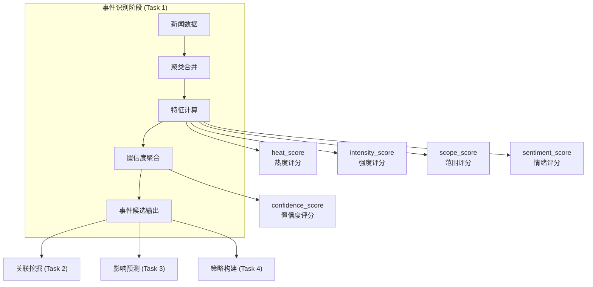
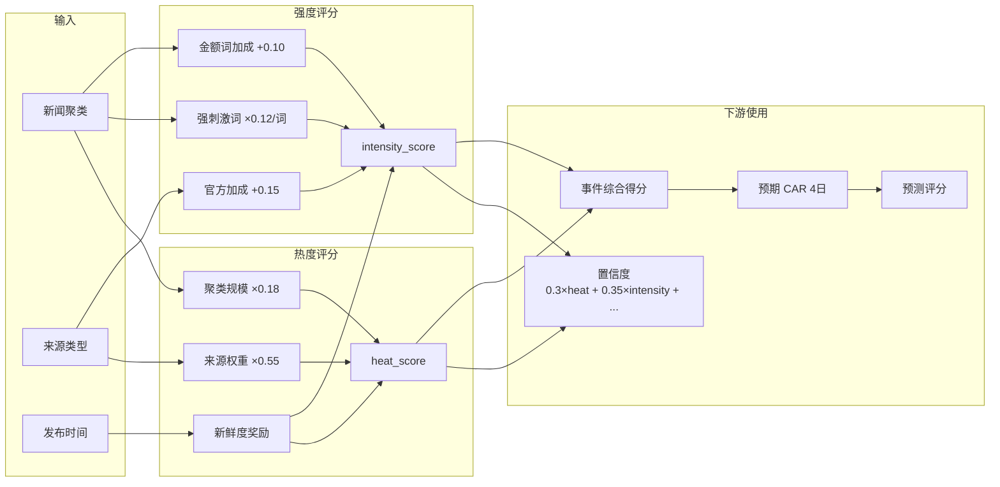

在事件驱动策略中，**热度评分**（heat_score）与**强度评分**（intensity_score）是事件候选阶段产生的两个核心量化特征，分别从「传播广度」和「刺激深度」两个维度刻画事件的冲击潜力。这两个评分在后续的关联挖掘与影响预测阶段被反复使用，是整个流水线评分体系的中间输入变量。

## 概念定位

这两个评分产生于 [Task 1 事件识别模块](14-shi-jian-shi-bie-mo-kuai)，作为 `run_event_identification` 函数的输出列，与情绪评分（sentiment_score）、范围评分（scope_score）、置信度评分（confidence_score）共同构成事件元数据的五大量化特征。



## 热度评分机制

热度评分衡量事件的**传播广度与新鲜程度**，核心逻辑是：来源越权威、聚类内新闻越多、距今越近，事件热度越高。

### 计算公式

```python
def compute_heat_score(cluster_df: pd.DataFrame) -> float:
    source_score = cluster_df["source"].map(source_weight).mean()
    cluster_size = len(cluster_df)
    freshness_days = max(0.0, (cluster_df["published_at"].max() - cluster_df["published_at"].min()).total_seconds() / 86400)
    value = min(1.0, 0.18 * cluster_size + 0.55 * source_score + max(0.0, 0.2 - 0.03 * freshness_days))
    return round(value, 4)
```

公式拆解为三个因子：

| 因子 | 权重系数 | 说明 |
|---|---|---|
| 聚类规模（cluster_size） | 0.18 | 每增加一条相关新闻，热度增加 0.18，上限受全局截断控制 |
| 来源权重均值（source_score） | 0.55 | 政策类来源权重最高（1.0），行业类次之（0.85），宏微观最低（0.8） |
| 新鲜度奖励（freshness） | max(0, 0.2 - 0.03×天数) | 初始新鲜度奖励 0.2，每过一天衰减 0.03 |

来源权重表定义在 `pipeline/utils.py`，取值如下：

| source | 权重 |
|---|---|
| policy | 1.00 |
| announcement | 0.95 |
| industry | 0.85 |
| macro | 0.80 |
| qstock | 0.75 |
| import | 0.70 |

Sources: [pipeline/utils.py#L12-L19](pipeline/utils.py#L12-L19)

### 典型数值范围

由于 `min(1.0, ...)` 截断，热度评分的实际取值范围为 `[0, 1.0]`：

- **高热度事件**（heat_score > 0.7）：多来源、近期、政策或公告类事件
- **中热度事件**（heat_score ∈ [0.4, 0.7]）：行业来源，聚类规模中等
- **低热度事件**（heat_score < 0.4）：单一来源或时效已过的事件

## 强度评分机制

强度评分衡量事件的**刺激深度与影响级别**，核心逻辑是：强刺激词越多、来源越官方、涉及金额词，事件强度越高。

### 计算公式

```python
INTENSITY_WORDS = ["重大", "核心", "超预期", "显著", "快速", "重点", "加快", "强烈", "高景气"]

def compute_intensity_score(text: str, cluster_df: pd.DataFrame) -> float:
    normalized = normalize_text(text)
    keyword_hits = sum(1 for word in INTENSITY_WORDS if normalize_text(word) in normalized)
    official_bonus = 0.15 if any(source in {"policy", "announcement"} for source in cluster_df["source"]) else 0.0
    amount_bonus = 0.1 if any(token in text for token in ["订单", "利润", "净利润", "预增"]) else 0.0
    value = min(1.0, 0.25 + keyword_hits * 0.12 + official_bonus + amount_bonus)
    return round(value, 4)
```

公式拆解为三个加成因子：

| 因子 | 加成值 | 说明 |
|---|---|---|
| 基础强度（base） | 0.25 | 即使无任何强刺激词，也有基础强度保底 |
| 强刺激词命中（keyword_hits） | ×0.12/词 | 命中越多强度越高，9 个关键词最多贡献约 1.08 |
| 官方来源加成（official_bonus） | +0.15 | 来自 policy 或 announcement 来源额外加成 |
| 金额词加成（amount_bonus） | +0.10 | 涉及「订单」「利润」「预增」等财务关键词 |

### 典型数值范围

由于 `min(1.0, ...)` 截断，强度评分的实际取值范围为 `[0.25, 1.0]`：

- **高强度事件**（intensity_score > 0.7）：命中多个强刺激词 + 官方来源 + 金额词
- **中强度事件**（intensity_score ∈ [0.4, 0.7]）：有基础强度加少量加成
- **低强度事件**（intensity_score ≈ 0.25）：无任何加成，仅有基础分

Sources: [pipeline/task1_event_identify.py#L26-L28](pipeline/task1_event_identify.py#L26-L28)

## 两评分的协同关系

热度与强度从不同角度刻画事件，但最终**共同决定置信度评分**。在事件识别输出中，置信度评分通过 logit 变换将四维评分聚合为一个综合置信度：

```python
raw = 0.3 * heat_score + 0.35 * intensity_score + 0.2 * scope_score + 0.15 * abs(sentiment_score)
confidence_score = round(logistic(6 * (raw - 0.5)), 4)
```

权重分配体现了设计意图：

| 评分类型 | 权重 | 理由 |
|---|---|---|
| intensity_score | **0.35** | 刺激深度最关键，决定市场冲击力度 |
| heat_score | **0.30** | 传播广度次之，影响受众范围 |
| scope_score | **0.20** | 影响范围第三，涉及公司数量 |
| abs(sentiment_score) | **0.15** | 情绪强度最小，正负方向已由其他变量处理 |

置信度通过 logistic 函数将原始加权得分映射到 `[0, 1]` 区间，中心点为 raw=0.5，对应 confidence≈0.5。

Sources: [pipeline/task1_event_identify.py#L64-L69](pipeline/task1_event_identify.py#L64-L69)

## 在影响预测中的角色

热度与强度评分在 [Task 3 影响预测模块](16-ying-xiang-yu-ce-mo-kuai) 中被二次使用，参与预期 CAR（累计超额收益）的计算与预测评分的加权。

### 事件综合得分的构成

```python
event_score = round(
    0.3 * heat_score + 0.35 * intensity_score +
    0.2 * scope_score + 0.15 * confidence_score,
    4
)
```

此处的权重与事件识别阶段略有不同——强度评分权重提升至 0.35，与事件识别阶段一致，但范围评分权重从 0.20 提升至 0.20（保持），置信度评分权重从 0.15 提升至 0.15（保持）。该评分作为中间变量参与后续公式。

### 预期 CAR 的计算

```python
expected_car_4d = round(
    sentiment_direction
    * event_score
    * row["association_score"]
    * subject_multiplier
    * (0.55 + market_state)
    * max(0.15, 1 - residual_risk)
    * (1 + fundamental_score * 0.15)
    * adaptive_scale,
    4
)
```

其中 event_score 包含了 heat_score 和 intensity_score 的加权贡献（分别贡献约 3% 和 3.5% 的权重）。最终预期 CAR 是多因子乘积模型，event_score 决定了事件的基准冲击力度。

### 预测评分的加权

```python
prediction_score = round(
    config.raw["scoring"]["prediction"]["expected_car_4d"] * expected_car_4d
    + config.raw["scoring"]["prediction"]["association_score"] * row["association_score"]
    + config.raw["scoring"]["prediction"]["event_score"] * event_score
    + config.raw["scoring"]["prediction"]["liquidity_score"] * liquidity_score
    - config.raw["scoring"]["prediction"]["risk_penalty"] * risk_penalty,
    4
)
```

预测评分配置中的 event_score 权重为 0.20，意味着事件综合得分对最终评分有 20% 的贡献。

Sources: [pipeline/task3_impact_estimate.py#L75-L95](pipeline/task3_impact_estimate.py#L75-L95)

## 配置驱动机制

热度与强度的计算虽然硬编码在 `pipeline/task1_event_identify.py` 中，但事件分类体系通过配置注入。配置路径位于 `config/config.yaml` 的 `event_taxonomy` 节点，影响 `scope_score` 的计算（范围评分依赖分类维度）。

默认的 `DEFAULT_EVENT_TAXONOMY` 定义在 `pipeline/models.py` 中，可在 `AppConfig.event_taxonomy` 属性中获取当前配置。

Sources: [pipeline/models.py#L5-L54](pipeline/models.py#L5-L54)

## 可视化理解



## 典型案例分析

| 场景 | heat_score | intensity_score | 说明 |
|---|---|---|---|
| 政策文件发布（多来源、权威媒体） | 0.85 | 0.73 | 高热度（来源权重 1.0）+ 中高强度（政策类加成） |
| 单一行业新闻 | 0.42 | 0.49 | 中低热度（小聚类）+ 中强度（行业来源加成） |
| 突发事故快讯 | 0.68 | 0.82 | 中高热度（新鲜度奖励）+ 高强度（金额词 + 官方来源） |

## 延伸阅读

- [事件分类体系](5-shi-jian-fen-lei-ti-xi)：了解 subject_type、duration_type 等维度如何影响 scope_score
- [关联评分机制](6-guan-lian-ping-fen-ji-zhi)：了解 association_score 与事件评分如何共同决定关联强度
- [预期CAR计算](9-yu-qi-carji-suan)：深入理解 event_score 如何参与预期超额收益的计算
- [影响预测模块](16-ying-xiang-yu-ce-mo-kuai)：查看完整的预测公式与配置参数