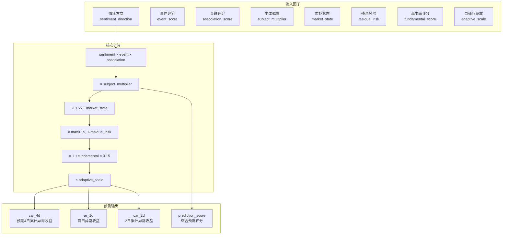

预期CAR（Expected Cumulative Abnormal Return）是指在事件尚未产生实际市场影响前，基于事件特征、关联关系和股票属性预测的未来累计异常收益。作为本项目事件驱动策略的核心预测指标，预期CAR为交易决策提供量化依据。

## 概念定位

在传统金融学中，CAR（Cumulative Abnormal Return）是一种事后计算的指标，用于衡量特定事件发生后股价的超额收益表现。然而在实时交易场景下，**我们需要预判事件将产生的市场影响**，这便催生了"预期CAR"的概念——一种前向预测而非回溯验证的量化指标。

本项目将预期CAR计算部署在**影响预测模块**（`pipeline/task3_impact_estimate.py`），其输出直接输入策略构建模块（`pipeline/task4_strategy.py`），形成"事件分析 → 影响预测 → 交易决策"的闭环链路。

Sources: [pipeline/task3_impact_estimate.py#L24](pipeline/task3_impact_estimate.py#L24)、[pipeline/task4_strategy.py#L446](pipeline/task4_strategy.py#L446)

## 多因子预测模型

预期CAR采用**多因子乘法模型**，将事件影响力、关联强度、市场环境、基本面质量等多个维度有机融合。



### 核心计算公式

预期CAR的计算实现位于 `run_impact_estimation` 函数中，具体逻辑如下：

```python
expected_car_4d = round(
    sentiment_direction               # 情绪方向 (+1 或 -1)
    * event_score                     # 事件综合评分 (0~1)
    * association_score              # 关联度评分 (0~1)
    * subject_multiplier             # 主体偏置因子 (0.92~1.15)
    * (0.55 + market_state)          # 市场状态调整 (0.65~1.45)
    * max(0.15, 1 - residual_risk)   # 残余风险调整 (0.15~0.85)
    * (1 + fundamental_score * 0.15) # 基本面增强 (1.0~1.15)
    * adaptive_scale,                # 自适应缩放 (0.10~0.25)
    4,
)
```

Sources: [pipeline/task3_impact_estimate.py#L127-L137](pipeline/task3_impact_estimate.py#L127-L137)

## 因子详解

### 事件综合评分（event_score）

事件评分由四个量化维度加权计算，反映事件本身的冲击力：

| 维度 | 权重 | 说明 |
|------|------|------|
| 热度评分 (`heat_score`) | 30% | 聚类条数、来源权重、新鲜度综合 |
| 强度评分 (`intensity_score`) | 35% | 强刺激词、官方来源、金额词 |
| 范围评分 (`scope_score`) | 20% | 涉及公司数、行业广度、政策加成 |
| 置信度评分 (`confidence_score`) | 15% | 综合以上四维的可信度 |

```python
event_score = round(
    0.3 * heat_score + 0.35 * intensity_score +
    0.2 * scope_score + 0.15 * confidence_score,
    4,
)
```

Sources: [pipeline/task3_impact_estimate.py#L116-L120](pipeline/task3_impact_estimate.py#L116-L120)

### 主体偏置因子（subject_multiplier）

不同类型事件对市场的影响幅度存在系统性差异，偏置因子用于校准这一偏差：

| 事件主体类型 | 偏置因子 | 逻辑依据 |
|-------------|---------|---------|
| 地缘类事件 | 1.15 | 地缘冲突往往引发避险情绪，冲击强烈 |
| 公司类事件 | 1.12 | 公司公告直接影响股价认知 |
| 政策类事件 | 1.08 | 政策文件具有明确的行业指引 |
| 行业类事件 | 1.00 | 行业动态影响适中 |
| 宏观类事件 | 0.92 | 宏观因素影响广泛但分散 |

Sources: [pipeline/task3_impact_estimate.py#L294-L298](pipeline/task3_impact_estimate.py#L294-L298)、[config/config.yaml#L78-L83](config/config.yaml#L78-L83)

### 市场状态因子（market_state）

市场状态因子基于基准指数近期表现动态调整，捕捉"牛市放大、熊市收敛"的市场情绪效应：

```python
def compute_market_state(benchmark_history, event_date):
    window = benchmark_history[benchmark_history["trade_date"] <= event_date].tail(10)
    recent_return = window["return"].mean()
    return round(float(np.clip(0.5 + recent_return * 8, 0.1, 0.9)), 4)
```

市场状态因子取值范围为 `[0.1, 0.9]`，基准调整值为 0.55，最终乘数为 `0.55 + market_state ∈ [0.65, 1.45]`。

Sources: [pipeline/task3_impact_estimate.py#L282-L291](pipeline/task3_impact_estimate.py#L282-L291)

### 残余风险因子（residual_risk）

残余风险源自市场模型回归的残差波动率，反映个股相对于市场的特异性风险：

```python
residual_risk = np.clip(np.std(residual) * np.sqrt(252), 0.02, 0.8)
```

风险调整系数为 `max(0.15, 1 - residual_risk)`，取值范围 `[0.15, 0.85]`。高残余风险的股票其预期CAR会被压制，体现了"高风险低预期"的经典金融逻辑。

Sources: [pipeline/task3_impact_estimate.py#L270-L272](pipeline/task3_impact_estimate.py#L270-L272)

### 基本面评分（fundamental_score）

基本面评分综合估值、盈利、成长三个维度：

```python
fundamental_score = round(
    0.30 * pe_score      # 市盈率评分
    + 0.25 * pb_score    # 市净率评分
    + 0.25 * roe_score   # 净资产收益率评分
    + 0.20 * growth_score # 净利润增长率评分,
    4
)
```

基本面评分作为增强因子，`1 + fundamental_score * 0.15` 产生 `[1.0, 1.15]` 的调整效果。优质基本面股票获得略高的预期CAR修正。

Sources: [pipeline/task3_impact_estimate.py#L428-L434](pipeline/task3_impact_estimate.py#L428-L434)

### 自适应缩放因子（adaptive_scale）

自适应缩放因子是连接历史经验与实时预测的关键桥梁：

```python
historical_car_std = _estimate_historical_car_volatility(price_df, benchmark_df)
adaptive_scale = min(0.25, max(0.10, historical_car_std * 2.5))
```

该因子基于历史4日CAR的标准差动态调整，范围限定在 `[0.10, 0.25]`。市场波动加剧时放大预测幅度，波动收窄时抑制噪声。

Sources: [pipeline/task3_impact_estimate.py#L95-L98](pipeline/task3_impact_estimate.py#L95-L98)、[pipeline/task3_impact_estimate.py#L437-L480](pipeline/task3_impact_estimate.py#L437-L480)

## 派生指标计算

基于核心预期CAR，系统进一步推导出多个交易参考指标：

```python
# 首日异常收益：考虑流动性的不对称分布
ar_1d = round(expected_car_4d * (0.22 + 0.18 * liquidity_score), 4)

# 2日累计异常收益：线性缩放
car_2d = round(expected_car_4d * 0.65, 4)
```

流动性评分 `liquidity_score` 由平均成交额标准化得到：
```python
liquidity_score = min(1.0, float(avg_turnover_million) / 600)
```

Sources: [pipeline/task3_impact_estimate.py#L121](pipeline/task3_impact_estimate.py#L121)、[pipeline/task3_impact_estimate.py#L138-L139](pipeline/task3_impact_estimate.py#L138-L139)

## 预测评分合成

最终的综合预测评分将预期CAR与其他维度整合为统一量纲：

```python
prediction_score = round(
    0.40 * expected_car_4d      # 预期CAR权重最高
    + 0.25 * association_score   # 关联强度
    + 0.20 * event_score         # 事件评分
    + 0.10 * liquidity_score      # 流动性
    - 0.05 * risk_penalty,        # 风险惩罚
    4,
)
```

权重配置可通过 `config.yaml` 中的 `scoring.prediction` 节点灵活调整。

Sources: [pipeline/task3_impact_estimate.py#L154-L165](pipeline/task3_impact_estimate.py#L154-L165)、[config/config.yaml#L72-L77](config/config.yaml#L72-L77)

## 输出字段说明

预测结果以 DataFrame 形式输出，包含以下关键字段：

| 字段名 | 类型 | 说明 |
|-------|------|------|
| `car_4d` | float | 预期4日累计异常收益（核心指标） |
| `ar_1d` | float | 预期首日异常收益 |
| `car_2d` | float | 预期2日累计异常收益 |
| `direction` | str | 方向标注（"正向" / "负向"） |
| `prediction_score` | float | 综合预测评分 |
| `event_score` | float | 事件综合评分 |
| `association_score` | float | 关联度评分 |
| `liquidity_score` | float | 流动性评分 |
| `fundamental_score` | float | 基本面评分 |
| `risk_penalty` | float | 风险惩罚项 |
| `pseudoconfidence` | float | 伪置信度（模型自信度指标） |
| `logic_chain` | str | 可解释逻辑链文本 |
| `beta` | float | 市场模型β系数 |
| `residual_volatility` | float | 残余波动率 |

Sources: [pipeline/task3_impact_estimate.py#L174-L198](pipeline/task3_impact_estimate.py#L174-L198)

## 与历史CAR的对比

本项目同时维护两套CAR计算体系，分别服务于不同目的：

| 维度 | 预期CAR | 实现CAR（历史CAR） |
|------|---------|-------------------|
| **计算位置** | `task3_impact_estimate.py` | `event_study_enhanced.py` |
| **数据来源** | 事件特征 + 股票属性 | 历史价格数据 |
| **计算时点** | 事件发生前（预测） | 事件发生后（回溯） |
| **核心输出** | `car_4d` | `cumulative_abnormal_return_0_4` |
| **应用场景** | 交易决策支持 | 性能评估验证 |

实现CAR采用标准市场模型法，以事件日前60~6个交易日估计α和β系数，然后在事件窗口（0~4日）内累计异常收益：

```python
# 市场模型估计
expected_return = alpha + beta * benchmark_return
abnormal_return = actual_return - expected_return
cumulative_abnormal_return = Σ abnormal_return
```

Sources: [pipeline/event_study_enhanced.py#L245-L265](pipeline/event_study_enhanced.py#L245-L265)、[pipeline/event_study_enhanced.py#L306-L311](pipeline/event_study_enhanced.py#L306-L311)

## 应用场景

预期CAR在以下环节发挥关键作用：

### 交易标的筛选

策略模块根据预期CAR排序筛选候选标的：
```python
# task4_strategy.py
if candidate.get('car_4d', 0) > threshold:
    f"预期4日CAR为{candidate.get('car_4d', 0):.4f}，具备较强的短线交易价值。"
```

Sources: [pipeline/task4_strategy.py#L446](pipeline/task4_strategy.py#L446)

### 周报性能评估

回测报告中对比预期CAR与实现CAR，用于评估模型预测质量：
```python
# report_builder.py
f"预测分数与实现 CAR(0,4) 的秩相关：{overall_spearman}"
f"预期异常收益 CAR(0,4)：{car_4d:+.2%}"
```

Sources: [pipeline/report_builder.py#L377](pipeline/report_builder.py#L377)、[pipeline/report_builder.py#L497](pipeline/report_builder.py#L497)

## 下一步

完成预期CAR计算后，建议继续阅读：

- [热度与强度评分](8-re-du-yu-qiang-du-ping-fen) — 深入了解event_score的构成
- [事件研究法原理](7-shi-jian-yan-jiu-fa-yuan-li) — 理解实现CAR的市场模型基础
- [策略构建模块](17-ce-lue-gou-jian-mo-kuai) — 查看预期CAR如何驱动交易决策