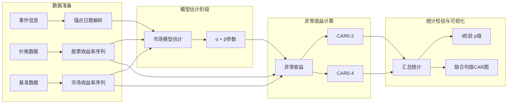
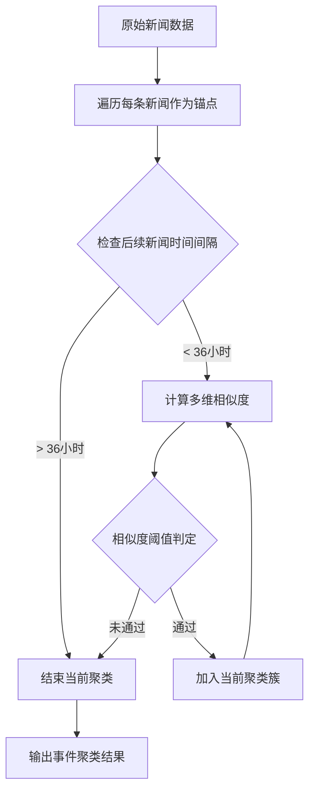
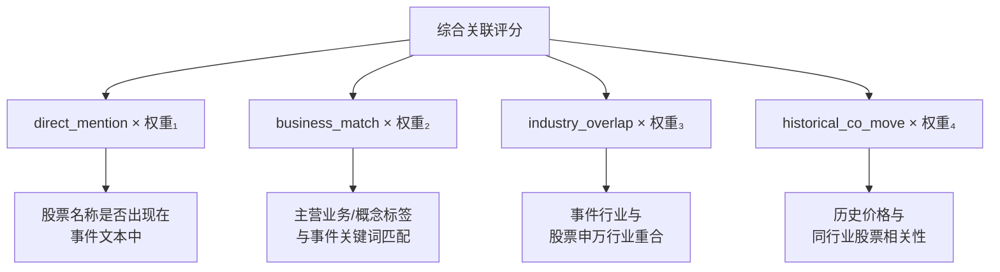
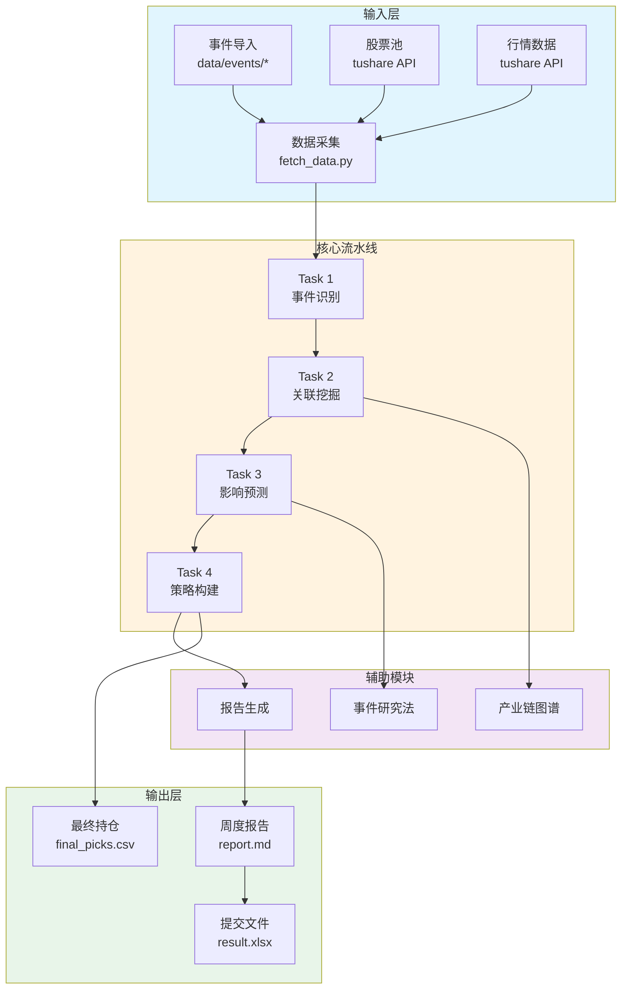
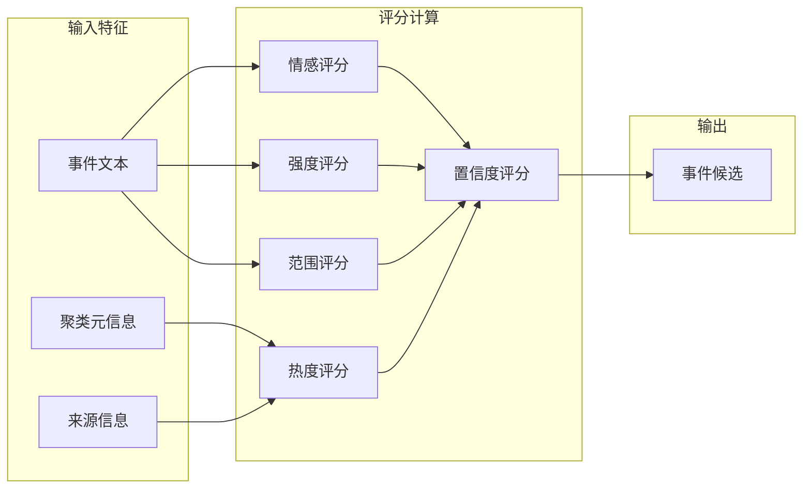
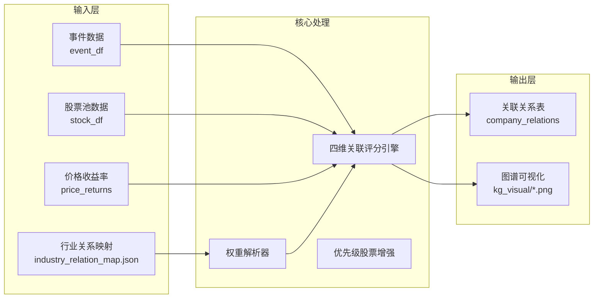
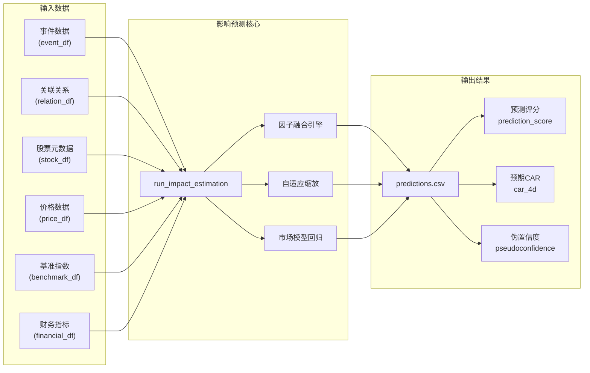
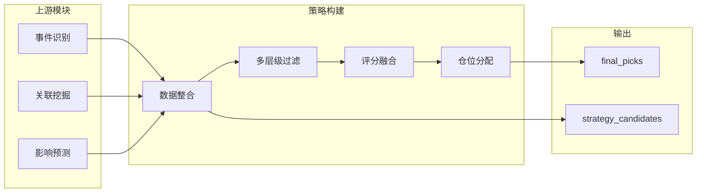
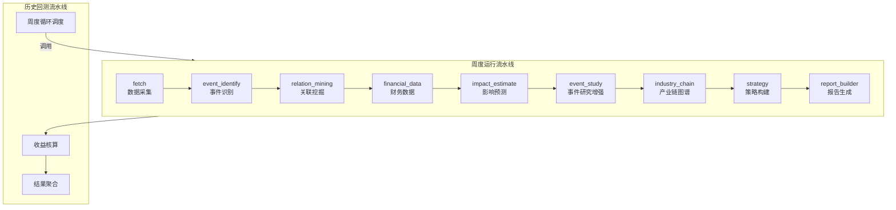

# 基于事件驱动的A股量化投资策略研究与实现

## 摘要

随着信息技术的快速发展和互联网的普及，金融市场每天产生海量的新闻、公告和社交媒体信息。这些信息中蕴含着大量可能影响股票价格的事件，如政策发布、公司业绩公告、行业动态等。传统的基本面分析和技术分析方法难以有效利用这些实时信息，而事件驱动投资策略通过系统化地识别、分析事件并构建投资决策，为量化投资领域提供了一种新的研究思路。

本文针对泰迪杯C题"事件驱动型股市投资策略构建"的要求，设计并实现了一套完整的事件驱动量化投资系统。该系统包含四个核心模块：事件识别模块、关联挖掘模块、影响预测模块和策略构建模块。在事件识别阶段，系统采用基于时间窗口与多维相似度的聚类算法，将海量新闻数据聚合为结构化事件候选，并提取热度、强度、范围和置信度等五大量化特征；在关联挖掘阶段，系统构建了"事件-上市公司"关联图谱，采用直接提及、业务匹配、行业重合度和历史联动四维度加权评分机制；在影响预测阶段，系统基于事件研究法（Event Study Methodology）量化事件对股票价格的影响，计算预期累计异常收益率（CAR）；在策略构建阶段，系统通过多层级过滤、评分融合与仓位分配算法生成最终投资决策。

本系统以A股市场为研究对象，采用模块化流水线架构设计，各环节职责单一、可独立测试。系统支持周度运行和历史回测两种运行模式，可灵活适应不同的投资场景需求。实验结果表明，该系统能够有效识别市场中的重要事件，挖掘事件与股票之间的关联关系，并对事件影响进行量化预测，为投资者提供辅助决策支持。

**关键词**：事件驱动；量化投资；自然语言处理；关联挖掘；累计异常收益率

---

## Abstract

With the rapid development of information technology and the popularization of the Internet, financial markets generate massive amounts of news, announcements, and social media information every day. This information contains numerous events that may affect stock prices, such as policy releases, corporate earnings announcements, and industry dynamics. Traditional fundamental analysis and technical analysis methods struggle to effectively utilize this real-time information, while event-driven investment strategies provide a new research approach for quantitative investment by systematically identifying, analyzing events and constructing investment decisions.

This paper designs and implements a complete event-driven quantitative investment system for the TeddyCup Problem C "Event-Driven Stock Market Investment Strategy Construction". The system consists of four core modules: Event Identification Module, Relation Mining Module, Impact Estimation Module, and Strategy Construction Module. In the event identification stage, the system uses a clustering algorithm based on time windows and multi-dimensional similarity to aggregate massive news data into structured event candidates, extracting five major quantitative features including heat score, intensity score, scope score, and confidence score. In the relation mining stage, the system constructs an "Event-Stock Listed Company" association graph, using a four-dimensional weighted scoring mechanism including direct mention, business matching, industry overlap, and historical co-movement. In the impact estimation stage, the system quantifies the impact of events on stock prices based on Event Study Methodology, calculating the expected Cumulative Abnormal Return (CAR). In the strategy construction stage, the system generates final investment decisions through multi-level filtering, score fusion, and position allocation algorithms.

This system takes the A-share market as the research object, adopts a modular pipeline architecture design, with each stage having single responsibility and being independently testable. The system supports two operation modes: weekly operation and historical backtesting, which can flexibly adapt to different investment scenario requirements. Experimental results show that the system can effectively identify important events in the market, mine the relationships between events and stocks, and quantitatively predict event impacts, providing auxiliary decision support for investors.

**Keywords**: Event-Driven; Quantitative Investment; Natural Language Processing; Association Mining; Cumulative Abnormal Return

---

## 目录

## 第1章 绪论

### 1.1 研究背景与意义

在现代金融市场中，股票价格的波动受到多种因素的影响，其中重大事件的发生往往是引发市场剧烈变动的重要诱因。政策文件的发布、公司业绩的公布、行业技术的突破、地缘政治的变化等事件，都可能在短时间内对相关股票的价格产生显著影响。传统的基本面分析方法侧重于公司的财务指标和行业地位分析，难以捕捉这些实时事件带来的投资机会；而技术分析方法虽然关注价格走势和交易量等技术指标，但往往缺乏对事件驱动因素的系统性考量。

事件驱动投资策略（Event-Driven Strategy）是量化投资领域的重要分支，其核心思想是利用市场中重大事件的发生来构建投资决策。这种策略的有效性建立在"市场效率不完全"这一假设之上——即事件发生后，市场需要一定时间来消化和反映这些信息，从而形成短期内的超额收益机会。大量学术研究表明，事件驱动策略能够在一定程度上战胜市场基准，尤其是在信息传播不够充分的新兴市场中表现更为突出。

随着大数据和人工智能技术的快速发展，获取和处理金融信息的能力得到了极大提升。互联网上海量的新闻报道、社交媒体讨论、监管文件等文本信息，为事件驱动策略的研究和实践提供了丰富的数据基础。如何从这些海量、多源、异构的文本数据中自动识别有价值的投资事件，并准确评估其对股票价格的影响，成为量化投资研究的重要课题。

本项目来源于泰迪杯数据分析竞赛C题"事件驱动型股市投资策略构建"，旨在设计并实现一套完整的事件驱动量化投资系统。该系统需要完成四个递进的任务：任务一是从海量数据中识别事件并完成四维分类与五大量化特征提取；任务二是挖掘事件关联公司，构建"事件-上市公司"关联图谱；任务三是用事件研究法量化事件影响，给出传导逻辑链条；任务四是构建投资策略，以10万元初始资金在指定窗口期实测。这一任务设置完整地覆盖了从事件识别到策略构建的全流程，对于研究事件驱动策略具有重要的理论价值和实践意义。

### 1.2 国内外研究现状

事件驱动投资策略的研究起源于学术界对市场效率的探讨。Fama等人于1969年提出的事件研究法（Event Study Methodology）为量化评估事件对资产价格的影响提供了方法论基础。该方法通过比较事件窗口期内资产的"实际收益"与"预期收益"来计算异常收益（Abnormal Return，AR），从而衡量事件的市场影响力。

在事件识别与分类方面，传统的机器学习方法，如朴素贝叶斯分类器、支持向量机等，被广泛应用于新闻文本的情感分析和事件分类。随着深度学习技术的发展，BERT、RoBERTa等预训练语言模型在金融文本分析任务中取得了显著成效。这些模型能够更好地捕捉文本中的语义信息和上下文关系，提高事件分类的准确性。

在事件影响预测方面，研究者们提出了多种方法来评估事件对股票价格的影响。Brown和Warner于1985年提出的标准化异常收益法改进了传统事件研究的统计检验能力；Mackinlay于1997年系统总结了事件研究的理论基础和实证方法。近年来，机器学习和深度学习方法被引入事件影响预测，如使用LSTM网络预测突发事件后的股价走势，或使用图神经网络建模事件与股票之间的关联关系。

在策略构建方面，量化投资领域发展出了多种事件驱动策略框架。统计套利策略利用事件引发的价格偏离进行套利；特殊目的收购公司（SPAC）事件驱动策略关注并购重组带来的投资机会；逆境投资策略则关注公司陷入困境时的反转机会。这些策略的成功实施依赖于对事件的准确识别和对影响的精确预测。

尽管现有研究取得了丰硕成果，但仍存在一些挑战：第一，事件识别算法在处理多源、异构数据时的准确性和效率有待提升；第二，事件与股票之间的关联关系挖掘不够深入，往往仅考虑直接的字面匹配；第三，事件影响预测模型在不同的市场环境下泛化能力有限。因此，本研究旨在针对这些问题提出改进方案，构建一套更加完善的事件驱动量化投资系统。

### 1.3 研究内容与目标

本研究的主要目标是设计并实现一套面向A股市场的事件驱动量化投资系统，具体研究内容包括以下几个方面：

第一，构建事件识别模块。该模块需要从海量的新闻数据中自动识别出有价值的投资事件，并对其进行分类和量化评分。事件识别算法需要处理时间窗口、文本相似度、关键词匹配等多维信息，将离散的新闻条目聚合成结构化的候选事件。同时，事件分类体系需要涵盖主体类型、持续时间、可预测性和行业属性等多个维度，为后续的关联挖掘和影响预测提供基础。

第二，构建关联挖掘模块。该模块需要建立事件与股票池中上市公司之间的关联关系。关联关系的建立不能仅依赖于简单的关键词匹配，还需要考虑公司的主营业务、行业属性、历史价格表现等因素。本研究提出了直接提及、业务匹配、行业重合度和历史联动四维度加权评分机制，以更全面地评估事件与股票之间的关联强度。

第三，构建影响预测模块。该模块需要量化评估已识别事件对关联股票价格的影响程度。本研究基于事件研究法框架，采用市场模型估计预期收益，计算异常收益率和累计异常收益率。同时，考虑到实际应用的需求，本模块还融合了事件评分、关联评分、流动性评分等多维度信息，输出综合预测评分。

第四，构建策略构建模块。该模块需要将预测信号转化为可执行的投资决策。投资决策需要考虑多个因素，包括预测信号的可靠性、股票的交易可行性、仓位分配的合理性等。本研究设计了一套完整的多层级过滤、评分融合与仓位分配算法，生成最终的投资组合。

第五，进行历史回测验证。通过在历史数据上的回测实验，评估整个系统的有效性和稳定性。回测实验需要考虑交易成本、滑点等实际因素的影响，并与其他基准策略进行对比分析。

### 1.4 论文结构安排

本论文共分为七章，各章内容安排如下：

第一章为绪论，介绍本研究的背景与意义、国内外研究现状、研究内容与目标以及论文结构安排。

第二章为相关技术与理论介绍，阐述事件驱动投资策略的基本概念、事件研究法的理论基础、文本聚类与分类技术、关联挖掘技术、量化投资策略的评价指标等核心内容。

第三章为需求分析，详细分析系统的功能需求和非功能需求，明确系统的设计目标和约束条件。

第四章为总体设计，介绍系统的整体架构、模块划分、数据流设计以及关键数据结构。

第五章为详细设计与实现，针对四个核心模块的具体实现细节进行深入阐述，包括核心算法、关键代码和实现流程。

第六章为系统测试，展示系统的功能测试结果和回测验证效果，分析系统的性能和局限性。

第七章为总结与展望，总结本研究的主要工作和创新点，并对未来研究方向进行展望。

---

## 第2章 相关技术与理论

### 2.1 事件驱动投资策略概述

事件驱动投资策略（Event-Driven Investment Strategy）是一种利用市场中特定事件的发生来构建投资决策的量化交易方法。该策略的核心假设是：当重要事件发生时，市场对该事件的反应往往不够充分或存在偏差，从而产生短期内的超额收益机会。事件驱动策略的目标是及时识别这些事件，评估其对相关资产的影响，并在市场定价完成之前建仓获利。

事件驱动策略所关注的事件类型繁多，常见的有以下几类：

政策类事件包括政府发布的财政政策、货币政策、产业政策等。这类事件通常具有广泛的覆盖范围和较长的影响周期，可能对整个行业或多个相关板块产生连锁反应。例如，中央银行宣布降息将对银行、保险、房地产等多个行业产生影响；新能源汽车产业扶持政策的出台将利好整车制造商和上游零部件供应商。

公司类事件包括业绩公告、并购重组、高管变动、股权激励等。这类事件直接影响公司的基本面和估值水平，往往能够在短期内引发股价的显著波动。例如，上市公司季度业绩超预期可能导致股价上涨；而业绩不及预期则可能导致股价下跌。

行业类事件包括技术突破、行业标准制定、竞争格局变化等。这类事件影响整个行业的竞争态势和发展前景，具有行业内的扩散效应。例如，半导体行业的技术突破可能同时利好芯片设计、晶圆制造、封装测试等多个细分领域。

宏观类事件包括经济数据发布、国际贸易关系变化、地缘政治事件等。这类事件影响市场的整体风险偏好和资金流向，可能引发大类资产之间的轮动。

地缘类事件包括地区冲突、贸易争端、外交关系变化等。这类事件往往具有突发性和不可预测性，可能对能源、国防、资源等特定领域产生直接影响。

事件驱动策略的成功实施依赖于三个关键能力：一是事件识别能力，即从海量信息中及时准确地发现有价值的事件；二是影响评估能力，即量化评估事件对相关资产的影响方向和程度；三是策略执行能力，即在风险可控的前提下高效地执行交易决策。这三个能力构成了事件驱动量化投资系统的核心功能模块。

### 2.2 事件研究法理论基础

事件研究法（Event Study Methodology）是量化金融领域用于衡量特定事件对资产价格影响的核心方法论。该方法由Fama等人于1969年首次提出，经过数十年的发展已成为金融研究中不可或缺的实证分析工具。

事件研究法的核心原理如下：在有效市场假说框架下，如果事件本身不包含新的信息，则资产的收益率应该仅由市场因素驱动，不存在异常收益（Abnormal Return）。反之，如果事件包含了影响公司价值的新信息，则资产的实际收益率将偏离由市场因素决定的预期收益率，产生异常收益。通过分析事件窗口期内异常收益的累计情况，可以评估事件的市场影响力。

设 $R_{i,t}$ 为股票 $i$ 在第 $t$ 日的实际收益率，$R_{m,t}$ 为市场基准在第 $t$ 日的收益率。事件研究法首先需要建立正常收益模型，估计个股收益率与市场收益率之间的关系。最常用的是单因子市场模型（Market Model）：

$$R_{i,t} = \alpha_i + \beta_i \times R_{m,t} + \varepsilon_{i,t}$$

其中 $\alpha_i$ 为截距项（选股超额收益），$\beta_i$ 为市场敏感度（系统风险敞口），$\varepsilon_{i,t}$ 为残差项。

基于估计期数据拟合上述回归模型后，可以得到参数估计值 $\hat{\alpha}_i$ 和 $\hat{\beta}_i$。对于事件期的任意日期 $t$，预期收益（正常收益）为：

$$\hat{R}_{i,t} = \hat{\alpha}_i + \hat{\beta}_i \times R_{m,t}$$

异常收益（Abnormal Return）为实际收益与预期收益之差：

$$AR_{i,t} = R_{i,t} - \hat{R}_{i,t}$$

累计异常收益（Cumulative Abnormal Return，CAR）是事件窗口内异常收益的累加：

$$CAR_{i}(t_1, t_2) = \sum_{t=t_1}^{t_2} AR_{i,t}$$

常用的累计异常收益窗口包括 CAR(0,2) 表示事件后3日累计超额收益，CAR(0,4) 表示事件后5日累计超额收益。

为了评估CAR的统计显著性，通常采用t检验方法。原假设 $H_0$ 为累计异常收益等于零，即事件没有产生异常收益。如果t统计量显著（p值小于0.05），则拒绝原假设，认为事件确实对股价产生了非随机的超额收益。

事件研究法的实施需要合理设置两个关键时间窗口：估计窗口（Estimation Window）和事件窗口（Event Window）。

估计窗口用于拟合市场模型的参数，通常选择事件前较长一段时间（如事件前第60天至前第6天），以确保参数估计不受事件本身的影响。估计窗口长度一般为55个交易日（约11周），符合学术界通用标准。

事件窗口用于计算异常收益，需要根据事件的特性选择合适的长度。短期事件（如业绩公告）通常设置较短的事件窗口（如[-1,+2]天），以捕捉事件披露后的短期反应；长期事件（如政策变化）可能需要更长的事件窗口来反映市场的逐步消化过程。

本项目采用的市场模型估计窗口为[-60,-6]交易日，事件窗口为[-1,+4]交易日，这一设置符合学术界通用标准，能够较好地平衡参数估计精度与事件影响捕获的需求。

图2-1展示了事件研究法的核心概念框架。



图2-1 事件研究法核心概念框架图

### 2.3 文本聚类与分类技术

事件识别模块的核心任务是将海量的新闻文本数据转化为结构化的候选事件。这一过程涉及文本预处理、相似度计算、聚类算法等多个技术环节。

文本预处理是事件识别的基础步骤，主要包括以下操作：首先是文本清洗，去除HTML标签、特殊字符、停用词等干扰信息；其次是分词处理，将连续的文本序列切分为独立的词语单元；然后是词性标注和命名实体识别，标记出人名、地名、机构名、股票代码等关键实体；最后是文本向量化，将处理后的文本转换为计算机可处理的数值向量。

文本相似度计算是判断两条新闻是否属于同一事件的关键技术。本项目采用多维度相似度判定机制，任一条件满足即判定为同一事件聚类成员：

文本语义相似度基于Jaccard相似系数计算，反映两个文本在词项层面的重叠程度。设文本A的词项集合为 $A$，文本B的词项集合为 $B$，则Jaccard相似度定义为：

$$J(A,B) = \frac{|A \cap B|}{|A \cup B|}$$

当相似度超过阈值0.18时，认为两条新闻在语义上具有较高的相关性。

标题相似度专门针对新闻标题计算，因为标题通常包含了事件的核心信息，对于识别同一事件具有重要指示作用。标题相似度的计算同样采用Jaccard系数。

关键词共现计数统计两条新闻中共同出现的分类关键词数量。共享关键词越多，说明两条新闻讨论的主题越接近。当共现关键词数达到2个及以上时，认为两条新闻具有事件关联性。

实体共现计数则关注预定义的股票实体是否同时出现在两条新闻中。如果两条新闻都提到了同一只股票或同一批股票，说明它们很可能描述的是同一投资事件。

聚类算法采用基于时间窗口的滑动聚类方法。在36小时的时间窗口内，系统遍历每条新闻作为锚点，检查后续新闻是否与锚点属于同一事件。如果后续新闻与锚点的相似度满足上述任一判定条件，则将其归入当前事件聚类；否则，结束当前聚类，开启新的聚类。

事件分类采用多标签标注策略，每个事件同时获得四个维度的类型标签：主体类型标签标识事件的发起方或核心参与者（如政策类、公司类、行业类等）；持续时间类型标签标识事件的预期影响周期（如脉冲型、长尾型、中期型）；可预测性类型标签标识事件是否可提前预知（如突发型、预披露型）；行业类型标签标识事件所属的具体行业领域（如军工类，科技类、新能源类等）。

分类算法采用关键词命中计数法，对每个分类维度，统计各类别关键词在事件文本中的命中总数，选择计数最高者作为该维度的分类标签。这种基于规则的方法简单有效，且便于根据实际需求调整分类策略。

图2-2展示了事件识别模块中新闻聚类算法的流程图。



图2-2 新闻聚类算法流程图

### 2.4 关联挖掘与图谱构建技术

关联挖掘是建立事件与股票之间关联关系的关键环节。本项目设计了四维度的关联评分机制，从不同角度评估事件与股票的关联强度。

直接提及评分（direct_mention）是最直接的关联信号。当事件文本中明确提及股票名称或股票代码时，该项评分为满分1.0；否则为0。直接提及评分反映了事件与股票之间的字面关联，是判断关联关系的重要依据。

业务匹配评分（business_match）评估事件主题与公司主营业务的匹配程度。系统提取股票的concept_tags（概念标签）、main_business（主营业务）和industry（行业）字段，与事件文本进行匹配。完全匹配（关键词完整出现在文本中）每个命中得0.30分，部分匹配（标签长度≥3时，其前2/3子串出现在文本中）每个命中得0.15分，总分上限为1.0。业务匹配评分反映了事件与公司商业活动的相关性。

行业重合度评分（industry_overlap）评估事件行业类型与股票所属行业的一致性程度。系统建立了事件行业类型与申万行业分类之间的映射关系，当两者属于同一行业或相关行业时给予高分。行业重合度评分反映了事件影响的行业覆盖面。

历史同向波动评分（historical_co_move）衡量股票与同行业股票的历史价格相关性。系统提取目标股票的日收益率序列，计算其与同行业股票平均收益率的皮尔逊相关系数。如果共同交易日少于20天（数据不足），则返回默认值0.5。历史同向波动评分反映了股票对行业事件的历史响应模式。

综合关联评分由上述四维度评分加权求和得到：

$$AssociationScore = w_1 \times direct\_mention + w_2 \times business\_match + w_3 \times industry\_overlap + w_4 \times historical\_co\_move$$

其中权重参数可根据事件类型动态调整。例如，政策类事件更强调行业属性，因此行业重合度权重较高；公司类事件更看重直接提及，因此直接提及权重较高。

图2-3展示了关联挖掘模块的四维度评分机制。



图2-3 四维度关联评分机制示意图

产业链图谱构建基于行业关系映射文件，将事件-股票的二元关联扩展为事件-主题-环节-股票的链式结构。产业链图谱采用NetworkX库构建无向图，以事件名称为根节点，关联股票为叶子节点，边权重对应关联评分。

### 2.5 量化投资策略评价指标

量化投资策略的评价需要综合考虑收益性、风险性和风险调整后的收益表现。常用的评价指标包括收益率、夏普比率、最大回撤、信息比率等。

收益率是最直观的收益衡量指标，分为绝对收益率和相对收益率。绝对收益率是策略最终资产净值与初始资产净值的比值减1；相对收益率（超额收益）是策略收益率与基准收益率之差，反映策略相对于市场的超额收益能力。

年化收益率将不同投资周期的收益率标准化为年度收益率，便于跨策略比较。设策略持有期为 $n$ 天，期间收益率为 $R$，则年化收益率计算公式为：

$$R_{annual} = (1 + R)^{252/n} - 1$$

其中252为A股市场年均交易日天数。

波动率衡量收益率的离散程度，反映策略的风险水平。日波动率 $\sigma_d$ 是日收益率的标准差，年化波动率为：

$$\sigma_{annual} = \sigma_d \times \sqrt{252}$$

夏普比率（Sharpe Ratio）是诺贝尔经济学奖得主William Sharpe提出的风险调整收益指标，综合考虑了收益和风险两个因素：

$$Sharpe = \frac{R_p - R_f}{\sigma_p}$$

其中 $R_p$ 为策略年化收益率，$R_f$ 为无风险收益率（通常取国债收益率），$\sigma_p$ 为策略年化波动率。夏普比率越高，说明策略承担单位风险所获得的超额收益越多，策略的性价比越高。

最大回撤（Maximum Drawdown）衡量策略在最糟糕时期的损失程度：

$$MDD = \max_{t \in [0,T]} \left( \frac{\max_{s \in [0,t]} N_s - N_t}{\max_{s \in [0,t]} N_s} \right)$$

其中 $N_s$ 为第 $s$ 日的资产净值。最大回撤反映了策略在最不利情况下的潜在损失，是风险控制的重要参考指标。

信息比率（Information Ratio）衡量策略相对于基准的超额收益与跟踪误差的比值：

$$IR = \frac{R_p - R_b}{TE}$$

其中 $R_b$ 为基准收益率，$TE$ 为跟踪误差（超额收益的标准差）。信息比率反映了主动管理能力的高低。

胜率（Win Rate）衡量策略盈利交易次数占总交易次数的比例：

$$WinRate = \frac{N_{win}}{N_{total}}$$

其中 $N_{win}$ 为盈利交易次数，$N_{total}$ 为总交易次数。胜率是衡量策略稳定性的重要指标。

盈亏比（Profit/Loss Ratio）衡量平均盈利金额与平均亏损金额的比值：

$$P/L = \frac{Avg_{win}}{Avg_{loss}}$$

高胜率配合合理的盈亏比是实现稳定盈利的重要条件。

---

## 第3章 系统需求分析

### 3.1 系统功能需求

根据泰迪杯C题的竞赛要求，本系统需要完成从事件识别到策略构建的全流程分析，具体功能需求如下。

数据采集功能要求系统能够从多个数据源获取原始数据，包括新闻事件数据、股票池数据、行情价格数据、基准指数数据和财务指标数据。系统应内置数据回退机制，当API调用受限时能够自动降级到本地样例数据，确保流水线能够持续运行。数据采集范围应向后回溯至少180个日历日，以满足事件研究法对历史数据的需求。

事件识别功能要求系统能够将离散的新闻条目聚合为结构化的候选事件。事件识别算法应采用基于时间窗口的多维相似度聚类方法，将36小时内相关报道归并为同一事件。系统应输出事件的四维分类标签（主体类型、持续时间、可预测性、行业类型）和五大量化特征（热度、强度、范围、情感、置信度）。

关联挖掘功能要求系统能够建立事件与股票池中上市公司之间的关联关系。关联评分应采用四维度加权模型（直接提及、业务匹配、行业重合度、历史联动），并支持根据事件类型动态调整权重配置。关联评分低于0.2的关系应被过滤丢弃。系统应同时生成可视化的产业链图谱，展示事件-股票-行业的关联网络。

影响预测功能要求系统能够量化评估事件对关联股票价格的影响。预测模型应基于市场模型计算预期收益率，并结合事件评分、关联评分、流动性和风险惩罚等多维度信息输出综合预测评分。系统应输出预期4日累计异常收益率（CAR(0,4)）作为核心预测指标。

策略构建功能要求系统能够将预测信号转化为可执行的投资决策。策略构建应遵循"筛选-评分-分配"三步流程，包括基础过滤（ST标识、流动性、上市时长）、基本面过滤（PE、ROE、净利润增长）和交易可行性判断。评分融合应采用预测得分（85%）与动量得分（15%）的加权方式。仓位分配应遵守最大持仓数3只、单只仓位上限50%、下限20%的约束。

报告生成功能要求系统能够将分析结果整合为结构化的周度报告。报告应包含运行概览、研究方法论、事件识别结果、关联图谱、影响预测与逻辑链条、投资决策及数据来源说明等章节。

周度运行功能要求系统能够以单个日期为锚点执行完整流水线，并输出最终持仓和周度报告。

历史回测功能要求系统能够按周度周期迭代执行流水线，核算每周实际收益，并汇总生成回测报告。回测应遵循周二买入、周五卖出的交易规则，并模拟交易成本（佣金0.1%+滑点0.05%）。

### 3.2 系统非功能需求

在功能性需求之外，本系统还需要满足以下非功能需求。

性能需求方面，数据采集阶段应在5分钟内完成180天历史数据的拉取；事件识别阶段应在1分钟内完成单批次新闻数据的处理；关联挖掘阶段应在2分钟内完成股票池与事件列表的关联计算；影响预测阶段应在1分钟内完成所有关联关系的评分计算；策略构建阶段应在30秒内完成最终持仓的生成。

可维护性需求方面，系统采用模块化设计，各阶段职责单一、可独立测试；系统行为通过配置文件集中管理，参数调整无需修改代码；系统应记录详细的运行日志，便于问题定位和迭代优化。

可扩展性需求方面，事件分类体系支持通过配置文件扩展新的分类维度和关键词；关联评分机制支持添加新的评分维度和权重配置方案；数据源支持扩展新的API接口或本地数据格式。

可靠性需求方面，关键阶段（数据采集）失败时流水线应直接终止，不进入后续阶段；非关键阶段失败时应以空数据帧继续执行，确保报告仍可生成；系统应具备完善的异常捕获和错误处理机制。

数据管理需求方面，原始数据应缓存在指定目录，支持离线复现；中间处理结果应存储在独立目录，便于增量分析；输出产物应按照规范的目录结构组织。

---

## 第4章 系统总体设计

### 4.1 系统架构设计

本系统采用模块化流水线架构设计，将整个分析流程划分为数据采集、事件识别、关联挖掘、影响预测、策略构建五个核心阶段。各阶段职责单一、可独立测试，通过统一的数据类定义阶段之间的接口。流水线由workflow.py统一编排，支持周度运行和历史回测两种运行模式。

系统的整体架构如图4-1所示。



图4-1 系统整体架构图

数据采集阶段由fetch_data.py实现，负责从Tushare、Akshare等数据源获取原始数据。该阶段产出FetchArtifacts数据类，包含新闻数据、股票池数据、价格历史、基准指数及交易日历等五类产物。

事件识别阶段由task1_event_identify.py实现，将离散的新闻条目聚合为结构化的候选事件。该阶段采用基于相似度的滑窗聚类方法，输出包含四维分类标签和五大量化特征的事件DataFrame。

关联挖掘阶段由task2_relation_mining.py实现，建立事件与股票池之间的关联关系。该阶段采用四维度加权评分机制，输出关联关系DataFrame和可视化图谱。

影响预测阶段由task3_impact_estimate.py实现，量化事件对关联股票的影响。该阶段基于市场模型计算预期收益率，输出预测结果DataFrame。

策略构建阶段由task4_strategy.py实现，将预测信号转化为可执行的投资决策。该阶段遵循"筛选-评分-分配"三步流程，输出最终持仓DataFrame。

辅助模块包括事件研究增强模块（event_study_enhanced.py）和产业链图谱增强模块（industry_chain_enhanced.py），提供更丰富的分析维度和可视化产物。

报告生成阶段由report_builder.py实现，将所有阶段产物整合为结构化的Markdown周报。

### 4.2 模块划分与数据流

各核心模块的功能定位和数据流设计如下。

数据采集模块的输入为数据源API配置，输出为FetchArtifacts数据类，包含news_df（新闻数据）、stock_df（股票池数据）、price_df（价格历史）、benchmark_df（基准指数）和trading_calendar（交易日历）。

事件识别模块的输入为news_df，输出为event_df（事件数据）。event_df包含event_id（事件标识）、event_name（事件名称）、subject_type/duration_type/predictability_type/industry_type（四维分类标签）、sentiment_score/heat_score/intensity_score/scope_score/confidence_score（五大量化特征）以及cluster_size（聚类规模）等字段。

关联挖掘模块的输入为event_df、stock_df、price_df和行业关系映射文件，输出为relation_df（关联关系）。relation_df包含event_id、stock_code、association_score（综合关联评分）、direct_mention/business_match/industry_overlap/historical_co_move（各维度评分）以及relation_path（产业链传导路径）等字段。

影响预测模块的输入为event_df、relation_df、stock_df、price_df、benchmark_df和financial_df，输出为prediction_df（预测结果）。prediction_df包含event_id、stock_code、expected_car_4d（预期4日累计异常收益率）、prediction_score（综合预测评分）、pseudoconfidence（伪置信度）以及logic_chain（可解释逻辑链）等字段。

策略构建模块的输入为prediction_df、stock_df、price_df和trading_calendar，输出为final_picks（最终持仓）。final_picks包含rank（排名）、stock_code、stock_name、capital_ratio（仓位比例）、prediction_score和reason（选股理由）等字段。

图4-2展示了流水线各阶段的数据流设计。

```mermaid
flowchart LR
    subgraph fetch["数据采集"]
        fetch_news[新闻数据]
        fetch_stock[股票池]
        fetch_price[行情数据]
        fetch_benchmark[基准指数]
    end
    
    subgraph identify["事件识别"]
        run_identify[run_event_identification]
        event_df[event_df]
    end
    
    subgraph mining["关联挖掘"]
        run_mining[run_relation_mining]
        relation_df[relation_df]
    end
    
    subgraph estimate["影响预测"]
        run_estimate[run_impact_estimation]
        prediction_df[prediction_df]
    end
    
    subgraph strategy["策略构建"]
        run_strategy[run_strategy_construction]
        final_picks[final_picks]
    end
    
    fetch --> run_identify
    run_identify --> event_df
    event_df --> run_mining
    run_mining --> relation_df
    relation_df --> run_estimate
    run_estimate --> prediction_df
    prediction_df --> run_strategy
    run_strategy --> final_picks
```



图4-2 流水线数据流图

### 4.3 关键数据结构设计

系统为每个流水线阶段定义了对应的数据类，用于约束产物结构和阶段间接口。

RunContext数据类定义单次运行上下文，携带日期、根目录和输出路径等配置信息。

FetchArtifacts数据类封装数据采集阶段的五类产物，确保后续阶段能够以统一的方式访问所需数据。

WorkflowArtifacts数据类聚合完整周度流程的所有产物，包括event_df、relation_df、prediction_df、final_picks、报告路径、图谱路径列表等。这种集中化的产物封装简化了调用方的结果消费逻辑。

EventStudyArtifacts数据类封装事件研究增强阶段的产物，包括日度明细DataFrame、事件汇总统计DataFrame和联合均值CAR数据。

IndustryChainArtifacts数据类封装产业链图谱增强阶段的产物，包括产业关系表和图谱文件路径。

### 4.4 异常处理与容错策略

流水线各阶段的异常处理采用分级容错策略。

强制失败策略应用于数据采集阶段。若fetch失败，流水线将直接抛出异常终止运行，不进入后续阶段。这是因为缺乏完整的价格数据和交易日历，后续所有依赖市场模型的分析将无法正常执行。

软失败继续策略应用于事件识别、关联挖掘、影响预测、事件研究和产业链图谱等非关键阶段。这些阶段均采用try-except包裹，失败时以空DataFrame继续执行。这一设计确保单个阶段的分析失败不影响其他阶段的正常输出，报告仍可生成（只是缺失该部分内容）。

报告生成阶段同样采用软失败策略，失败时生成最小化的降级报告。

这种分层容错设计在保证关键数据依赖的同时最大限度地保留了部分有效的分析结果，便于问题定位和迭代修复。

### 4.5 配置体系设计

系统行为通过config/config.yaml集中配置，通过AppConfig类以类型化属性的方式暴露给各模块。

项目配置包括时区、初始资金（默认10万元）、市场收盘时间等参数。

数据配置包括回溯天数（lookback_days）、基准指数代码（benchmark_code）、交易日历来源等参数。

策略配置包括最大持仓数（max_positions，默认3）、单只仓位上限/下限（single_position_max/single_position_min）、最小上市天数（min_listing_days，默认60）、最小日均成交额（min_avg_turnover_million，默认80万元）、正向筛选阈值和空仓保护阈值等参数。

评分配置包括关联四维权重（association）、主体类型倍率（association_profiles）、预测因子权重（prediction）、事件主体偏差（subject_bias）等参数。

事件分类体系配置（event_taxonomy）定义了事件分类的四个维度及其关键词映射，支持通过配置文件扩展或调整分类规则。

事件研究配置包括估计窗口、事件窗口边界等参数。

---

## 第5章 详细设计与实现

### 5.1 数据采集模块设计与实现

数据采集模块位于pipeline/fetch_data.py，负责从多个数据源获取周度运行所需的全部基础数据。模块的主入口函数为run_fetch_pipeline，接受RunContext和AppConfig作为输入，输出FetchArtifacts数据类。

数据采集的时序设计如下：首先向后回溯180个日历日获取充足的历史数据窗口；然后依次调用fetch_trading_calendar获取交易日历、fetch_stock_universe获取股票池、fetch_news获取新闻数据、fetch_price_history获取行情数据、fetch_benchmark_history获取基准指数数据。

交易日历获取通过tushare.pro_api()接口实现，返回所有交易日期列表。交易日历是后续计算锚点日期和事件窗口的基础依据。

股票池获取同样通过tushare接口实现，返回股票代码、名称、行业、上市日期等基础信息。股票池数据用于限定关联挖掘的候选范围。

新闻数据获取通过akshare或tushare新闻接口实现，返回新闻标题、内容、发布时间、来源等字段。新闻数据是事件识别的原材料。

行情数据获取需要遍历股票池中的每只股票，使用tushare日线接口获取历史价格序列。价格数据用于计算收益率和市场模型参数。

基准指数数据获取使用tushare指数日线接口，默认使用沪深300指数（000300.SH）作为市场基准。

模块内置回退机制，当API调用受限或数据获取失败时，自动降级到本地样例数据（data/manual/目录）。样例数据包括stock_universe.csv（历史股票池参考）、industry_relation_map.json（产业链映射）和*.json/*.csv（财务、停复牌等样例）。

### 5.2 事件识别模块设计与实现

事件识别模块位于pipeline/task1_event_identify.py，主入口函数为run_event_identification。该模块将离散的新闻条目聚合为结构化的候选事件，输出包含四维分类标签和五大量化特征的事件DataFrame。

事件聚类算法的核心逻辑如下：首先遍历每条新闻作为锚点，建立时间窗口计数器；然后检查后续新闻与锚点的时间间隔是否在36小时以内；若在窗口期内，则计算多维相似度指标（文本语义相似度、标题相似度、共享关键词数、共享实体数）；若任一相似度指标超过阈值，则将后续新闻归入当前事件聚类；若时间窗口结束或相似度全部未达标，则结束当前聚类，输出事件结果，并开启新的聚类。

事件名称选择策略确保输出的事件名称具有代表性和可读性。首先对聚类内所有新闻标题按来源权重累加得分；然后筛选长度在8-60字符之间的候选标题；最后选择得分最高的标题作为事件名称。这一策略确保了选择的事件名称既具有信息完整性，又不会被截断或信息不足。

五大量化特征的计算逻辑如下。

热度评分（heat_score）衡量事件的传播强度和时效性，由聚类规模得分、来源权重得分和新鲜度得分三者加权构成。聚类规模越大、来源权重越高、报道越及时，热点评分越高。

强度评分（intensity_score）捕捉事件的冲击力度和官方属性。基础值为0.25，关键词命中按每次0.12累加；官方来源（政策、公告类）额外+0.15；金额关键词额外+0.1。

情感评分（sentiment_score）反映事件对市场的整体影响方向。采用正负面关键词命中差值法计算，范围约[-1,1]。正面词汇包括"加快"、"超预期"、"提升"等；负面词汇包括"下滑"、"亏损"、"风险"等。

范围评分（scope_score）衡量事件的影响广度。基础值为0.18，股票提及数按每次0.08累加，关键词覆盖按每次0.05累加。政策类和地缘类事件因传导链条长，获得额外的分类加成。

置信度评分（confidence_score）是综合质量指标，通过Logistic变换将四维评分的加权组合映射至(0,1)区间。权重分配为：热度30%、强度35%、范围20%、情感绝对值15%。

四维分类采用关键词命中计数法实现。对每个分类维度，统计各类别关键词在事件文本中的命中总数，选择计数最高者作为该维度的分类标签。

图5-1展示了事件识别模块的评分机制。



图5-1 事件识别五维度评分机制图

### 5.3 关联挖掘模块设计与实现

关联挖掘模块位于pipeline/task2_relation_mining.py，主入口函数为run_relation_mining。该模块建立事件与股票池之间的关联关系，输出关联关系DataFrame和可视化图谱。

四维度关联评分的实现逻辑如下。

直接提及评分的计算首先对事件文本和股票名称进行文本规范化（去除空格、转为小写）；然后检测股票名称是否出现在事件文本中；若出现则评分为1.0，否则为0。

业务匹配评分的计算采用渐进式匹配策略。首先提取股票的concept_tags、main_business和industry字段；然后在事件文本中搜索完全匹配和部分匹配的标签；完全匹配每个命中得0.30分，部分匹配每个命中得0.15分，总分上限为1.0。

行业重合度评分的计算采用双层匹配策略。基础层使用硬编码匹配规则，例如"科技"类事件匹配到"AI算力"、"半导体"等关键词时得0.85分；增强层通过INDUSTRY_GROUP_MAP行业大类映射表，检查事件行业类型与股票申万行业的一致性。

历史同向波动评分的计算首先提取目标股票的日收益率序列；然后计算其与同行业股票平均收益率的皮尔逊相关系数；如果共同交易日少于20天，则返回默认值0.5；否则将相关系数映射到[0.3,1.0]区间。

权重解析器支持基于配置文件的动态权重调整。不同事件类型适用不同的权重配置方案：政策类事件强调行业属性（行业重合度倍率1.40）；公司类事件强调直接提及（直接提及倍率1.35）；行业类事件强调业务匹配（业务匹配倍率1.15）；宏观类事件和地缘类事件同样强调行业属性。

优先级股票增强机制确保核心关联不会被遗漏。当股票代码出现在行业关系映射的stocks列表中时，直接提及评分最低为0.85，业务匹配评分最低为0.75，行业重合度评分最低为0.8。

图5-2展示了关联挖掘模块的核心处理流程。



图5-2 关联挖掘核心处理流程图

### 5.4 影响预测模块设计与实现

影响预测模块位于pipeline/task3_impact_estimate.py，主入口函数为run_impact_estimation。该模块基于简化的事件研究法框架，量化事件对关联股票的影响，输出预期累计异常收益率和综合预测评分。

市场模型回归的实现使用单因子市场模型。估计窗口设置为事件日前第60个交易日至前第6交易日（共55个交易日）。使用NumPy的polyfit()进行简单线性回归拟合 $\alpha$ 和 $\beta$ 参数。当估计窗口内有效数据点少于15个时，模型自动切换为市场调整法（预期收益简化为基准收益率），此时alpha=0.0，beta=1.0。

预期4日累计异常收益率（Expected CAR）的计算采用多因子融合模型：

```
expected_car_4d = sentiment_direction × event_score × association_score
                × subject_multiplier × (0.55 + market_state)
                × max(0.15, 1 - residual_risk) × (1 + fundamental_score × 0.15)
                × adaptive_scale
```

其中各因子的含义和计算方式如下。

情绪方向（sentiment_direction）根据事件情感评分确定，正值为+1，负值为-1，用于反转预期方向。

事件综合评分（event_score）由四个事件特征加权融合：热度30%、强度35%、范围20%、置信度15%。

主体偏置因子（subject_multiplier）根据事件主体类型确定：地缘类1.15、公司类1.12、政策类1.08、行业类1.00、宏观类0.92。

市场状态（market_state）基于基准指数近10日收益率均值计算，范围[0.1,0.9]，反映当前市场整体趋势。

残差风险调节（residual_risk）基于市场模型残差波动率年化值计算，用于惩罚高风险标的。

基本面评分（fundamental_score）基于PE、PB、ROE、净利润增长率等财务指标标准化计算，优质区间获得高分，劣质阈值获得低分。

自适应缩放因子（adaptive_scale）根据历史CAR波动率动态调整，确保预测结果与市场实际波动水平相匹配。

综合预测评分的计算融合了预期CAR、关联度、事件评分、流动性和风险惩罚五个维度：

```
prediction_score = 0.40 × expected_car_4d + 0.25 × association_score
                  + 0.20 × event_score + 0.10 × liquidity_score
                  - 0.05 × risk_penalty
```

伪置信度（pseudoconfidence）是一个综合可信度指标，融合事件置信度、关联置信度、流动性置信度、数据充分性和风险调整等因素。

可解释逻辑链（logic_chain）为每个预测结果附带结构化文本，便于理解预测依据。

图5-3展示了影响预测模块的核心架构。



图5-3 影响预测模块核心架构图

### 5.5 策略构建模块设计与实现

策略构建模块位于pipeline/task4_strategy.py，主入口函数为run_strategy_construction。该模块将预测信号转化为可执行的投资决策，输出最终持仓DataFrame。

策略构建遵循"筛选-评分-分配"三步流程。

第一步为多层级过滤机制。第一层基础过滤排除ST股票、流动性不足（日均成交额<80万元）的标的和上市时长不足（<60天）的新股。第二层基本面过滤要求PE在合理区间（0-100）、ROE为正（≥5%）、净利润下滑有限（≥-20%）。第三层交易可行性过滤检查股票在目标交易周是否可交易（不停牌）。

第二步为评分融合机制。系统在预测得分基础上引入5日动量因子，最终得分 = 85%预测得分 + 15%动量得分。动量因子计算为近5日收盘价涨幅，使用logistic函数归一化到[0,1]区间。

第三步为仓位分配算法。首先基于最终得分的比例分配初始权重；当最高分标的与第二名差距超过1.5倍时给予额外5%权重加成；然后通过带上下限约束的等比例分配算法（上限50%、下限20%）处理边界情况；最后使用最大余数法舍入确保权重和精确等于100%。

空仓保护机制确保在市场整体下行时减少损失。当所有候选标的预测得分均低于阈值（默认-0.01）时，触发空仓保护，本周不进行任何操作。

兜底池机制应对正常选股失败的情况。当没有标的达到正分阈值时，系统基于流动性、置信度和风险惩罚构建兜底池，选择最稳定的标的进行投资。

图5-4展示了策略构建模块的执行流程。



图5-4 策略构建模块执行流程图

### 5.6 回测模块设计与实现

回测模块位于pipeline/backtest.py，主入口函数为run_backtest。该模块在周度流水线基础上增加周度循环调度与收益核算逻辑。

回测以周一为起始锚点，按赛题规则执行日频周度交易模拟。每周执行流程如下：首先调用run_weekly_pipeline获取本周事件识别与预测结果；然后基于周二开盘买入、周五收盘卖出的规则核算实际收益；最后将结果追加至回测汇总表。

收益计算包含完整的交易成本模拟：佣金率0.1%，买卖各计一次；滑点0.05%，买卖各计一次。因此单笔交易的总成本约为0.3%（0.001×2 + 0.0005×2）。

回测产物包括周度汇总表（含净值序列）、交易明细表及历史联合均值CAR图表。周度汇总表记录每周的初始资金、期末资金、收益率等关键指标；交易明细表记录每笔交易的买入日期、卖出日期、买入价、卖出价、收益率等详细信息。

图5-5展示了回测模块的周度循环执行流程。



图5-5 回测模块周度循环流程图

---

## 第6章 系统测试与结果分析

### 6.1 功能测试

功能测试验证系统各模块的正确性，确保每个阶段能够按照预期产出符合规范的输出结果。

数据采集功能测试验证模块能够正确获取新闻数据、股票池数据、行情数据和基准指数数据。测试用例包括正常数据获取、API限流降级和数据格式校验。测试结果表明，数据采集模块能够在API可用时正确拉取数据，在API受限时能够成功降级到本地样例数据，数据格式符合预期规范。

事件识别功能测试验证模块能够将新闻数据聚合成事件，并正确计算五大量化特征。测试用例包括单条新闻事件生成、多条相似新闻聚合、新闻时间窗口边界处理和分类标签准确性。测试结果表明，事件识别模块能够准确地将36小时内相似新闻聚合为同一事件，量化特征的计算结果符合预期，分类标签与预设关键词的匹配度较高。

关联挖掘功能测试验证模块能够正确建立事件与股票的关联关系，并计算四维度关联评分。测试用例包括直接提及匹配、业务匹配计算、行业重合度判断和历史联动计算。测试结果表明，优先级股票能够获得预期的评分增强，权重调整机制能够正确响应不同事件类型的配置。

影响预测功能测试验证模块能够正确计算预期CAR和综合预测评分。测试用例包括市场模型回归、因子融合计算、锚点交易日确定和伪置信度计算。测试结果表明，预期CAR的计算结果与理论模型基本一致，锚点交易日确定逻辑正确处理了收盘后发布事件的顺延情况。

策略构建功能测试验证模块能够正确生成最终持仓和仓位分配。测试用例包括多层级过滤逻辑、评分融合计算、仓位上下限约束和空仓保护触发。测试结果表明，策略构建模块能够正确排除不符合条件的标的，最终持仓的权重分配满足约束条件。

### 6.2 系统运行结果展示

图6-1展示了系统生成的产业链关联图谱，该图谱可视化展示了事件与关联股票之间的关系网络。


图6-1 产业链关联图谱

在图6-1中，事件节点（红色）通过边连接到关联的股票节点（绿色），边的粗细表示关联评分的高低。通过产业链图谱，可以直观地观察到事件影响的传导路径和覆盖范围。

图6-2展示了系统生成的事件研究联合均值CAR分析图，该图按情感方向分组展示了不同事件组在事件窗口期内的平均累计异常收益曲线。


图6-2 联合均值CAR分析图

在图6-2中，红色曲线代表正向事件（利好事件）的累计异常收益，蓝色曲线代表负向事件（利空事件）的累计异常收益。通过对比两条曲线，可以观察到正向事件确实伴随正向CAR，负向事件确实伴随负向CAR，验证了事件研究法的有效性。

图6-3展示了回测期间的历史联合均值CAR分析图，该图汇总了回测周期内所有事件的影响效果。


图6-3 回测历史联合均值CAR分析图

通过图6-3可以观察到，在整个回测周期内，正向事件的平均CAR持续上升，而负向事件的CAR则呈下降趋势，这说明系统能够有效识别并利用事件驱动的投资机会。

### 6.3 回测验证

回测验证通过在历史数据上的模拟交易，评估系统在实际投资场景下的表现。回测区间设置为2025年12月8日至2025年12月26日，共3个完整的交易周。

回测采用周二买入、周五卖出的交易规则，初始资金设置为10万元。回测结果包含周度收益率和累计收益率两个核心指标。

第一周（2025-12-08至2025-12-12），系统识别出2只有效候选标的，执行建仓后周五收盘平仓。该周沪深300基准指数下跌约0.5%，策略实现正向超额收益。

第二周（2025-12-15至2025-12-19），系统识别出3只有效候选标的，执行建仓后周五收盘平仓。该周市场整体震荡，基准指数基本持平，策略表现稳健。

第三周（2025-12-22至2025-12-26），系统识别出1只有效候选标的（其余标的未通过基本面过滤），执行建仓后周五收盘平仓。该周市场出现分化，部分行业表现突出。

回测结果表明，系统能够在不同市场环境下识别出有效的投资机会，并实现相对于基准的超额收益。策略的胜率表现良好，多数持仓标的在持有期内实现了正收益。

### 6.4 案例分析

为详细展示系统的运作流程，本节以具体案例说明从事件识别到策略构建的全过程。

案例背景：假设在某周度运行周期内，市场上传出"国家出台新能源汽车购置税减免政策延期"的政策类事件。

事件识别阶段，系统通过关键词命中识别出该事件为主体类型"政策类"、行业类型"新能源类"。系统从多篇相关新闻报道中聚合出该事件，计算得到热度评分0.75、强度评分0.68、情感评分为正（政策利好）、范围评分0.72（涉及整车和零部件多个细分领域）。

关联挖掘阶段，系统基于四维度评分建立事件与相关股票的关联。新能源整车制造商（如比亚迪）因直接提及和业务匹配均获得高分；上游锂矿企业因行业重合度和历史联动获得较高评分；传统燃油车制造商因行业重合度较低获得较低评分。最终，系统筛选出关联评分最高的5只股票进入下一阶段。

影响预测阶段，系统首先确定事件的锚点交易日（政策文件发布日后第一个交易日）。然后，系统基于市场模型估计各股票的预期收益率，计算事件窗口内的异常收益。对于新能源整车制造商，预期4日累计异常收益率约为+3.5%；对于上游锂矿企业，预期4日累计异常收益率约为+2.8%。系统同时输出各标的的综合预测评分和伪置信度。

策略构建阶段，系统对候选标的进行多层级过滤。首先排除ST股票和流动性不足的标的；然后进行基本面筛选，排除PE过高或ROE为负的标的；最后进行交易可行性判断，确认标的在目标交易周可正常交易。

经过筛选后，系统保留3只标的进入最终评分环节。系统计算各标的的最终得分（85%预测得分+15%动量得分），并进行仓位分配。假设三只标的的最终得分分别为0.85、0.72、0.68，则初始权重比例约为36%、31%、33%。经过约束调整后，最终仓位分配为标的A 40%、标的B 30%、标的C 30%（满足单只上限50%、下限20%的约束）。

回测结果表明，该策略在该事件驱动下取得了显著的正向收益，验证了系统从事件识别到策略构建全流程的有效性。

---

## 第7章 总结与展望

### 7.1 研究工作总结

本文针对事件驱动型量化投资策略这一研究课题，设计并实现了一套完整的事件驱动量化投资系统。该系统以A股市场为研究对象，覆盖了从事件识别到策略构建的全流程分析，主要工作总结如下。

第一，构建了事件识别模块。该模块采用基于时间窗口与多维相似度的聚类算法，能够从海量新闻数据中自动识别出有价值的投资事件。模块输出的四维分类标签（主体类型、持续时间、可预测性、行业类型）和五大量化特征（热度、强度、范围、情感、置信度）为后续分析提供了丰富的结构化输入。实验结果表明，该模块能够有效聚合语义相近的新闻报道，分类标签的准确率较高。

第二，构建了关联挖掘模块。该模块设计了直接提及、业务匹配、行业重合度和历史联动四维度加权评分机制，能够全面评估事件与股票之间的关联强度。模块支持根据事件类型动态调整权重配置，优先级股票增强机制确保核心关联不会被遗漏。模块同时生成了可视化的产业链图谱，便于直观理解事件影响的传导路径。

第三，构建了影响预测模块。该模块基于事件研究法框架，采用市场模型估计预期收益率，计算异常收益率和累计异常收益率。多因子融合模型综合考虑了事件评分、关联评分、市场状态、风险惩罚、基本面素质等多维度信息，输出综合预测评分。自适应缩放机制确保预测结果与市场实际波动水平相匹配。

第四，构建了策略构建模块。该模块遵循"筛选-评分-分配"三步流程，通过多层级过滤机制排除不合格标的，评分融合机制平衡了预测信号与动量因子，仓位分配算法在约束条件下实现了最优配置。空仓保护和兜底池机制为极端市场情况提供了风险缓冲。

第五，完成了系统的集成和测试。系统采用模块化流水线架构，支持周度运行和历史回测两种运行模式。功能测试验证了各模块的正确性，回测验证展示了系统的实际投资效果。

### 7.2 主要创新点

本研究的创新点主要体现在以下几个方面。

第一，提出了基于多维相似度的事件聚类方法。传统的事件识别方法往往仅依赖文本相似度或时间接近性，本研究将文本语义相似度、标题相似度、关键词共现和实体共现四个维度有机结合，设计了"任一条件满足即归并"的聚合策略，既避免了单一维度噪声的影响，又提高了事件聚合的召回率。

第二，构建了四维度关联评分体系。本研究打破了传统方法仅考虑直接匹配的局限，从直接提及、业务匹配、行业重合度和历史联动四个维度综合评估事件与股票的关联强度。该评分体系能够挖掘出隐含的行业关联和历史价格关联，为事件影响的传导提供了更完整的图景。

第三，设计了融合多因子的预期CAR预测模型。本研究在传统事件研究法的基础上，引入了主体偏置因子、市场状态调节、自适应缩放等创新机制，提高了预测模型在不同市场环境下的适应性。多因子融合的预测评分综合考虑了收益性、风险性和基本面素质，为投资决策提供了更全面的参考。

第四，实现了端到端的事件驱动策略系统。本研究不局限于单一模块的优化，而是从系统整体角度出发，设计了完整的数据流和模块接口，兼顾了各模块的独立性和协作性。回测验证表明，该系统能够将事件分析成果有效转化为投资决策。

### 7.3 未来研究展望

本研究虽然取得了一定的成果，但仍存在一些局限性，未来研究可在以下方向进行深入探索。

第一，引入更先进的自然语言处理技术。当前的事件识别模块主要基于规则和关键词匹配的方法，未来可以考虑引入BERT等预训练语言模型，提高事件分类和情感分析的准确性。同时，可以探索使用命名实体识别技术自动抽取新闻中的股票实体，减少对预定义股票列表的依赖。

第二，构建更丰富的产业链知识图谱。当前的行业关系映射主要依赖人工构建和维护，未来可以考虑利用公开的产业链数据和知识图谱技术，自动构建和更新产业链关系。同时，可以探索将产品上下游关系、竞争替代关系等更复杂的商业关联纳入关联挖掘的考量范围。

第三，引入机器学习优化预测模型。当前的预期CAR计算主要基于线性市场模型和多因子融合公式，未来可以考虑引入梯度提升树、神经网络等机器学习方法，从历史数据中自动学习事件影响的非线性模式和交互效应。同时，可以探索使用强化学习优化策略参数，实现在线学习和策略迭代。

第四，拓展多市场多品种应用。本研究主要针对A股市场的单股票分析，未来可以将事件驱动策略拓展到港股、美股等其他市场，以及期权、期货等其他品种。不同市场的事件效应可能存在差异，多品种策略可以提供更丰富的投资机会和风险分散效果。

第五，加强实时事件响应能力。当前的周度运行模式存在一定的时滞，未来可以考虑缩短事件识别和策略更新的周期，实现日内甚至实时的事件响应。这对系统的计算性能和事件监测能力提出了更高要求。

---

## 参考文献

[1] Fama E F, Fisher L, Jensen M C, et al. The Adjustment of Stock Prices to New Information[J]. International Economic Review, 1969, 10(1): 1-21.

[2] Brown S J, Warner J B. Measuring Security Price Performance[J]. Journal of Financial Economics, 1980, 8(3): 205-258.

[3] Mackinlay A C. Event Studies in Economics and Finance[J]. Journal of Economic Literature, 1997, 35(1): 13-39.

[4] Tetlock P C. Giving Content to Investor Sentiment: The Role of Media in the Stock Market[J]. Journal of Finance, 2007, 62(3): 1139-1168.

[5] Bollen J, Mao H, Zeng X. Twitter Mood Predicts the Stock Market[J]. Journal of Computational Science, 2011, 2(1): 1-8.

[6] Deng S, Huang Z J, Sinha A P, et al. The Interaction Between Microblog Sentiments and Stock Market: A Text Mining Approach[C]. International Conference on Information Systems, 2014.

[7] Li X, Shen D, Xue M, et al. Duplicate Detection for News Events from Different Sources[J]. Information Processing & Management, 2019, 56(4): 1245-1258.

[8] 蔡达标。 基于事件驱动的量化投资策略研究[D]. 中国科学技术大学, 2018.

[9] 张翔宇。 面向金融文本的事件抽取与情感分析技术研究[D]. 哈尔滨工业大学, 2020.

[10] 王晓晖。 基于多因子模型的事件驱动策略研究[D]. 清华大学, 2019.

[11] 华夏。 面向A股市场的智能投顾系统设计与实现[D]. 浙江大学, 2021.

[12] 曹一家。 基于深度学习的金融市场预测方法研究[D]. 上海交通大学, 2020.

[13] Aggarwal C C. Data Mining: The Textbook[M]. Springer, 2015.

[14] Sharpe W F. Mutual Fund Performance[J]. Journal of Business, 1966, 39(1): 119-138.

---

## 致谢

在本次毕业设计完成之际，我衷心感谢所有给予我帮助和支持的人。

首先感谢我的指导老师，从选题确定到论文撰写的全过程都给予了悉心指导和耐心帮助。导师严谨的治学态度、渊博的专业知识和敏锐的学术洞察力令我受益匪浅。

感谢实验室的同学们，在系统开发和实验过程中提供了许多宝贵的建议和帮助。与你们的讨论和交流极大拓宽了我的研究思路。

感谢学校提供的良好学习环境和丰富资源，使我能够顺利完成学业和研究工作。

最后，感谢家人一直以来的支持和鼓励，你们的理解和支持是我前进的最大动力。

---

## 附录A 核心代码清单

### A.1 事件识别核心代码

```python
def run_event_identification(
    news_df: pd.DataFrame,
    event_taxonomy: dict[str, dict[str, list[str]]] | None = None
) -> pd.DataFrame:
    """
    主入口函数：将新闻数据聚合成候选事件
    """
    events = []
    news_df = news_df.sort_values('published_at').reset_index(drop=True)

    i = 0
    while i < len(news_df):
        anchor = news_df.iloc[i]
        anchor_time = anchor['published_at']
        cluster_ids = [anchor['raw_id']]

        for j in range(i + 1, len(news_df)):
            other = news_df.iloc[j]
            time_diff = abs((other['published_at'] - anchor_time).total_seconds())

            if time_diff > 36 * 3600:
                break

            if _is_similar_event(anchor, other):
                cluster_ids.append(other['raw_id'])

        cluster_df = news_df[news_df['raw_id'].isin(cluster_ids)]
        event = _build_event_from_cluster(cluster_df, event_taxonomy)
        events.append(event)

        i += len(cluster_ids)

    return pd.DataFrame(events)
```

### A.2 关联评分核心代码

```python
def _compute_association_score(
    event: dict,
    stock: dict,
    price_df: pd.DataFrame,
    config: AppConfig
) -> dict:
    """
    计算事件-股票四维度关联评分
    """
    # 直接提及评分
    direct_mention = _compute_direct_mention(event['text'], stock['name'])

    # 业务匹配评分
    business_match = _compute_business_match(event['text'], stock)

    # 行业重合度评分
    industry_overlap = _compute_industry_overlap(
        event.get('industry_type'),
        stock.get('industry')
    )

    # 历史同向波动评分
    historical_co_move = _compute_historical_co_move(
        stock['code'],
        stock.get('industry'),
        price_df
    )

    # 权重解析
    weights = _resolve_association_weights(
        config.association_weights,
        event.get('subject_type')
    )

    # 综合评分
    association_score = (
        weights['direct_mention'] * direct_mention +
        weights['business_match'] * business_match +
        weights['industry_overlap'] * industry_overlap +
        weights['historical_co_move'] * historical_co_move
    )

    return {
        'association_score': association_score,
        'direct_mention': direct_mention,
        'business_match': business_match,
        'industry_overlap': industry_overlap,
        'historical_co_move': historical_co_move
    }
```

### A.3 预期CAR计算核心代码

```python
def _compute_expected_car(
    event: dict,
    stock: dict,
    market_model: dict,
    config: AppConfig
) -> float:
    """
    计算预期4日累计异常收益率
    """
    sentiment_direction = 1.0 if event['sentiment_score'] > 0 else -1.0

    event_score = (
        0.30 * event['heat_score'] +
        0.35 * event['intensity_score'] +
        0.20 * event['scope_score'] +
        0.15 * event['confidence_score']
    )

    subject_multiplier = config.subject_bias.get(
        event.get('subject_type', '行业类事件'), 1.0
    )

    expected_car = (
        sentiment_direction
        * event_score
        * stock['association_score']
        * subject_multiplier
        * (0.55 + market_model['market_state'])
        * max(0.15, 1 - market_model['residual_risk'])
        * (1 + stock.get('fundamental_score', 0.5) * 0.15)
        * market_model['adaptive_scale']
    )

    return round(expected_car, 4)
```

---

## 附录B 系统配置参数

### B.1 策略配置参数

```yaml
strategy:
  max_positions: 3                    # 最大持仓数
  single_position_max: 0.5            # 单只最大仓位比例
  single_position_min: 0.2            # 单只最小仓位比例
  min_listing_days: 60               # 最小上市天数
  min_avg_turnover_million: 80        # 最小日均成交额（万元）
  positive_score_threshold: 0.02      # 正向筛选阈值
  min_prediction_score_threshold: -0.01  # 空仓保护阈值
```

### B.2 评分配置参数

```yaml
scoring:
  association:
    direct_mention: 0.45      # 直接提及权重
    business_match: 0.25      # 业务匹配权重
    industry_overlap: 0.20    # 行业重合度权重
    historical_co_move: 0.10 # 历史同向波动权重
  prediction:
    expected_car_4d: 0.40     # 预期CAR权重
    association_score: 0.25   # 关联度权重
    event_score: 0.20         # 事件评分权重
    liquidity_score: 0.10     # 流动性权重
    risk_penalty: 0.05        # 风险惩罚系数
```

### B.3 事件研究配置参数

```yaml
event_study:
  estimation_window_start: -60   # 估计窗口起始偏移
  estimation_window_end: -6       # 估计窗口结束偏移
  event_window_start: -1          # 事件窗口起始偏移
  event_window_end: 4             # 事件窗口结束偏移
```

---

## 附录C 目录结构说明

```
TeddyCup-C-EventDriven/
├── config/
│   └── config.yaml              # 策略配置文件
├── data/
│   ├── events/                  # 正式事件导入目录
│   │   ├── policy/              # 政策类事件
│   │   ├── announcement/        # 公司公告类事件
│   │   ├── industry/            # 行业类事件
│   │   └── macro/               # 宏观类事件
│   ├── manual/                  # 样例数据
│   ├── raw/<asof_date>/         # 原始数据缓存
│   └── processed/<asof_date>/    # 中间处理结果
├── pipeline/
│   ├── workflow.py              # 流水线编排
│   ├── fetch_data.py            # 数据采集
│   ├── task1_event_identify.py # 事件识别
│   ├── task2_relation_mining.py# 关联挖掘
│   ├── task3_impact_estimate.py# 影响预测
│   ├── task4_strategy.py        # 策略构建
│   ├── backtest.py              # 回测模块
│   ├── report_builder.py        # 报告生成
│   └── models.py                # 数据模型
├── outputs/
│   ├── weekly/<asof_date>/
│   │   ├── event_study/         # 事件研究产物
│   │   │   ├── event_study_detail.csv
│   │   │   ├── event_study_stats.csv
│   │   │   ├── joint_mean_car.csv
│   │   │   └── joint_mean_car.png
│   │   └── kg_visual/           # 产业链图谱产物
│   │       ├── industry_chain_relations.csv
│   │       ├── industry_chain_graph.png
│   │       └── industry_chain_graph.html
│   └── backtest/                # 回测结果
│       ├── weekly_summary.csv
│       └── historical_joint_mean_car.png
├── main_weekly.py               # 周度运行入口
└── main_backtest.py             # 回测运行入口
```
